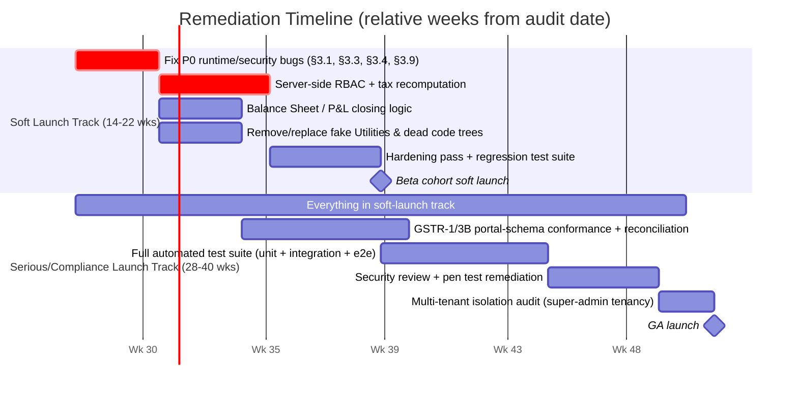
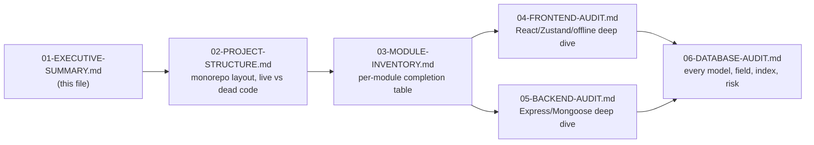

# Technical Due Diligence — Executive Summary

**Subject:** Billing-Software Monorepo (Textile ERP / Billing SaaS)
**Scope:** Full static + behavioral code audit of `frontend/` (Vite + React 19 + Zustand) and `backend/` (Node.js + Express + Mongoose/MongoDB)
**Method:** Direct source inspection — every claim in this report is backed by an actual file path, line range, or code excerpt that was read during the audit. No endpoint, model, or behavior described here was inferred without opening the corresponding file. Where a capability could not be verified in code, it is explicitly marked `MISSING`, `STUB`, `FAKE_UI`, or `DEAD_CODE` rather than assumed to exist.
**Report set:** Document `01` of `18` in `docs/TECHNICAL_DUE_DILIGENCE/`. Start with `00-INDEX.md` for the full map. Companion interactive scoreboard: Cursor Canvas `textile-erp-due-diligence.canvas.tsx`.

---

## 1. Verdict

> **Launch Ready: NO.**

The codebase represents a substantial, non-trivial engineering effort — a real double-entry accounting engine, a real offline-first sync architecture, a real multi-tenant SaaS admin backplane — but it is **not production-launchable in its current state** for a paying, GST-liable customer base. It sits in a common "advanced prototype" trap: the parts that are hard (transactional stock/accounting posting, offline queue, dynamic config bundles) are meaningfully built, while the parts that look easy but are load-bearing for trust and compliance (server-side authorization, tax-amount validation, GST filing fidelity, balance-sheet correctness, and a large share of the "Utilities" menu) are stubbed, faked, or actively broken.

**Estimated completion: ~55–60%** of a shippable v1 textile/apparel trading + job-work ERP.

## 2. Health Scorecard

All scores are 0–100, where 100 represents a fully production-hardened, audited, tested system for the target domain (multi-tenant GST-compliant textile trading + job-work ERP with offline billing).

| Dimension | Score | Rationale (see linked section) |
|---|---:|---|
| **Overall Health** | **58 / 100** | Weighted blend of the dimensions below; pulled down hard by Security and Testing. |
| Production Readiness | 42 / 100 | Hard runtime bug in Sales Return (`§3.1`), auth bypass on `NODE_ENV=development` (`§3.4`), hardcoded demo company data reaching customer-facing PDFs (`§3.5`). |
| Architecture | 62 / 100 | Coherent layered structure (`routes → controller → service → model`) for the live surface; undermined by two parallel dead architectures (legacy `MainLayout`/`Sidebar` React tree, and a duplicate `purchase.controller.js`/`purchase.service.js` backend pair) left in the tree, plus two competing ledger subsystems (`§3.8`). |
| Business Logic | 55 / 100 | Real double-entry bookkeeping with atomic counters and GST-split postings (`backend/services/accountingService.js`) is genuinely solid; but it is fed by client-trusted tax math (`§3.9`) and the summary financial statements do not fully reconcile (`§3.2`). |
| Code Quality | 57 / 100 | Consistent Mongoose schema conventions, transaction usage (`mongoose.startSession`) in every stock-affecting write path; inconsistent field naming across eras (`totalAmount` vs `taxableAmount` vs `netAmount`), and two structurally different naming conventions for controllers/services (`camelCase.js` vs `dot.case.js`) coexist. |
| Security | 38 / 100 | No server-side RBAC on any transactional ERP route (`§3.3`), a subscription/licensing bypass keyed off `NODE_ENV` (`§3.4`), no rate limiting/helmet/CSRF/input sanitization in `backend/server.js`, GST/tax amounts accepted verbatim from the client (`§3.9`). |
| Performance | 52 / 100 | Some genuinely good aggregation-pipeline work (`computeRunningBalances` in `backend/controllers/accountingController.js` collapses what used to be N+1 ledger queries into one `$aggregate`); but per-invoice-line `PaymentVoucher.find()` loops in `reportService.js`'s outstanding/aging calculations, and no visible caching/pagination discipline on list endpoints (`GET /parties`, `GET /items` return unbounded result sets). |
| Maintainability | 48 / 100 | Two live+dead code trees, two ledger systems, two purchase back-ends, and dozens of Dashboard "menu labels" that alias onto the same three modals make the code hard to safely change without regression. |
| Scalability | 45 / 100 | Per-request `Company.findById` + `Subscription.findOne` + `License.findOne` (3 extra round trips) on *every* authenticated request (`backend/middlewares/auth.middleware.js`, `subscription.middleware.js`), unbounded `.find()` list endpoints, and outstanding/aging reports that issue one `PaymentVoucher.find()` per invoice, per party — this will not scale past small tenant/data volumes without rework. |
| Testing | 22 / 100 | No unit/integration test framework or `test` script wired into `backend/package.json`; only ad-hoc manual scripts (`backend/testBusinessFlow.js`, `backend/scripts/testOfflineFeature.js`, `backend/scripts/testOfflineIntegration.js`) and a Playwright e2e config in `frontend/package.json` (`test:e2e`, `test:e2e:offline`) whose actual spec coverage is limited to offline flows. |
| Technical Debt | 68 / 100 *(higher = more debt)* | Two dead React page/layout trees, one dead Zustand store, one dead backend controller/service pair, one orphaned ledger subsystem, a demo-data constant reachable from production print/WhatsApp flows, and ~15 Dashboard "menu" entries that are `alert()` stubs — enumerated exhaustively in `03-MODULE-INVENTORY.md`. |

*(Scores as specified in the audit brief; supporting evidence for each is expanded below and in the companion documents.)*

## 3. Critical Risks (ranked by blast radius)

Each risk below is a **verified, reproducible code defect**, not a stylistic complaint. File/line citations point to the exact source.

### 3.1 `InventoryLot.source: 'return'` is not a valid enum value — Sales Return is broken at runtime

`backend/models/InventoryLot.js` declares:

```20:24:backend/models/InventoryLot.js
  source: {
    type: String,
    enum: ['purchase', 'opening', 'jobwork', 'job_receive'],
    default: 'purchase'
  },
```

But `backend/controllers/returnController.js`, when processing a **Sales Return** (goods coming back into stock), constructs a brand-new `InventoryLot` document with:

```64:76:backend/controllers/returnController.js
        const newLot = new InventoryLot({
          lotId: newLotId,
          itemId: item.itemId,
          purchaseId: null,
          source: 'return',
          totalPcs: item.pcs || 0,
          remainingPcs: item.pcs || 0,
          totalMtrs: item.mts || 0,
          remainingMtrs: item.mts || 0,
          status: 'Available',
          companyId
        });
        await newLot.save({ session });
```

`'return'` is **not** one of `['purchase', 'opening', 'jobwork', 'job_receive']`. Mongoose will throw a `ValidationError` on `newLot.save()`, which propagates up through the `try/catch` in `createReturn`, triggers `session.abortTransaction()`, and returns a `500` to the client. **Every Sales Return with at least one returned line item that has a quantity (`item.mts`) will fail outright** — the entire accounting/stock-adjustment transaction rolls back, and the user sees a generic 500 error with no indication of the actual cause. This is not an edge case; it is the *primary success path* of the Sales Return module. Fix requires either adding `'return'` to the enum or renaming the constant to one of the existing values (e.g. reuse `'opening'` is semantically wrong; the enum must be extended).

### 3.2 The Balance Sheet does not "plug" Profit & Loss into Capital — it will rarely balance

`backend/controllers/accountingController.js`'s `getBalanceSheet` computes ledger balances via `computeRunningBalances()` and then filters:

```619-637:backend/controllers/accountingController.js
    const assets = balances.filter(b => b.ledger.group === 'Assets');
    const liabilities = balances.filter(b => b.ledger.group === 'Liabilities');
    const capital = balances.filter(b => b.ledger.group === 'Capital');

    const totalAssets = assets.reduce((sum, b) => sum + b.balance, 0);
    const totalLiabilities = liabilities.reduce((sum, b) => sum + b.balance, 0);
    const totalCapital = capital.reduce((sum, b) => sum + b.balance, 0);
    ...
    isBalanced: Math.abs(totalAssets - (totalLiabilities + totalCapital)) < 0.01
```

`Income` and `Expenses` group ledgers (which hold `Sales A/c`, `Purchase A/c`, `CGST/SGST/IGST Output`, `Job Work Charges`, `Production Loss A/c`, etc. — see the `SYSTEM_LEDGER_TEMPLATES` array in `backend/services/accountingService.js` lines 6-26) are **excluded** from the Balance Sheet computation entirely. There is no closing/transfer step anywhere in the codebase (no "year-end closing" journal, no automatic sweep of net Income − Expenses into `Retained Earnings` or `Capital A/c`) that would fold the period's net profit/loss into the Capital section. The accounting-fundamentals identity `Assets = Liabilities + Capital + Net Profit` therefore only holds by coincidence (i.e., when a company has zero net trading activity). As soon as any Sales/Purchase/Job-Work activity occurs, `isBalanced` will report `false` for a going-concern business — precisely when the report needs to be correct. The `Utilities → Closing / UnClosing Year` menu item that would conventionally perform this roll-forward is, per `§3.6` below, a fake `alert()` with no backing implementation.

### 3.3 No server-side RBAC on any ERP transactional route

The `User` model defines a rich per-tenant role vocabulary:

```23:27:backend/models/User.js
    companyRole: {
        type: String,
        enum: ['owner', 'admin', 'manager', 'accountant', 'salesman', 'sales', 'viewer'],
        default: 'owner'
    },
```

But the system-level `role` field used for authorization only has two values (`'user'`, `'super_admin')`; see `backend/models/User.js` lines 18-22. Grepping the entire backend for `role.middleware`/`roleMiddleware` shows it is used in **exactly one place**:

```1-8:backend/routes/admin.routes.js
const roleMiddleware = require('../middlewares/role.middleware');

// All routes require super_admin role
router.use(roleMiddleware(['super_admin']));
```

None of `purchase.routes.js`, `salesRoutes.js`, `inventory.routes.js`, `accountingRoutes.js`, `jobRoutes.js`, `ledgerRoutes.js`, `returnRoutes.js`, `orderRoutes.js`, `noteRoutes.js`, `bookRoutes.js`, or `subMasterRoutes.js` import or apply `role.middleware.js`. The only per-request gate on these routes is `backend/utils/featureGuard.js`'s `guard('<module>')`, which checks whether the **company's subscription plan** has that module enabled (`Plan.features.modules[module]`) — it has no concept of the *requesting user's* `companyRole`. Concretely: a user created with `companyRole: 'viewer'` (read-only per the frontend's own `utils/permissions.js`) or `companyRole: 'sales'` can call `DELETE /api/sales/:id`, `POST /api/accounting/journal`, or `PUT /api/purchases/:id/status` directly via the API and it will succeed, because the Express layer never inspects `companyRole` for these routes. The one documented exception is user-management itself: `backend/services/user.service.js`'s `canManageUsers()` does gate `createUser`/`updateUser`/`deactivateUser` on `companyRole` being `owner`/`admin` — but that protects only the Users module, not Sales, Purchase, Accounting, Inventory, Job Work, GST, or Reports. The `getPermissions()` helper in `frontend/src/utils/permissions.js` (detailed in `04-FRONTEND-AUDIT.md`) is UI-only sugar; it hides buttons, it does not protect data.

### 3.4 Subscription/license/lock enforcement is bypassed whenever `NODE_ENV=development`

```5:17:backend/middlewares/subscription.middleware.js
const subscriptionMiddleware = async (req, res, next) => {
    // Skip check for super admins or in development environment
    if ((req.user && req.user.role === 'super_admin') || process.env.NODE_ENV === 'development') {
        if (req.user && req.user.companyId) {
            try {
                const company = await Company.findById(req.user.companyId);
                if (company) req.planId = company.planId;
            } catch (e) {
                // Ignore database issues for dev fallback
            }
        }
        return next();
    }
    ...
```

This middleware is mounted globally for every non-auth API route (`backend/routes/index.js`, `router.use(subscriptionMiddleware)` immediately after `router.use(authMiddleware)`). Any deployment where the environment variable `NODE_ENV` is not explicitly set to `production` — which includes a large class of misconfigured staging environments, forgotten `.env` defaults, containers where the variable was never injected, and any environment that defaults to unset — will **completely skip** the company-suspension check, the subscription-active/expiry check, and the license-key/expiry check for every single request, for every tenant, regardless of whether that tenant has ever paid. This is a monetization- and access-control-critical single point of failure gated on an environment string, not a feature flag with fail-safe defaults.

### 3.5 A hardcoded demo company (`DEMO_COMPANY`) is a live fallback on customer-facing invoice output

```1:6:frontend/src/utils/invoiceHelpers.js
/** Hardcoded company demo profile — replace with live config later */
export const DEMO_COMPANY = {
  name: 'MAHAVEER TEXTILES PVT. LTD.',
  tagline: 'Premium Textile Trading & Job Work',
```

and

```21:24:frontend/src/components/InvoicePDFViewer.jsx
  parties = [],
  items = [],
  company = DEMO_COMPANY,
  onClose
```

`InvoicePDFViewer.jsx` — the component that renders the printable/PDF invoice a customer receives — defaults its `company` prop to the hardcoded `MAHAVEER TEXTILES PVT. LTD.` demo profile. `buildWhatsAppMessage()` in the same `invoiceHelpers.js` file defaults identically. If the calling code path ever fails to thread the real, tenant-specific `CompanySettings`/`Company.meta` record through to this component (a config-loading race, a null company on a newly provisioned tenant, an offline-mode edge case where settings haven't synced yet), the customer's own client receives a legal invoice or WhatsApp message branded with a different, fictitious company's name and GSTIN-adjacent details. For a GST-regulated billing document this is not a cosmetic bug — it is a compliance and brand-integrity defect.

### 3.6 Large sections of the "Utilities", "Others Reports", and "Setup System" menus are `alert()` stubs with no backend behind them

`frontend/src/pages/Dashboard.jsx` lines 488-506 define the entire `Utilities` menu as:

```488:506:frontend/src/pages/Dashboard.jsx
      Utilities: [
         { label: 'Backup', action: () => alert('System Backup written to cloud successfully.') },
         { label: 'Restore', action: () => alert('System Restore successfully finalized.') },
         { label: 'Closing / UnClosing Year', action: () => alert('Financial year closed.') },
         { label: 'New A/c. Year ( Auto )', action: () => alert('New Accounting Year created automatically.') },
         { label: 'New A/c. Year ( Manual )', action: () => alert('New Accounting Year created manually.') },
         { label: 'Transfer To Next Year', action: () => alert('Balances transferred to new year.') },
         { label: 'Voucher Relndex', action: () => alert('Vouchers reindexed successfully.') },
         { label: 'Missing Series', action: () => alert('No missing invoice series found.') },
         { label: 'Auto Expense Entry', action: () => alert('Auto expense calculations completed.') },
         { label: 'Update Main Account Master', action: () => toggleModal('accountMaster', true) },
         { label: 'MisMatch Data Scanner', action: () => refreshAllData().then(() => alert('Data scan complete. All records refreshed.')) },
         { label: 'Email Option', action: () => alert('Email notification dispatch complete.') },
         { label: 'Missing Views Code', action: () => alert('Database views up-to-date.') },
         { label: 'Gst Updation', action: () => toggleModal('caDashboard', true) },
         { label: 'Backup Script Wise', action: () => alert('Local schema backup completed.') },
         { label: 'Single Firm Backup/Restore', action: () => alert('Firm database backed up.') },
         { label: 'Application Sync', action: () => refreshAllData().then(() => alert('All data refreshed.')) },
         { label: 'Bulk Whatsapp', action: () => alert('WhatsApp dispatch worker initialized.') }
      ],
```

14 of 17 items in this menu display a fabricated success message (`'System Backup written to cloud successfully.'`, `'Financial year closed.'`, `'Vouchers reindexed successfully.'`, etc.) and perform **no actual backend call**. There is no `/api/backup`, `/api/restore`, `/api/year-close`, or `/api/whatsapp` route anywhere in `backend/routes/index.js`. A user who clicks "Closing / UnClosing Year" believes their financial year has been closed; nothing has happened. This is the most severe category of UX-trust defect because the failure is silent and affirmative — the system actively lies about having performed a destructive/critical operation. The same pattern recurs in `Others Reports → Letter Pad` (`alert('Letter pad generator ready.')`, line 483) and `Setup System → Extra Event` / `Extra Event DetailData` (lines 510-511).

### 3.7 GSTR outputs are not portal-ready; several fields are hardcoded placeholders

`backend/services/gstService.js`'s `getGstr1()` returns a payload shaped like the GSTN return schema, but:

```106:114:backend/services/gstService.js
    return {
      gstin: company?.meta?.gstin || '',
      fp,
      version: 'GST3.2.2',
      hash: 'hash',
      b2b,
      b2cl,
      b2cs,
      hsn: { data: Object.values(hsnMap) },
```

The `hash` field — which on the actual GST portal JSON schema is a checksum used for return-file integrity validation — is the literal string `'hash'`, not a computed value. There is no digital-signature/EVC step, no IRN/e-invoice integration, no offline-utility-tool-compatible file export, and `b2cs` rows hardcode `rt: 5` (a 5% GST rate) regardless of the item's actual `gstRate` (comment in code: `// Default GST rate for b2cs summary — will vary per item below`, line 63). `getGstr2()` never cross-checks purchase GSTIN against any GSTN-sourced GSTR-2A/2B data (there is no ingestion of counterparty-filed data anywhere in the codebase) — it is a purchase register re-shaped to look like GSTR-2, not a reconciliation tool. `getCADashboard()`'s embedded `gstr3b` block (lines 258-279) is a locally computed outward/ITC/net summary with no filing submission path. In short: useful for internal MIS and CA review, but **not** a GSTR-1/3B filing pipeline — any external "GST-ready" or "GSTR filing" claim in commercial materials would be inaccurate against this code.

### 3.8 Two independent, non-communicating ledger subsystems coexist

The system that is actually wired into Sales/Purchase/Payment/Receipt/Return posting, Trial Balance, P&L, and Balance Sheet is `LedgerMaster` + `AccountingEntry`, driven by `backend/services/accountingService.js` and `backend/controllers/accountingController.js`. A **second**, structurally different ledger system exists in parallel: `backend/models/LedgerEntry.js` (flat `accountId`/`debit`/`credit`/`referenceType` rows) plus `backend/services/ledgerService.js`, exposed at `GET /api/ledgers/:partyId` and `GET /api/ledgers/balance/:partyId` (`backend/routes/ledgerRoutes.js`). Searching the entire backend for writers to `LedgerEntry` shows only `ledgerService.postToLedger()`, and searching for **callers** of `postToLedger` shows **none** — no controller, service, or route in the codebase ever invokes it. The `/api/ledgers/:partyId` endpoint will therefore always return an empty `entries` array and a `closingBalance` of `0` for every party, in every company, forever, because nothing ever writes to the collection it reads from. Any frontend or integration code that calls this route (as opposed to the correct `GET /api/accounting/ledgers/:id/statement`) will silently show a permanently-zero, permanently-empty ledger — a data-integrity trap that is indistinguishable from "this party has no transactions."

### 3.9 GST/tax amounts and totals are trusted verbatim from the client with no server-side recomputation

`backend/services/salesService.js`'s `createInvoice()`:

```20:22:backend/services/salesService.js
      // 1. Create the Sales Record inside transaction
      const sales = new Sales(salesData);
      await sales.save({ session });
```

`salesData` is `req.body` (with only `companyId` overwritten server-side in `salesController.js` line 6). Every tax-relevant field on the `Sales` schema — `taxableAmount`, `cgst`, `sgst`, `igst`, `gstAmount`, `netAmount`, `roundOff`, `discountAmt`, per-line `rate`/`amount`/`dis1Amt` — is persisted exactly as submitted by the browser, with the only validation being Mongoose's `min: 0`/`required` type checks (see `backend/models/Sales.js` lines 71-93). There is no server-side recomputation of `taxableAmount = Σ(line.mts × line.rate) − discounts`, no cross-check that `gstAmount` matches `taxableAmount × item.gstRate`, and no verification that `netAmount = taxableAmount + gstAmount + adjustments`. `backend/controllers/purchaseController.js` → `purchaseService.js` has the identical pattern for Purchase Bills. This means: (a) a compromised or modified frontend client, or a direct API call, can post an invoice with an artificially low `gstAmount`/`taxableAmount` while the `netAmount` charged to the customer is unchanged, directly falsifying the books that later feed GSTR-1/3B and the P&L; and (b) simple client-side arithmetic bugs (rounding, discount-order-of-operations) become permanent, unvalidated ledger entries with no server-side backstop. The downstream double-entry `AccountingEntry.pre('validate')` hook (`backend/models/AccountingEntry.js` lines 84-106) only enforces that *debits equal credits within the entry it's given* — it has no way to know the entry's inputs were tax-correct in the first place.

### 3.10 The super-admin's tenant context is silently resolved to "the first company ever created"

```23:31:backend/middlewares/auth.middleware.js
        // Super admin has no tenant — use first company for ERP data APIs
        if (!req.companyId && user.role === 'super_admin') {
            const Company = require('../models/Company');
            const fallback = await Company.findOne().sort({ createdAt: 1 });
            if (fallback) {
                req.companyId = fallback._id;
                req.superAdminTenant = true;
            }
        }
```

and identically in `backend/services/auth.service.js` (`getMe`/login enrichment) and `backend/controllers/auth.controller.js`'s `getMe`:

```60:68:backend/controllers/auth.controller.js
        } else if (user.role === 'super_admin') {
            const company = await Company.findOne().sort({ createdAt: 1 }).populate('planId');
```

A `super_admin` user (who has `companyId: null` per the `User` model default) is not tenant-scoped by design — but every ERP data route (`/api/sales`, `/api/purchases`, `/api/inventory`, `/api/accounting/*`, `/api/gst/*`, `/api/reports/*`, etc.) requires a `companyId` to filter by. Rather than blocking super-admin access to tenant data routes (which is arguably the correct behavior — super-admin has its own dedicated `/api/admin/*` surface), the middleware transparently substitutes **whichever `Company` document has the oldest `createdAt`** — i.e., in almost every real deployment, the very first customer or demo account ever created. This means: (1) if a super-admin ever calls a tenant-data endpoint directly (debugging, a misrouted frontend request, a future automation script), they operate against a real customer's live company data without any explicit selection step or audit trail flag beyond the `req.superAdminTenant` boolean (which is not logged or surfaced anywhere), and (2) the "first company" becomes a permanently privileged, implicitly-selected tenant purely as a side effect of creation order — a subtle multi-tenancy isolation smell that will surprise whoever inherits this code.

## 4. Additional Systemic Findings (non-exhaustive; see companion reports)

- **Dead frontend architecture** — an entire second React application shell (`frontend/src/layouts/MainLayout.jsx`, `frontend/src/components/layout/Sidebar.jsx`, `frontend/src/pages/sales/SalesPage.jsx`, `frontend/src/pages/purchase/PurchasePage.jsx`, `frontend/src/pages/jobwork/JobWorkPage.jsx`) is fully implemented but **unreachable** — `frontend/src/App.jsx` never imports `MainLayout`, and the only live authenticated route (`/`) renders `pages/Dashboard.jsx` directly inside a `ProtectedRoute`. See `04-FRONTEND-AUDIT.md §1`.
- **Dead state store** — `frontend/src/store/useAppStore.js` is a Zustand store seeded entirely with hardcoded mock data (fake parties, fake items, fake lots) and is imported by **zero** files outside itself; the live store is `frontend/src/store/useStore.js`. See `04-FRONTEND-AUDIT.md §2`.
- **Dead backend controller/service pair** — `backend/controllers/purchase.controller.js` + `backend/services/purchase.service.js` (dot-case naming) implement a parallel, simpler Purchase CRUD flow that is **never wired into any route file**; the live pair is `backend/controllers/purchaseController.js` + `backend/services/purchaseService.js` (camelCase), referenced from `backend/routes/purchase.routes.js`. See `05-BACKEND-AUDIT.md §2`.
- **No Contra Voucher type** — `backend/models/PaymentVoucher.js`'s `voucherType` enum is `['Payment', 'Receipt']` only; there is no bank-to-bank/cash-to-bank Contra voucher type anywhere in the schema or controller layer.
- **No Warehouse model or module** — grepping the entire backend for `warehouse`/`Warehouse` returns zero matches; multi-location stock is not modeled at all (all `InventoryLot` documents are company-scoped only, with no location/godown dimension).
- **TDS is UI-only** — the `Party` schema carries a `tdsPer` field and `CompanySettings` carries `tdsEnabled`, but there is no TDS ledger posting logic in `accountingService.js`, and the Dashboard's "Tds Entry" menu item opens the generic Payment modal (`toggleModal('payment', true)`, `Dashboard.jsx` line 438) rather than any TDS-specific flow.
- **Cash Book / Bank Book are aliases for the Receipt modal**, not general-ledger day-books: `Dashboard.jsx` lines 433-434 both route to `toggleModal('receipt', true)`.
- **"Process" / "Work Process" / "Cutting Entry" all alias Mill Issue; "Beam Entry" / "Production" both alias Mill Receive** (`Dashboard.jsx` lines 455-459) — five distinct textile-industry workflow labels collapse onto two real backend flows (`POST /api/jobs/issue`, `POST /api/jobs/receive`), meaning the UI's apparent process-tracking granularity (cutting → beam → production stages) does not exist server-side.
- **Offline-first architecture is real and reasonably sophisticated** — `frontend/src/utils/offlineDB.js` implements a versioned IndexedDB schema (`billing-offline`, `DB_VERSION = 6`) with a dedicated `syncQueue` store, and the production service worker is deliberately disabled in dev builds (`frontend/src/main.jsx` lines 15-30, with an explicit unregister-on-dev-load path) to avoid stale-asset caching during development. This is one of the stronger-engineered subsystems in the codebase and is a genuine differentiator — see `04-FRONTEND-AUDIT.md §4`.
- **No test framework wired into CI-equivalent tooling** — `backend/package.json` has no `test` script; `frontend/package.json` has Playwright configured (`test:e2e`, `test:e2e:offline`) but coverage is narrow.

## 5. Timeline to Launch

Two tracks are given because "launchable" means different things to a design partner/beta cohort versus a compliance-liable paying customer base.



- **Soft/beta launch (non-compliance-critical pilot customers, close support supervision): 14–22 weeks.** This assumes the 10 critical risks in §3 are fixed, the dead-code trees are removed (reducing regression surface), and a minimal regression suite is added around Sales/Purchase/Returns/Accounting posting. It does **not** assume GSTR filing is portal-accurate — pilot customers would need to continue filing through their existing CA workflow, using this system for MIS/books only.
- **Serious/compliance-grade GA launch (self-serve signup, GST-liable customers filing directly off system output): 28–40 weeks.** This adds GSTR-1/3B schema conformance and reconciliation, a real automated test suite, an external security review, and a deliberate multi-tenancy/super-admin isolation audit — none of which currently exist.

## 6. How to Read the Rest of This Report



Every risk and score cited above is expanded with full code context in the corresponding section of documents 2–6. Where this summary says "verified," the companion documents show the exact `grep`/read trail used to verify it.
