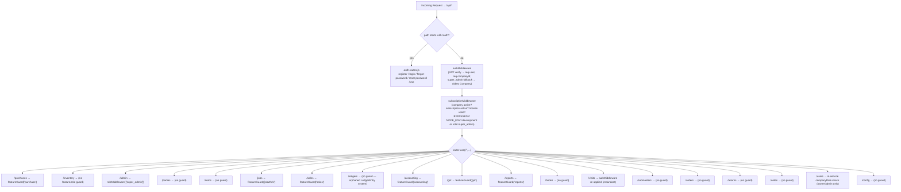
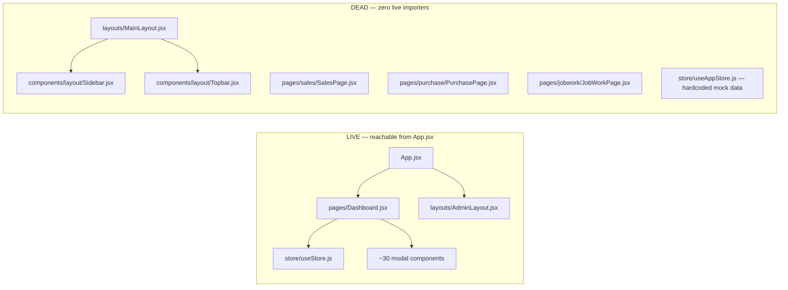

# Technical Due Diligence — Project Structure

**Companion to:** `01-EXECUTIVE-SUMMARY.md`
**Purpose:** Map the physical repository layout to what is *actually reachable at runtime*, distinguishing the live application graph from dead/orphaned code that remains in the tree. All paths below were opened and read directly; "dead" classifications are backed by exhaustive `grep` searches for import references, not assumption.

---

## 1. Repository Topology

This is a two-workspace monorepo with **no shared package/lockfile linkage** between the workspaces — `frontend/package.json` and `backend/package.json` are independent Node projects, each with their own `node_modules`, each runnable standalone.

```
Billing-software/
├── frontend/                     # Vite + React 19 + Zustand SPA
│   ├── package.json              # "vite", "react": "^19.2.5", "zustand": "^5.0.12"
│   ├── src/
│   │   ├── App.jsx               # ⭐ ROOT ROUTER — the only source of truth for live routes
│   │   ├── main.jsx              # ReactDOM bootstrap + conditional Service Worker registration
│   │   ├── pages/                # Route-level and modal-level page components (live + dead mixed)
│   │   ├── components/           # Shared UI, auth guards, layout shells (live + dead mixed)
│   │   ├── layouts/               # MainLayout.jsx (DEAD), AdminLayout.jsx (LIVE)
│   │   ├── store/                # useStore.js (LIVE Zustand store), useAppStore.js (DEAD mock store)
│   │   ├── context/              # ConfigContext.jsx — dynamic config bundle provider
│   │   ├── utils/                # offlineDB.js, offlineAuth.js, permissions.js, invoiceHelpers.js, etc.
│   │   ├── hooks/                # useOnlineStatus.js
│   │   └── api/                  # axios client wrapper
│   └── e2e/                      # Playwright specs (offline.spec.js referenced by package.json)
│
├── backend/                      # Node.js + Express + Mongoose API
│   ├── package.json              # "express": "^4.19.2", "mongoose": "^8.3.4", no test runner
│   ├── server.js                 # ⭐ Express app bootstrap, CORS policy, Mongo connection, mounts /api
│   ├── routes/
│   │   └── index.js              # ⭐ ROOT ROUTER — the only source of truth for live API surface
│   ├── controllers/              # Route handlers (contains one dead camelCase/dot-case duplicate pair)
│   ├── services/                 # Business logic (contains one dead duplicate: purchase.service.js)
│   ├── models/                   # ~35 Mongoose schemas (see 06-DATABASE-AUDIT.md)
│   ├── middlewares/               # auth, subscription, role, error
│   ├── utils/                    # featureGuard.js, license.js
│   ├── config/                   # defaultConfigs.js (seed data for dynamic config layer)
│   └── scripts/                  # seedDynamicConfig.js, seedFeatureSetup.js, testOffline*.js (manual, not CI-wired)
│
└── docs/
    └── TECHNICAL_DUE_DILIGENCE/  # this report set
```

## 2. The Live Frontend Route Graph

`frontend/src/App.jsx` is authoritative. It is a **flat `<Routes>` tree with no nested layout for the main app** — the entire authenticated ERP experience is a single route (`/`) rendering `pages/Dashboard.jsx`, which is a self-contained modal-driven shell (not a router-driven multi-page app).

```1:78:frontend/src/App.jsx
function App() {
  return (
    <Router>
      <ApiLoader />
      <Routes>
        <Route path="/portal" element={<PanelPortal />} />
        <Route path="/login" element={<LoginPage />} />
        <Route path="/offline-login" element={<LoginPage />} />
        <Route path="/signup" element={<SignupPage />} />
        <Route path="/forgot-password" element={<ForgotPasswordPage />} />
        <Route path="/admin/login" element={<AdminLogin />} />

        {/* Only the Legacy Dashboard is kept */}
        <Route path="/" element={
          <ProtectedRoute allowedRoles={['user', 'super_admin']}>
            <AuthBootstrap>
              <ConfigProvider>
                <Dashboard />
              </ConfigProvider>
            </AuthBootstrap>
          </ProtectedRoute>
        } />

        <Route path="/app" element={<Navigate to="/" replace />} />

        {/* Admin Panel Routes */}
        <Route path="/admin" element={
          <ProtectedRoute allowedRoles={['super_admin']}>
            <AdminLayout />
          </ProtectedRoute>
        }>
          <Route index element={<Navigate to="dashboard" replace />} />
          <Route path="dashboard" element={<AdminDashboard />} />
          <Route path="companies" element={<AdminCompanies />} />
          <Route path="plans" element={<AdminPlans />} />
          <Route path="subscriptions" element={<AdminSubscriptions />} />
          <Route path="licenses" element={<AdminLicenses />} />
          <Route path="usage" element={<AdminUsage />} />
          <Route path="audit" element={<AdminAudit />} />
          <Route path="modules" element={<AdminModuleControl />} />
          <Route path="dynamic" element={<AdminDynamicConfig />} />
          <Route path="users" element={<AdminUserManagement />} />
          <Route path="config" element={<AdminCompanyConfig />} />
        </Route>

        <Route path="*" element={<FallbackRedirect />} />
      </Routes>
    </Router>
  );
}
```

The developer's own comment on line 39 — `{/* Only the Legacy Dashboard is kept */}` — is a direct admission in the source that a prior, presumably more "modern," multi-page routing scheme was abandoned in favor of the single-page modal shell. This is corroborated by the dead-code findings in §4 below.

```mermaid
flowchart TD
    Root["/ (BrowserRouter)"] --> Portal["/portal → PanelPortal.jsx<br/>(panel chooser: ERP vs Admin)"]
    Root --> Login["/login, /offline-login → LoginPage.jsx"]
    Root --> Signup["/signup → SignupPage.jsx"]
    Root --> Forgot["/forgot-password → ForgotPasswordPage.jsx"]
    Root --> AdminLogin["/admin/login → admin/Login.jsx"]
    Root --> Dash["/ → ProtectedRoute(user, super_admin)<br/>→ AuthBootstrap → ConfigProvider → Dashboard.jsx<br/>(modal-shell ERP application)"]
    Root --> AppRedirect["/app → Navigate('/')"]
    Root --> AdminRoot["/admin → ProtectedRoute(super_admin) → AdminLayout.jsx"]
    AdminRoot --> AD1["dashboard → admin/Dashboard.jsx"]
    AdminRoot --> AD2["companies → admin/Companies.jsx"]
    AdminRoot --> AD3["plans → admin/Plans.jsx"]
    AdminRoot --> AD4["subscriptions → admin/Subscriptions.jsx"]
    AdminRoot --> AD5["licenses → admin/Licenses.jsx"]
    AdminRoot --> AD6["usage → admin/Usage.jsx"]
    AdminRoot --> AD7["audit → admin/Audit.jsx"]
    AdminRoot --> AD8["modules → admin/ModuleControl.jsx"]
    AdminRoot --> AD9["dynamic → admin/DynamicConfig.jsx"]
    AdminRoot --> AD10["users → admin/UserManagement.jsx"]
    AdminRoot --> AD11["config → admin/CompanyConfig.jsx"]
    Root --> Fallback["* → FallbackRedirect.jsx"]

    Dash -.->|"toggleModal()"| M1["30+ modals rendered inline<br/>(SalesModal, PurchaseModal, IssueModal,<br/>ReceiveModal, LedgerModal, GstModals,<br/>ReportsHub, DataRecordsHub, etc.)"]
```



**Key structural fact:** the ERP application is not a set of routes — it is one route (`/`) that mounts `Dashboard.jsx`, which internally manages a `modals` state object (`setModals`) and conditionally renders ~30 different modal components (`SalesModal`, `PurchaseModal`, `IssueModal`, `ReceiveModal`, `LedgerModal`, the GST modal family, `ReportsHub`, `DataRecordsHub`, etc.) based on which "menu item" was clicked. There is no deep-linkable URL for "the sales screen" or "the GST dashboard" — everything is client-side modal state. This has real implications for shareable links, browser back-button behavior, and SEO/bookmarking (moot for an authenticated ERP, but relevant for support/debugging workflows that rely on "send me the URL you're stuck on").

The `/admin` branch is architecturally different and conventional: a real nested-route layout (`AdminLayout.jsx`, `frontend/src/layouts/AdminLayout.jsx`) with a persistent sidebar (`navGroups` array covering Core/Subscriptions/Dynamic Control/Monitoring) and an `<Outlet/>`-rendered child page per route. This is the more modern half of the frontend and is fully wired end-to-end.

`PanelPortal.jsx` (`/portal`) is the entry "chooser" screen — `openErp()` navigates to `/` (or `/login` if unauthenticated) and `openAdmin()` navigates to `/admin/dashboard` (or `/admin/login`) gated on `role === 'super_admin'` read from the Zustand store, per `frontend/src/pages/PanelPortal.jsx` lines 40-48.

## 3. The Live Backend Route Graph

`backend/server.js` mounts exactly one router group under `/api`:

```42:42:backend/server.js
app.use('/api', require('./routes/index.js'));
```

`backend/routes/index.js` is authoritative for every reachable API path:

```1:53:backend/routes/index.js
const authRoutes = require('./auth.routes');
const purchaseRoutes = require('./purchase.routes');
const inventoryRoutes = require('./inventory.routes');
const adminRoutes = require('./admin.routes.js');
const partyRoutes = require('./partyRoutes');
const itemRoutes = require('./itemRoutes');
const jobRoutes = require('./jobRoutes');
const salesRoutes = require('./salesRoutes');
const ledgerRoutes = require('./ledgerRoutes');
const gstRoutes = require('./gstRoutes');
const reportRoutes = require('./reportRoutes');
const accountingRoutes = require('./accountingRoutes');
const bookRoutes = require('./bookRoutes');
const visitRoutes = require('./visit.routes');
const subMasterRoutes = require('./subMasterRoutes');
const orderRoutes = require('./orderRoutes');
const returnRoutes = require('./returnRoutes');
const noteRoutes = require('./noteRoutes');
const userRoutes = require('./user.routes');
const configRoutes = require('./config.routes');
const authMiddleware = require('../middlewares/auth.middleware');
const subscriptionMiddleware = require('../middlewares/subscription.middleware');

router.use('/auth', authRoutes);

// Protected Routes
router.use(authMiddleware);
router.use(subscriptionMiddleware);

router.use('/purchases', purchaseRoutes);
router.use('/inventory', inventoryRoutes);
router.use('/admin', adminRoutes);
router.use('/parties', partyRoutes);
router.use('/items', itemRoutes);
router.use('/jobs', jobRoutes);
router.use('/sales', salesRoutes);
router.use('/ledgers', ledgerRoutes);
router.use('/accounting', accountingRoutes);
router.use('/gst', gstRoutes);
router.use('/reports', reportRoutes);
router.use('/books', bookRoutes);
router.use('/visits', visitRoutes);
router.use('/submasters', subMasterRoutes);
router.use('/orders', orderRoutes);
router.use('/returns', returnRoutes);
router.use('/notes', noteRoutes);
router.use('/users', userRoutes);
router.use('/config', configRoutes);
```

Every route under this mount point — with the sole exception of `/auth/*` — passes through `authMiddleware` (JWT verification, `req.user`/`req.companyId` resolution) and then `subscriptionMiddleware` (plan/subscription/license gate, subject to the `NODE_ENV=development` bypass documented in `01-EXECUTIVE-SUMMARY.md §3.4`) **in that fixed order**, applied globally before the per-router mounts. Individual routers layer additional, router-specific middleware on top (e.g. `router.use(guard('sales'))` in `salesRoutes.js`, `router.use(roleMiddleware(['super_admin']))` in `admin.routes.js`).



Note that `featureGuard('<module>')` (`backend/utils/featureGuard.js`) checks the **company's subscription plan**, not the **requesting user's role** — see `01-EXECUTIVE-SUMMARY.md §3.3` for the RBAC gap this creates. `visit.routes.js` redundantly re-applies `authMiddleware` (`backend/routes/visit.routes.js` line 6) even though it is already mounted behind the global `router.use(authMiddleware)` in `routes/index.js` — harmless but indicates the route file was written/copied without full awareness of the global mount order.

## 4. Dead Code Inventory (Frontend)

The following files exist in the repository, are syntactically complete/functional-looking React components, but are **unreachable from any live route** as of `App.jsx`. Each was confirmed dead by grepping the entire `frontend/src` tree for import references outside the file's own module.

| File | What it is | Evidence of dead status |
|---|---|---|
| `frontend/src/layouts/MainLayout.jsx` | A conventional `Sidebar` + `Topbar` + `<Outlet/>` shell, with special-cased dashboard-only rendering (`if (isDashboard) return <Outlet/>` at line 11) | Not imported anywhere in `App.jsx`; grep for `import MainLayout` across `frontend/src` returns zero hits outside its own file. |
| `frontend/src/components/layout/Sidebar.jsx` | Full multi-section ERP sidebar navigation component | Only imported by the dead `MainLayout.jsx` (`import Sidebar from '../components/layout/Sidebar';`, line 3) — no other importer. |
| `frontend/src/components/layout/Topbar.jsx` | Top navigation bar for `MainLayout` | Same dependency chain as `Sidebar.jsx` — dead via `MainLayout.jsx`. |
| `frontend/src/pages/sales/SalesPage.jsx` | Full page-level Sales list/detail view (`const SalesPage = () => {...}`, 166 lines) | grep for `SalesPage` across `frontend/src` shows only its own declaration and its own default export — zero external imports. |
| `frontend/src/pages/purchase/PurchasePage.jsx` | Full page-level Purchase list/detail view (163 lines) | Identical pattern — self-referencing only. |
| `frontend/src/pages/jobwork/JobWorkPage.jsx` | Full page-level Job Work view (120 lines) | Identical pattern — self-referencing only. |
| `frontend/src/store/useAppStore.js` | A Zustand store pre-seeded with hardcoded mock parties/items/lots (`Suresh Fabrics`, `Om Textiles`, `Cotton 40s`, `LOT-501`, etc.) | grep for `useAppStore` outside its own declaration file returns zero hits; the live store used everywhere (`Dashboard.jsx` line 12, `LoginPage.jsx`, `ProtectedRoute.jsx`, 50+ other files) is `useStore.js`. |



The practical risk of this dead subtree is not that it executes (it does not — it is never mounted), but that **a future developer, an AI coding assistant, or a new team member will edit it believing it is live**, silently wasting effort or — worse — reintroducing it into the route tree with its hardcoded mock data and incompatible data-fetching assumptions still baked in.

## 5. Dead Code Inventory (Backend)

| File pair | What it is | Evidence of dead status |
|---|---|---|
| `backend/controllers/purchase.controller.js` + `backend/services/purchase.service.js` | A second, simpler Purchase CRUD implementation (`purchaseService.createPurchase(req.companyId, req.body)` signature, no transaction/session usage, no inventory-lot side effects) | `backend/routes/purchase.routes.js` requires `../controllers/purchaseController` (camelCase, no dot) — never `../controllers/purchase.controller`. Grep for `purchase.controller` and `purchase.service` (dot-case) across `backend/routes/*.js` returns zero matches. |

The live pair — `backend/controllers/purchaseController.js` + `backend/services/purchaseService.js` — is a materially more complete implementation: it runs inside a `mongoose.startSession()` transaction, generates per-item `InventoryLot` records with `StockMovement` audit rows, and posts a real double-entry `AccountingEntry` via `accountingService.onPurchaseBillPost()`. The dead pair does none of this. This is a textbook "someone built v2 next to v1 and forgot to delete v1" situation — low risk while dead, but a landmine if anyone ever "fixes a bug" in the dot-case files under the mistaken belief they are load-bearing.

No equivalent dead-controller pattern was found for Sales, Inventory, Jobs, Accounting, GST, Reports, Returns, Orders, or Notes — those each have exactly one controller/service implementation.

## 6. The Admin/Super-Admin Surface (Fully Live, Structurally Distinct)

Unlike the tenant ERP shell, the `/admin/*` surface is a conventional page-per-route SPA and is fully wired:

```1:12:frontend/src/layouts/AdminLayout.jsx
const AdminLayout = () => {
    const location = useLocation();
    const navigate = useNavigate();
    const logout = useStore(state => state.logout);
```

It shares the **same** `useStore.js` Zustand store as the tenant ERP shell (no separate admin store), and reuses the same `api` axios client, `PanelSwitcher` component, and JWT-based session. The nav groups defined at `AdminLayout.jsx` lines 23-55 (`Core`, `Subscriptions`, `Dynamic Control`, `Monitoring`) map 1:1 onto the eleven admin sub-routes registered in `App.jsx` (`dashboard`, `companies`, `plans`, `subscriptions`, `licenses`, `usage`, `audit`, `modules`, `dynamic`, `users`, `config`) and, on the backend, onto `backend/routes/admin.routes.js`'s endpoint groups (Companies, Plans, Subscriptions, License, Usage, Audit, Module Config, Dynamic Config Layer, Company Settings, User Management — see `05-BACKEND-AUDIT.md §3` for the full endpoint table). This is the most internally consistent, best-architected corner of the entire codebase.

## 7. Cross-Cutting Structural Observations

- **Two naming conventions for the same layer coexist**: `purchaseController.js` (camelCase, live) vs. `purchase.controller.js` (dot-case, dead); `salesRoutes.js`/`partyRoutes.js`/`itemRoutes.js` (suffix `Routes.js`, no dot) vs. `purchase.routes.js`/`visit.routes.js`/`config.routes.js` (dot-case `.routes.js`) — both patterns are live simultaneously in `routes/index.js`. This is cosmetic but is a leading indicator that the codebase passed through at least two different engineering eras or contributors without a full consolidation pass.
- **The frontend's `pages/` directory mixes three eras**: (1) the dead page-per-route era (`sales/SalesPage.jsx`, `purchase/PurchasePage.jsx`, `jobwork/JobWorkPage.jsx`), (2) the live modal era (`sales/SalesModal.jsx`, `purchase/PurchaseModal.jsx`, `jobwork/IssueModal.jsx`, etc., all mounted from `Dashboard.jsx`), and (3) the admin SPA era (`admin/*.jsx`, mounted from `AdminLayout.jsx` via `App.jsx`). All three eras' files are physically interleaved in the same directory tree with no naming or folder convention separating live from dead.
- **The `backend/` root contains ad-hoc operational scripts** (`backend/testBusinessFlow.js`, `backend/fixBooks.js`, `backend/query_books.js`, `backend/seed.js`) that are not referenced by `package.json` scripts and were evidently run manually via `node <file>.js` during development/debugging. `fixBooks.js` and `query_books.js` in particular suggest at least one prior production/staging data-repair incident involving the `Book` collection.
