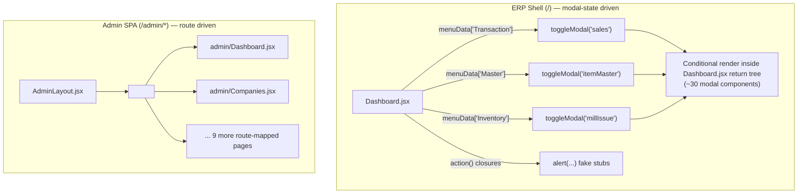

# Technical Due Diligence — Frontend Audit

**Companion to:** `01-EXECUTIVE-SUMMARY.md`, `02-PROJECT-STRUCTURE.md`, `03-MODULE-INVENTORY.md`
**Stack confirmed from `frontend/package.json`:** React `^19.2.5`, React Router `^7.14.2`, Zustand `^5.0.12`, Vite `^8.0.10`, `idb` `^8.0.3` (IndexedDB wrapper), `axios` `^1.6.8`, `framer-motion` `^12.38.0`, `jspdf`/`html2pdf.js`/`html2canvas` (client-side PDF generation), `@playwright/test` `^1.61.1` (e2e, dev dependency).

---

## 1. Application Shell & Routing

As established in `02-PROJECT-STRUCTURE.md §2`, the live application is not a conventional multi-route SPA for its core ERP functionality — it is a single protected route (`/`) rendering `frontend/src/pages/Dashboard.jsx`, which is a **modal-orchestration shell**. This has several concrete frontend-engineering consequences worth calling out on their own:

- **State-driven, not URL-driven, navigation.** `Dashboard.jsx` holds a `modals` state object and a `menuData` object (over 130 individual menu-item entries across `Master`, `Transaction`, `Inventory`, `Reports`, `Others Reports`, `Utilities`, `Setup System`, `Records`, `Company`) that maps menu clicks to either `toggleModal(key, true)` or an inline `action()` closure. There is no `react-router` `<Route>` per module — `handleMenuItemClick()` (`Dashboard.jsx` lines 398-408) is the single dispatch point for the entire ERP surface.
- **This means the browser back/forward buttons do nothing meaningful inside the ERP** (they operate on the outer `/` route only, since no inner navigation changes the URL) — a real UX regression relative to a route-per-module design, and a real complication for support workflows ("send me a link to where you are stuck" is not possible).
- **The `/admin/*` surface is architecturally the opposite** — a conventional nested-route SPA (`AdminLayout.jsx` + `<Outlet/>` + one component per `/admin/<segment>` route). The two halves of the same frontend codebase were evidently built by different engineering approaches or in different eras, and no attempt has been made to reconcile them.



## 2. State Management — One Live Store, One Dead Store

`frontend/src/store/useStore.js` (1571 lines) is the single, authoritative Zustand store for the entire live application — imported by `Dashboard.jsx`, `ProtectedRoute.jsx`, `LoginPage.jsx`, `PanelPortal.jsx`, `AdminLayout.jsx`, `AuthBootstrap.jsx`, `ConfigContext.jsx`, and roughly 45 other files.

Its responsibilities span far beyond typical "global UI state": it is a **full offline-aware data-access layer**, implementing, for every entity type (`parties`, `items`, `sales`, `purchases`, `inventoryLots`, `jobWorkEntries`, `ledgers`, `books`, `subMasters`, `orders`, `returns`, `notes`, `visits`, `vouchers`, `companyUsers`):

1. An online `fetch*()` action that calls the REST API, then **writes the result into IndexedDB** via `cacheEntities()` (`frontend/src/utils/offlineDB.js`) as a side effect, so the next offline session has fresh data.
2. A network-failure fallback inside the same action that reads from IndexedDB via `getCachedEntities()` if the live call throws a network error (`isNetworkError(err)`, `utils/offlineHelpers.js`).
3. A `add*()`/`update*()`/`delete*()` mutation action that, when offline (`isOffline()` true) and the user is authenticated (`canSaveOffline(get)`), writes an optimistic local record (`generateLocalId()` → `local-<timestamp>-<random>`) directly into IndexedDB and enqueues it onto the `syncQueue` store (`saveOffline`/`saveOfflineUpdate`/`saveOfflineDelete`, `utils/syncQueue.js`), rather than calling the API.

This "one store, many concerns" design is pragmatic for an app this size but means `useStore.js` is a single 1500+-line file that mixes authentication, seven-plus business-entity CRUD, offline queueing, and report-fetching concerns — a maintainability risk as the module count grows (already reflected in the Maintainability score in `01-EXECUTIVE-SUMMARY.md`).

`frontend/src/store/useAppStore.js`, by contrast, is a **second, entirely separate Zustand store** (`create((set) => ({...}))`, 30 lines) pre-populated with hardcoded demo data:

```1:30:frontend/src/store/useAppStore.js
export const useAppStore = create((set) => ({
  isSidebarOpen: true,
  toggleSidebar: () => set((state) => ({ isSidebarOpen: !state.isSidebarOpen })),
  ...
  notifications: [
    { id: 1, title: 'Low Stock Alert', desc: 'Cotton Blue 40s is below 50m', time: '2h ago', type: 'warning' },
    { id: 2, title: 'Purchase Order #501', desc: 'Received from Suresh Fabrics', time: '5h ago', type: 'success' },
  ],
  parties: [
    { id: 'P001', name: 'Suresh Fabrics', ... },
    { id: 'P002', name: 'Om Textiles', ... },
  ],
  items: [ { id: 'I001', name: 'Cotton 40s', ... }, { id: 'I002', name: 'Silk Mix', ... } ],
  lots: [ { id: 'LOT-501', ... }, { id: 'LOT-505', ... } ],
}));
```

A repository-wide search for `useAppStore` (outside its own declaration file) returns **zero import references**. It exists solely as an artifact of the dead `MainLayout`/`Sidebar`/`*Page.jsx` subtree documented in `02-PROJECT-STRUCTURE.md §4` — those dead components were presumably the intended consumers. Its practical risk is identical to the dead component tree: it is a landmine for anyone who reconnects the old subtree without realizing the data it would display is entirely fictitious.

## 3. Config & Feature-Gating Layer

The frontend has **three independent, overlapping mechanisms** that each claim some responsibility for "what should this user see," none of which are unified:

### 3.1 `ConfigContext.jsx` — the real dynamic-config sync layer

`frontend/src/context/ConfigContext.jsx` implements a genuinely well-built live-config mechanism: on mount, it fetches the merged config bundle (`GET /api/config/active`), then **polls `GET /api/config/version` every 5 seconds** (`POLL_MS = 5000`, line 9) and only re-fetches the full bundle if the returned `configHash` differs from the last-seen hash (lines 43-54) — a sensible cheap-poll/expensive-refresh pattern that lets a super-admin's `CompanyModuleConfig`/`FeatureFlag`/`PricingRuleConfig` edits propagate to already-logged-in tenant sessions within 5 seconds without a full page reload. It correctly no-ops while offline (`isOffline()` check, lines 62-73), falling back to the last bundle persisted onto the `user` object (`user.activeConfig`).

### 3.2 `frontend/src/utils/permissions.js` — role-based UI section visibility

```15:51:frontend/src/utils/permissions.js
export const getPermissions = (companyRole = 'owner', systemRole = 'user') => {
  if (systemRole === 'super_admin') {
    return { role: 'owner', canSave: true, canManageUsers: true, readOnly: false, readOnlyMasters: false, sections: ALL_SECTIONS, canAccessSection: () => true };
  }
  const role = companyRole || 'owner';
  const sectionAccess = {
    owner: ALL_SECTIONS,
    admin: ALL_SECTIONS.filter(s => s !== 'Company'),
    accountant: ['Master', 'Transaction', 'Inventory', 'Records', 'Reports', 'Others Reports', 'Ledger'],
    sales: ['Transaction', 'Inventory', 'Records', 'Reports', 'Others Reports'],
    viewer: ['Records', 'Reports', 'Others Reports', 'Ledger']
  };
  const canSave = !['viewer', 'accountant'].includes(role);
  const canManageUsers = ['owner', 'admin'].includes(role);
  const readOnlyMasters = ['viewer', 'accountant'].includes(role);
  return { role, canSave, canManageUsers, readOnly: role === 'viewer', readOnlyMasters, sections: sectionAccess[role] || ALL_SECTIONS, canAccessSection: (section) => (sectionAccess[role] || ALL_SECTIONS).includes(section) };
};
```

This is a pure, side-effect-free function consulted by `Dashboard.jsx` to decide which top-level menu sections (`Master`, `Transaction`, `Inventory`, `Reports`, etc.) to render for the current `companyRole`. It is well-designed **as UI sugar** — but as established in `01-EXECUTIVE-SUMMARY.md §3.3`, none of the backend routes it is meant to correspond to actually enforce the same restriction. A `viewer`-role user simply won't be *shown* the "Transaction" menu section, but if they (or a browser extension, or a replayed request, or a modified build) issue `POST /api/sales` directly, the request succeeds. This function protects pixels, not data.

### 3.3 `frontend/src/components/auth/FeatureGuard.jsx` — disabled entirely

```1:27:frontend/src/components/auth/FeatureGuard.jsx
const FeatureGuard = ({ feature, children }) => {
    // Making all fields/sections visible as requested by the user
    return children;

    // Access Denied State
    return (
        <div className="flex flex-col items-center justify-center p-12 bg-slate-50 rounded-3xl border-2 border-dashed border-slate-200">
            ...
            <h2 className="text-xl font-bold text-slate-800">Module Locked</h2>
            <p className="text-slate-500 text-center mt-2 max-w-sm">
                Your current plan does not include the <span className="font-bold text-indigo-600 uppercase">{feature}</span> module. ...
            </p>
            ...
        </div>
    );
};
```

This component was clearly built to render a "Module Locked / upgrade your plan" empty state per-feature (mirroring the backend's `featureGuard.js` plan-gating concept), but an unconditional `return children;` was inserted **before** the gating logic, with a code comment explicitly stating this was a deliberate, requested change ("Making all fields/sections visible as requested by the user"). The entire second `return` block — the actual gate — is unreachable dead code within a live, imported component. **Net effect: any UI wrapped in `<FeatureGuard feature="...">` renders unconditionally regardless of the company's plan**, meaning the frontend currently performs *zero* plan-based feature gating even in the one place it was purpose-built to do so. Combined with the backend's `featureGuard.js` (which *is* live and does block requests server-side, per `05-BACKEND-AUDIT.md`), the practical symptom is: **a locked-out module's UI will render normally, and only fail when the user actually submits an action**, producing a confusing "why does this button not work" experience rather than an upfront "this isn't in your plan" message.

### 3.4 Net assessment

None of these three systems talk to each other. `permissions.js` is role-based and has no concept of plan/feature; `ConfigContext`/`FeatureGuard` are plan/feature-based (in principle) and have no concept of `companyRole`; and the one component built to unify plan-gating in the UI (`FeatureGuard`) is switched off. A future maintainer trying to answer "why can this user see this button" has to reason about three independent, partially-disabled systems simultaneously.

## 4. Offline-First Architecture (Genuine Strength)

This is, on balance, the **best-engineered subsystem in the frontend**, and deserves to be documented on its own merits before its edge cases.

### 4.1 IndexedDB layer

`frontend/src/utils/offlineDB.js` wraps the `idb` library around a versioned database:

```1:12:frontend/src/utils/offlineDB.js
const DB_NAME = 'billing-offline';
const DB_VERSION = 6;
const DATA_STORES = [
  'parties', 'items', 'sales', 'purchases', 'books',
  'inventory', 'payments', 'receipts', 'syncQueue',
  'jobs', 'orders', 'returns', 'notes', 'visits', 'ledgers', 'subMasters'
];
const AUTH_STORE = 'offlineAuth';
const STORES = [...DATA_STORES, AUTH_STORE];
```

Sixteen data object stores plus a dedicated `offlineAuth` store (for offline login support — see §5) plus a `syncQueue` store for pending mutations. The `getDB()` accessor (lines 74-83) is defensive: if `openDatabase()` throws (a corrupted or version-mismatched local DB), it deletes and recreates the database rather than leaving the app in a permanently broken state — a small but meaningful reliability choice most teams skip.

Every cached record is tagged with `companyId` (`withCompany()`, lines 88-91) and cache reads (`getCachedEntities`) filter by the **active** company (`getActiveCompanyId()`, backed by `localStorage`). `prepareCompanyCache()` (lines 268-275) proactively wipes a previous company's cached rows when a *different* company logs in on the same device/browser — a deliberate defense against one tenant's offline cache leaking into another tenant's session on a shared device.

### 4.2 Sync queue

`frontend/src/utils/syncQueue.js` implements the write side: `saveOffline()`/`saveOfflineUpdate()`/`saveOfflineDelete()` push an entry onto the `syncQueue` IndexedDB store, tagged with `entityType`, `action`, `payload`, `status: 'pending'`, and `retries: 0`. When connectivity returns, the queue is drained (`runCreate`/`runUpdate`/`runDelete`, lines 59-86) against a fixed `ENDPOINTS` map (`sales`, `purchases`, `parties`, `items`, `payments`→`/accounting/payments`, `receipts`→`/accounting/receipts`). Notably, `runCreate()` has a specific duplicate-invoice-number recovery path:

```53:71:frontend/src/utils/syncQueue.js
const renameInvoiceNo = (payload) => {
  const current = payload.invoiceNo;
  if (!current || current === 'AUTO') return { ...payload, invoiceNo: 'AUTO' };
  return { ...payload, invoiceNo: `${current}-OFF${Date.now().toString().slice(-4)}` };
};

const runCreate = async (item) => {
  const endpoint = ENDPOINTS[item.entityType];
  let payload = { ...item.payload };
  try {
    return await api.post(endpoint, payload, { forceNetwork: true });
  } catch (err) {
    if (isDuplicateError(err) && (item.entityType === 'sales' || item.entityType === 'purchases')) {
      payload = renameInvoiceNo(payload);
      return await api.post(endpoint, payload, { forceNetwork: true });
    }
    throw err;
  }
};
```

This is a thoughtful accommodation for a real offline-billing failure mode: two devices independently create invoice `INV-104` while both offline, and on reconnect the second sync would otherwise fail the server's per-company unique `{invoiceNo, companyId}` index (`Sales.js`/`Purchase.js`) — instead it detects the duplicate-key error and retries with a disambiguated number rather than losing the transaction. `FailedSyncModal.jsx` surfaces items that exhaust this recovery path to the user for manual resolution — the escape hatch is not silent.

### 4.3 Service worker — deliberately dev/production split

```15:31:frontend/src/main.jsx
// Service worker: only in production builds. In dev it caches CSS/JS and breaks styles.
if ('serviceWorker' in navigator) {
  window.addEventListener('load', async () => {
    if (import.meta.env.DEV) {
      const regs = await navigator.serviceWorker.getRegistrations();
      await Promise.all(regs.map((r) => r.unregister()));
      if (window.caches) {
        const keys = await caches.keys();
        await Promise.all(keys.map((k) => caches.delete(k)));
      }
      return;
    }
    navigator.serviceWorker.register('/sw.js').catch((err) => {
      console.warn('Service worker registration failed:', err);
    });
  });
}
```

In dev mode, the app **actively unregisters any existing service worker and purges the Cache Storage API** before doing anything else, rather than merely skipping registration — a defensive measure against exactly the kind of "why is my CSS stale" bug that plagues teams who add a service worker without this guard. In production, registration is fire-and-forget with a caught rejection (no hard failure if `/sw.js` 404s or the browser blocks it).

### 4.4 Assessed risk in the offline layer

The offline architecture's correctness depends on the server-side validation gaps documented elsewhere in this report. Specifically: an offline-created Sale or Purchase is queued with whatever `taxableAmount`/`gstAmount`/`netAmount` the client computed while disconnected (see `frontend/src/utils/offlineBillHelpers.js`'s `enrichSalePayload`/`enrichPurchasePayload`, referenced from `useStore.js` lines 598, 762), and — per `01-EXECUTIVE-SUMMARY.md §3.9` — the server performs **no recomputation** on sync. This means the offline path is not just a UX feature but also, unintentionally, the *easiest* path for tax-amount drift to enter the books, since the numbers are computed once, client-side, potentially hours before the device regains connectivity and syncs.

```mermaid
sequenceDiagram
    participant U as User (offline)
    participant IDB as IndexedDB (offlineDB.js)
    participant SQ as syncQueue.js
    participant API as Backend API
    U->>IDB: addSale() → generateLocalId(), offlinePending: true
    IDB->>SQ: saveOffline('sales', payload)
    Note over U,IDB: Device works fully offline;<br/>taxableAmount/gstAmount computed client-side only
    U->>SQ: connectivity restored → drainQueue()
    SQ->>API: POST /api/sales (payload as originally computed offline)
    API->>API: new Sales(salesData) — NO server-side tax recomputation
    API-->>SQ: 201 Created (or 400 duplicate → renameInvoiceNo retry)
    SQ->>IDB: remove synced item from syncQueue + local cache
```

## 5. Authentication & Session Flow

`frontend/src/components/auth/AuthBootstrap.jsx` wraps the live `/` route and is responsible for: calling `restoreSession()` on mount (reconciling `localStorage` + IndexedDB `offlineAuth` state with a live `GET /auth/me` call when online), triggering `bootstrapMasters()` (the initial `refreshAllData()`/`hydrateFromCache()` fan-out) once the session is ready, wiring up `initSyncListener()` to reactively splice synced records back into the Zustand store as the background queue drains, and subscribing to network-status transitions to trigger a cache rehydrate the moment the app goes offline.

`ProtectedRoute.jsx` (`frontend/src/components/auth/ProtectedRoute.jsx`) is a simple but correctly-defensive guard: it reads `token`/`role` from the store (falling back to `localStorage` directly if the store hasn't hydrated yet, line 9), and branches its "not authenticated" redirect based on both the target path (`/admin/*` → `/admin/login`) and current connectivity (`isOffline()` → `/login` rather than `/portal`, since the portal-chooser page is not meaningful without a network round-trip). Role checking (`allowedRoles.includes(role)`) always makes an explicit exception for `super_admin` (line 25), consistent with the backend's own universal super-admin bypass pattern.

`LoginPage.jsx` is reused for both `/login` and `/offline-login` (identical component, per `App.jsx` lines 33-34) — the offline login path is backed by `frontend/src/utils/offlineAuth.js`, which persists a hashed/cached credential envelope into the `offlineAuth` IndexedDB store at login time (`putOfflineAuth`) so a user can authenticate against the last-known-good credential entirely offline, then have that local session reconciled against the server's `/auth/me` once reconnected (`useStore.js`'s `restoreSession()`, lines 196-214).

## 6. UI Component Inventory (Live vs. Dead)

Cross-referencing every file under `frontend/src/pages/` and `frontend/src/components/` against actual import graphs (full methodology in `02-PROJECT-STRUCTURE.md §4`) produces the following partition:

**Live, mounted from `Dashboard.jsx`'s modal registry:** `SalesModal`, `PurchaseModal`, `AccountingForms.PaymentForm`, `IssueModal`, `ReceiveModal`, `UpdateModal`, `JobReceiptModal`, `ProcessUpdateModal`, `SalesOutstanding`, `LedgerModal`, `AccountMasterModal`, `ItemMasterModal`, `BookMasterModal`, `InventoryPage`, the GST modal family (`Gst3bMonthlyModal`, `Gstr1Modal`, `Gst2bMatchingModal`, `Gst3bDetailModal`, `Gstr1ErrorChekModal`, `GstComplianceModal`), `CADashboardModal`, `VisitLogModal`, `PartyModal`, `JobWorkerMaster`, `BookSelectionModal`, `GenericMasterModal`, `OrderModal`, `ReturnModal`, `NoteModal`, `JournalEntryModal`, `UserRightsModal`, `OpeningBalanceModal`, `OpeningStockModal`, `DataRecordsHub`, `ReportsHub`.

**Live, mounted from `App.jsx` routes:** `LoginPage`, `SignupPage`, `ForgotPasswordPage`, `PanelPortal`, all 11 `admin/*.jsx` pages, `AdminLayout`.

**Live, print/export utility components:** `SalesPrint.jsx`, `PurchasePrint.jsx`, `InvoicePDFViewer.jsx` (subject to the `DEMO_COMPANY` fallback defect).

**Dead (unreachable):** `MainLayout.jsx`, `Sidebar.jsx`, `Topbar.jsx`, `SalesPage.jsx`, `PurchasePage.jsx`, `JobWorkPage.jsx`, and a second, apparently earlier-draft `frontend/src/pages/dashboard/Dashboard.jsx` (distinct file from the live `frontend/src/pages/Dashboard.jsx`, not imported by `App.jsx`), plus the components each of those exclusively depends on (e.g. `components/purchase/{PurchaseTable,SummaryPanel,PurchaseForm}.jsx` — imported only by the dead `PurchasePage.jsx`; verified by grep).

## 7. Print / Document Generation & the `DEMO_COMPANY` Risk

Invoice printing and PDF export are implemented entirely client-side (`jspdf`, `html2pdf.js`, `html2canvas` per `package.json`) rather than server-generated — meaning the exact HTML/CSS the customer sees on screen is what gets rasterized into their PDF, with no server-side canonical-document generation step to fall back on if the client-rendered version is wrong. `InvoicePDFViewer.jsx`'s `company` prop defaulting to `DEMO_COMPANY` (full defect writeup in `01-EXECUTIVE-SUMMARY.md §3.5`) is compounded by this architecture: because there is no server-rendered PDF to double-check against, a misconfigured/late-loading company-settings state produces a PDF that looks completely legitimate (same layout, same fonts, same GST fields) but with the wrong legal entity's name printed on it — the kind of defect that is invisible in a quick QA pass and only surfaces when a real customer notices their invoice says "MAHAVEER TEXTILES PVT. LTD."

`frontend/src/utils/invoiceHelpers.js`'s `buildWhatsAppMessage()` (line 88) shares the identical `company = DEMO_COMPANY` default and is used to compose the outbound WhatsApp share text for an invoice — the same risk applies to the WhatsApp-share flow.

## 8. Menu-Label vs. Backend-Behavior Mismatches (Frontend-Specific View)

`03-MODULE-INVENTORY.md` documents the business impact of each of these; this section catalogs them purely as a **frontend engineering pattern** — `Dashboard.jsx`'s `menuData` object aliases many distinct textile-ERP concepts onto a small number of underlying `toggleModal()` calls:

| Menu label(s) | Actual `action`/`key` | `Dashboard.jsx` line(s) |
|---|---|---|
| `Cash Book`, `Bank Book`, `Voucher Entry` | `toggleModal('receipt', true)` | 433-435 |
| `Tds Entry` | `toggleModal('payment', true)` | 438 |
| `Process`, `Work Process`, `Cutting Entry` | `toggleModal('millIssue', true)` | 455-457 |
| `Beam Entry`, `Production` | `toggleModal('millRec', true)` | 458-459 |
| `Journal (GST)`, `Stock Transfer (Jv)` | `openJournal()` | 436, 446 |
| `Backup`, `Restore`, `Closing / UnClosing Year`, `New A/c. Year (Auto/Manual)`, `Transfer To Next Year`, `Voucher Relndex`, `Missing Series`, `Auto Expense Entry`, `Email Option`, `Missing Views Code`, `Backup Script Wise`, `Single Firm Backup/Restore`, `Bulk Whatsapp` | `alert('<fabricated success message>')` | 488-506 |
| `Letter Pad` | `alert('Letter pad generator ready.')` | 483 |
| `Extra Event`, `Extra Event DetailData` | `alert('Event pipeline active.')` / `alert('Pipeline events loaded.')` | 510-511 |

This is not a small stylistic nit — it means the menu system, taken at face value, over-represents the breadth of the application by roughly a third. A demo or sales walkthrough that clicks through the full menu tree will appear to show a dramatically more complete ERP than what actually persists data.

## 9. Deployment Topology

`frontend/api/index.js` (note: at the frontend workspace root, sibling to `src/`, not inside it) is a one-line Vercel serverless-function adapter:

```1:3:frontend/api/index.js
const app = require('../../backend/server.js');

module.exports = app;
```

This, combined with `backend/server.js`'s `if (!process.env.VERCEL) { app.listen(...) }` guard (line 52) and `server.js`'s CORS policy explicitly allowlisting `*.vercel.app` origins (lines 24-25), confirms the intended production deployment target is **Vercel, serving the frontend as a static Vite build and the backend as a Vercel serverless function re-exporting the same Express app** — a single-repo, dual-target deployment model. This is a reasonable low-ops choice for an early-stage SaaS, but it means the backend inherits all of Vercel serverless's constraints (cold starts, execution-time limits, no persistent in-process state across invocations) which is relevant context for the Mongoose connection-reuse pattern and any future background-job requirements (e.g., a real GSTR filing queue, scheduled subscription-expiry sweeps) that a long-running Node process would otherwise handle trivially.

## 10. Frontend-Specific Recommendations (Prioritized)

1. **Re-enable `FeatureGuard.jsx`'s gate**, or delete the dead branch — the current state (children always rendered) silently defeats the plan-based UI messaging the component was built for.
2. **Delete the dead code tree** (`MainLayout.jsx`, `Sidebar.jsx`, `Topbar.jsx`, `SalesPage.jsx`, `PurchasePage.jsx`, `JobWorkPage.jsx`, `useAppStore.js`, the orphan `pages/dashboard/Dashboard.jsx`) — zero runtime risk to remove, meaningful reduction in codebase confusion and AI/human maintenance risk.
3. **Thread real `CompanySettings`/`Company.meta` data all the way to `InvoicePDFViewer.jsx` and `buildWhatsAppMessage()` with no `DEMO_COMPANY` fallback** — fail loudly (block printing, show an error) rather than silently substituting fictitious company data.
4. **Replace the `alert()`-stub Utilities/Reports/Setup menu items** with either real implementations or a consistent, honest "Coming Soon" affordance — the current behavior actively misinforms users that destructive/critical operations (year closing, backup, database sync) succeeded.
5. **Split `useStore.js`** into per-domain slices (auth, masters, transactions, offline-sync) as the module count grows — the current single-file design is already large enough to be a code-review and merge-conflict bottleneck.
6. **Unify the three feature-gating systems** (`permissions.js`, `ConfigContext`/`FeatureGuard`, and the absent backend-role linkage) into one coherent client+server model, per the RBAC recommendation in `05-BACKEND-AUDIT.md`.
