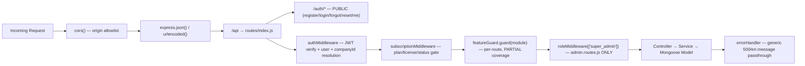

# Technical Due Diligence — Backend Audit

**Companion to:** `01-EXECUTIVE-SUMMARY.md`, `02-PROJECT-STRUCTURE.md`, `03-MODULE-INVENTORY.md`, `06-DATABASE-AUDIT.md`
**Stack confirmed from `backend/package.json` and `backend/server.js`:** Node.js + Express (version pinned in `package.json`), Mongoose ODM against MongoDB, `jsonwebtoken` + `bcryptjs` for auth, `cors`, `dotenv`. **No** `helmet`, `express-rate-limit`, `express-validator`/`joi`/`zod`, `morgan`/structured logger, or job-queue (`bull`/`agenda`) dependency is present.

---

## 1. Process & Middleware Topology

`backend/server.js` is a 59-line, single-file bootstrap: it loads `.env`, configures CORS with a custom origin-callback allowlist (localhost any port, `*.vercel.app`, `process.env.FRONTEND_URL`), applies `express.json()`/`express.urlencoded()`, connects to Mongoose against `process.env.MONGO_URI` with an unguarded fallback to `mongodb://localhost:27017/billing_software` if the env var is absent, mounts the entire API under `/api` via `backend/routes/index.js`, and registers a single catch-all `errorHandler` (`backend/middlewares/error.middleware.js`) after the routes. The `if (!process.env.VERCEL) { app.listen(...) }` guard confirms the dual local-server/Vercel-serverless deployment model documented in `04-FRONTEND-AUDIT.md §9`.

Two observations of note:

- **Silent local-DB fallback is dangerous in a misconfigured deploy.** If `MONGO_URI` is ever missing from a production environment's variables (a plausible ops mistake, e.g. a typo'd Vercel env var name), the app does not crash — it silently connects to `localhost:27017`, which in a serverless/production context either fails loudly downstream (acceptable) or, worse, silently succeeds against an ephemeral/attacker-controlled local Mongo instance in certain container configurations. A fail-fast `process.exit(1)` on missing `MONGO_URI` in production would be safer.
- **No global security middleware.** There is no `helmet()` (missing HSTS, X-Content-Type-Options, X-Frame-Options, CSP headers), no rate limiter (the login/register/forgot-password endpoints are exposed to unlimited brute-force/credential-stuffing attempts), and no request-body size limit override (Express defaults apply). This is consistent with `01-EXECUTIVE-SUMMARY.md`'s Security score of 38/100.



## 2. Authentication & Session Resolution (`backend/middlewares/auth.middleware.js`)

Every protected request pays for **up to three sequential Mongoose round-trips** before reaching a controller:

```1:49:backend/middlewares/auth.middleware.js
const authMiddleware = async (req, res, next) => {
    try {
        const token = req.headers.authorization?.split(' ')[1];
        if (!token) return res.status(401).json({ message: 'No token, authorization denied' });
        const decoded = jwt.verify(token, process.env.JWT_SECRET);
        const user = await User.findById(decoded.id).select('-password');
        if (!user) return res.status(401).json({ message: 'User not found' });
        req.user = user;
        req.companyId = user.companyId;
        if (!req.companyId && user.role === 'super_admin') {
            const Company = require('../models/Company');
            const fallback = await Company.findOne().sort({ createdAt: 1 });
            if (fallback) { req.companyId = fallback._id; req.superAdminTenant = true; }
        }
        if (req.companyId) {
            const Company = require('../models/Company');
            const company = await Company.findById(req.companyId);
            if (company) {
                req.planId = company.planId;
                req.companyStatus = company.status;
                if (company.status === 'suspended') {
                    return res.status(403).json({ message: 'Your company account is suspended...' });
                }
            }
        }
        next();
    } catch (err) {
        res.status(401).json({ message: 'Token is not valid' });
    }
};
```

1. `User.findById(decoded.id)` — resolve the JWT subject to a user document.
2. (super-admin-with-no-company path only) `Company.findOne().sort({ createdAt: 1 })` — the **super-admin-tenant-is-first-company** defect (`01-EXECUTIVE-SUMMARY.md §3.10`); this walks every super-admin session onto whichever `Company` document happens to have the smallest `createdAt`, with no explicit "acting as" selection step.
3. `Company.findById(req.companyId)` — resolve the company to check `status === 'suspended'` and stash `req.planId`.

Then `backend/middlewares/subscription.middleware.js` runs immediately afterward and **independently re-fetches the same `Company` document** (`Company.findById(req.user.companyId)`, line 24) to check `isActive`/`status` again, plus a `Subscription.findOne` and a `License.findOne` — meaning a single authenticated API call touches the `Company` collection twice, redundantly, before any business logic executes. On a hot path (e.g. `GET /api/inventory` polled by a dashboard) this is a meaningful, easily-fixed per-request tax; caching the resolved company/plan context for the lifetime of the request (or briefly, in-memory, keyed by companyId) would remove one full round-trip per request with no behavior change.

The `catch` block collapses **every** possible failure — expired token, malformed token, wrong signing secret, unexpected `User.findById` error (e.g. a transient Mongo timeout) — into an identical `401 Token is not valid`. This is defensible for security (it avoids leaking which failure mode occurred) but means a genuine database outage on this endpoint is indistinguishable, from the client's perspective, from a bad credential — complicating incident diagnosis and (worse) potentially causing the frontend to force-logout users during a transient backend blip (`client.js`'s 401 handling, `04-FRONTEND-AUDIT.md §5`).

## 3. Subscription/License Gate and the `NODE_ENV=development` Bypass

```1:49:backend/middlewares/subscription.middleware.js
const subscriptionMiddleware = async (req, res, next) => {
    // Skip check for super admins or in development environment
    if ((req.user && req.user.role === 'super_admin') || process.env.NODE_ENV === 'development') {
        if (req.user && req.user.companyId) {
            try {
                const company = await Company.findById(req.user.companyId);
                if (company) req.planId = company.planId;
            } catch (e) { /* Ignore database issues for dev fallback */ }
        }
        return next();
    }
    try {
        if (!req.user.companyId) return res.status(403).json({ message: 'User is not associated with any company' });
        const company = await Company.findById(req.user.companyId);
        if (!company || !company.isActive || company.status === 'suspended') {
            return res.status(403).json({ message: 'Account locked or inactive. Please contact support.' });
        }
        const subscription = await Subscription.findOne({ companyId: req.user.companyId });
        if (!subscription || subscription.status !== 'active' || new Date() > subscription.endDate) {
            return res.status(402).json({ message: 'Subscription expired or inactive' });
        }
        const license = await License.findOne({ companyId: req.user.companyId, isActive: true });
        if (!license || new Date() > license.expiresAt) {
            return res.status(403).json({ message: 'License key invalid or expired' });
        }
        req.planId = company.planId;
        next();
    } catch (err) {
        res.status(500).json({ message: 'Subscription check failed', error: err.message });
    }
};
```

This is `01-EXECUTIVE-SUMMARY.md §3.4`'s critical risk in full: **any deployment where `NODE_ENV` is not explicitly set to `production`** — which is the default state of a huge number of hosting platforms and self-managed VMs unless an operator remembers to export it — silently disables subscription-expiry checks, license-expiry checks, and company-suspension checks for every tenant, not just a designated test tenant. There is no separate `DEV_BYPASS_SUBSCRIPTION` flag, no allowlist of specific companies, and no logging/warning emitted when the bypass fires. Because Vercel serverless functions and many container platforms do not set `NODE_ENV=production` by default (only frameworks like `next build` do this automatically — a bare Express app does not), this bypass has a real chance of being silently live in a misconfigured production deployment, and there is currently no automated safeguard (health-check, startup assertion) that would catch it.

## 4. Authorization Model — Three Independent, Inconsistent Systems

The backend has three separate authorization primitives, and — as documented at the module level in `03-MODULE-INVENTORY.md` — they are applied with **no consistent policy** about which routes get which combination:

### 4.1 `roleMiddleware` (`backend/middlewares/role.middleware.js`)

```1:15:backend/middlewares/role.middleware.js
const roleMiddleware = (roles) => {
    return (req, res, next) => {
        if (!req.user) return res.status(401).json({ message: 'Unauthorized' });
        if (!roles.includes(req.user.role)) {
            return res.status(403).json({ message: 'Access denied: insufficient permissions' });
        }
        next();
    };
};
```

A correct, simple, generic RBAC primitive — checking the **system-level** `User.role` (`'user'` | `'super_admin'`), not the tenant-level `companyRole`. Its only production usage found across all route files is `backend/routes/admin.routes.js`'s `router.use(roleMiddleware(['super_admin']))`. It is imported nowhere else. This means the only place in the entire API surface where this correct, reusable middleware is applied is the super-admin panel — every tenant-facing ERP route (`/sales`, `/purchases`, `/accounting/*`, `/inventory`, `/jobs`, etc.) has **zero use of `roleMiddleware`**, so a logged-in `viewer` or `accountant` companyRole account can call any transactional endpoint directly (confirmed by inspecting `salesRoutes.js`, `purchase.routes.js`, and the absence of `roleMiddleware` imports in `Grep`-confirmed route files).

### 4.2 `featureGuard.guard()` (`backend/utils/featureGuard.js`)

Plan-based, not role-based — it answers "does this company's `Plan.features.modules[module]` allow this?", not "is this user allowed to?". Applied inconsistently: `purchase.routes.js` and `salesRoutes.js` apply `guard('purchase')`/`guard('sales')` at the router level, but this only blocks companies on a plan lacking that module — it does nothing to distinguish an `owner` from a `viewer` on the same company/plan.

### 4.3 `user.service.js`'s `canManageUsers` — the one bespoke `companyRole` check

```javascript
// backend/services/user.service.js
const canManageUsers = (requester) => ['owner', 'admin'].includes(requester.companyRole);
```

This is the **only** place in the backend that inspects `companyRole` server-side (used to gate `POST/PUT/DELETE /api/users/*`). Every other `companyRole`-dependent decision in the product — including the entire `permissions.js` menu-visibility system documented in `04-FRONTEND-AUDIT.md §3.2` — exists exclusively client-side.

### 4.4 Net effect

Combining §4.1–4.3: a user with `companyRole: 'viewer'` is *shown* a reduced menu by the frontend, is *not* blocked by `roleMiddleware` (never applied to ERP routes), and *is* blocked by `featureGuard` only if their company's plan lacks that specific module (unrelated to their personal role). In practice this means **any authenticated user of a company can create, edit, and cancel Sales, Purchases, Payments, Receipts, Journal Entries, and Ledgers**, regardless of whether the UI shows them the corresponding button, as long as their company's plan includes that module. This is the concrete mechanism behind Critical Risk #3 in `01-EXECUTIVE-SUMMARY.md`.

## 5. Business-Logic Layer — Service Design Quality (Mixed)

Reading through `backend/services/*.js` reveals a codebase that has clearly been through at least one bug-fixing pass — nearly every service file contains inline `// FIXED:` comments describing a previously-broken behavior — but the fixes are uneven in depth. This section documents both the genuine engineering strengths and the specific remaining gaps.

### 5.1 Genuine strength: transactional integrity for the core sales/purchase/job-work flows

`salesService.createInvoice`, `purchaseService.createPurchase`, and `jobService.issueToJob`/`receiveFromJob` each wrap their multi-document writes (invoice/bill/job header + `InventoryLot` mutation + `StockMovement` audit row + `AccountingEntry` posting) in a single Mongoose `session.startTransaction()` / `commitTransaction()` / `abortTransaction()` block. Critically, the accounting-entry posting call (`accountingService.onSalesInvoicePost(sales, session)`) is invoked **inside** the same transaction and passed the session explicitly — a comment in `purchaseService.js` line 57 notes this was previously outside the transaction ("silent failures"), i.e. this was itself a prior bug that has since been fixed. This means a failed accounting-entry post (e.g. because a ledger lookup throws) now correctly rolls back the entire invoice/stock-movement chain rather than leaving an invoice recorded with no corresponding ledger postings.

`salesService.deleteSale`/`purchaseService.deletePurchase` implement **reversal-based cancellation** rather than deletion-based cancellation for any document that has already been posted (`status === 'active' || 'partial'`): they create a new `AccountingEntry` with every `Dr`/`Cr` line flipped, mark the original entry `isReversed: true`, and link the two via `reversalEntryId`. This is the textbook-correct accounting pattern (never delete a posted journal entry; reverse it) and its presence indicates real accounting-domain literacy went into this part of the system.

### 5.2 Genuine strength: double-entry integrity enforced at the schema layer

As detailed further in `06-DATABASE-AUDIT.md §on AccountingEntry`, `AccountingEntry`'s Mongoose schema has a `pre('validate')` hook that sums all `Dr` and `Cr` lines and **rejects the save** if they differ by more than ₹0.01 — meaning it is not possible, even via a coding mistake in some future controller, to persist an unbalanced accounting entry. This is a strong, cheap-to-maintain invariant that most of the identified defects in this report (client-trusted tax amounts, the balance sheet exclusion bug) do *not* violate, because those defects are about *which* numbers get summed into the entry, not about whether the entry itself balances.

### 5.3 Genuine strength: atomic sequence generation

`generateEntryNo`/`generateVoucherNo`/`Job`'s job-card numbering, and `salesService`/`purchaseService`'s invoice/bill numbering, all route through `Counter.nextSeq()` (`backend/models/Counter.js`), which uses a single atomic `findOneAndUpdate({ _id: counterId }, { $inc: { seq: 1 } }, { upsert: true })`. Inline comments in `accountingService.js` and `accountingController.js` explicitly note this replaced an earlier `countDocuments() + 1` pattern that was vulnerable to duplicate numbers under concurrent requests — a real, previously-present race condition that has been correctly fixed with the standard MongoDB atomic-counter idiom.

### 5.4 Remaining gap: no server-side recomputation of tax amounts

As established in `01-EXECUTIVE-SUMMARY.md §3.9`, `salesService.createInvoice(salesData)` and the equivalent purchase path construct `new Sales(salesData)` / `new Purchase(purchaseData)` directly from the request body's `taxableAmount`, `cgst`, `sgst`, `igst`, `gstAmount`, and `netAmount` fields — every downstream figure (the accounting entry lines, the GSTR-1 return, the P&L, the balance sheet) inherits whatever the client computed, correctly or not, offline or online, honestly or maliciously. None of the "FIXED" comments in `salesService.js`/`purchaseService.js`/`accountingService.js` address this — the fixes that did happen (session handling, atomic counters, standardized field names) are all about **structural correctness of the pipeline**, not about **validating the numbers flowing through it**. A minimal remediation would recompute `taxableAmount = Σ(item.mts * item.rate) - discounts` and `gstAmount = taxableAmount * item.gstRate` server-side per line, using the authoritative `Item.gstRate` from the database rather than trusting the request body, and reject the request (or silently correct it with a warning) if the client's totals disagree beyond a rounding tolerance.

### 5.5 Remaining gap: `gstService.js` is not GSTN-portal-ready

`getGstr1()` (`backend/services/gstService.js` lines 8-128) hardcodes `hash: 'hash'` (line 110) — the GST portal's JSON schema requires a cryptographic hash of the return payload for authentication; a literal string `'hash'` means this payload would be rejected by the actual GSTN API/offline-utility import, confirming this endpoint produces a JSON shape that superficially resembles a GSTR-1 return but has never been validated against the real portal or its offline tool. `getGstr1`'s B2CS aggregation additionally defaults `rt: 5` for every summary bucket (line 63, with an inline comment acknowledging "will vary per item") even though the same function correctly computes per-item, per-HSN GST rates for the HSN summary block a few lines later (lines 74-98) — the B2CS section and the HSN section use inconsistent rate-resolution logic within the same function. `getGstr2()` has no equivalent of the government's GSTR-2B auto-drafted ITC matching (it is simply the company's own `Purchase` records restated) — there is no reconciliation against supplier-filed data, so it cannot serve its real compliance purpose (catching suppliers who didn't file, which is the entire point of GSTR-2B matching for input tax credit eligibility). `getCADashboard()` is a reasonably well-designed **aggregation and warnings layer** on top of `getGstr1`/`getGstr2` (its `warnings` array flagging `B2CL_CHECK`, `ZERO_GST`, `NO_GSTIN`, `HSN_MISSING` conditions is a genuinely useful CA-facing sanity-check feature) — but it inherits every upstream defect and there is no `gstr3b` filing endpoint distinct from the `gstr3b` object embedded in this dashboard response; `gstController.js` exposes only `getGstr1`, `getGstr2`, and `getCADashboard` — confirmed by inspection, there is no standalone GSTR-3B route.

### 5.6 Remaining gap: duplicated, independently-maintained business logic across services and controllers

This codebase has at least three areas where the **same computation is implemented twice, independently, with different bugs**:

- **Outstanding/aging report:** `reportService.getOutstanding()` (mounted at `GET /api/reports/outstanding`) and `accountingController.getOutstandingReport()` (mounted at `GET /api/accounting/outstanding`) both compute party-wise receivable/payable aging from `Sales`/`Purchase` documents against `PaymentVoucher.againstInvoices`, but were clearly written independently: `reportService`'s version factors the "amount paid against a document" lookup into a shared `paidAgainstDoc()` helper reused by three different report functions, while `accountingController.getOutstandingReport()` inlines the identical `PaymentVoucher.find({...}).reduce(...)` logic directly inside its own nested `for` loop. Both are N+1 query patterns (see §6), but a future bug fix to one (e.g., correcting the aging-bucket boundary logic) will not automatically propagate to the other, and the two endpoints can already silently disagree if one has field-name coverage the other lacks — `reportService`'s version reads `doc.netAmount || doc.totals?.total || doc.totalAmount`, while `accountingController`'s version reads `doc.totals?.total || doc.totalAmount || doc.netAmount` (**different field-priority order** — for a document that has, say, both a stale `totalAmount` and a corrected `netAmount` populated, the two endpoints can compute a different outstanding balance for the exact same invoice).
- **Profit & Loss:** `reportService.getProfitLoss()` (`GET /api/reports/...`, embedded in `getReportBundle`) sums `Sales.taxableAmount`/`Purchase.taxableAmount` directly from source documents, entirely bypassing the ledger system, while `accountingController.getProfitLoss()` (`GET /api/accounting/pnl`) correctly aggregates `Income`/`Expenses`-group `LedgerMaster` balances via `AccountingEntry` lines. These two P&L calculations have no structural reason to agree (one is document-based, one is ledger-based) and **will diverge** the moment any non-invoice ledger activity exists (a manual journal entry adjusting an expense ledger, a reversed/cancelled invoice whose reversal entry nets to zero in the ledger-based calculation but whose original document is simply excluded by `status: {$ne: 'cancelled'}` filtering in the document-based one — these are not guaranteed to produce identical numbers even in the cancellation case).
- **Ledger/party-statement system:** see §7 below — this is the most severe instance, because one of the two systems is completely non-functional rather than merely divergent.

### 5.7 Remaining gap: generic error handling leaks Mongoose internals to API responses

`backend/middlewares/error.middleware.js` is 8 lines:

```1:11:backend/middlewares/error.middleware.js
const errorHandler = (err, req, res, next) => {
    const statusCode = res.statusCode === 200 ? 500 : res.statusCode;
    res.status(statusCode);
    res.json({
        message: err.message,
        stack: process.env.NODE_ENV === 'production' ? null : err.stack,
    });
};
```

Every controller's `catch` block additionally does its own inline `res.status(...).json({ message: error.message })`, so this global handler is mostly a safety net for uncaught async errors that skip a controller's own `try/catch` (e.g. a synchronous throw before the try block, or a middleware-level failure). Because `err.message` is always echoed verbatim regardless of environment, a raw Mongoose `ValidationError` — such as the exact `InventoryLot.source: 'return'` enum-violation defect in `01-EXECUTIVE-SUMMARY.md §3.1` — will surface to the API caller as something like `InventoryLot validation failed: source: \`return\` is not a valid enum value for path \`source\`.`, which is harmless information disclosure in this specific case but is a generally risky pattern: it means **any** Mongoose schema validation message, MongoDB driver error message, or third-party library error message thrown anywhere in the call stack is forwarded to the HTTP client verbatim, including in production. A production-grade error handler should classify errors (validation vs. not-found vs. auth vs. unexpected) and only forward a curated message for the last category, logging the raw error server-side instead.

## 6. Performance Patterns

### 6.1 N+1 query patterns in reporting

`reportService.getSalesRegister`, `getPurchaseRegister`, and `getOutstanding` (`backend/services/reportService.js`) each iterate a `for...of` loop over query results and `await paidAgainstDoc(companyId, doc._id)` **inside the loop body** — one additional `PaymentVoucher.find()` query per row. For a sales register covering a full month for an active textile trading company (hundreds of invoices), this means the register endpoint issues hundreds of sequential round-trips to MongoDB instead of one. `accountingController.getOutstandingReport` compounds this further with a **nested** double loop — for every matching `Party`, for every one of that party's `Sales`/`Purchase` documents, issue one `PaymentVoucher.find()` — an O(parties × documents) query count. `getReportBundle()` (used by the combined Reports Hub UI) calls `getSalesRegister`, `getPurchaseRegister`, and both `getOutstanding` calls concurrently via `Promise.all`, which parallelizes the *top-level* awaits but does nothing to fix the serial N+1 pattern *within* each one — the bundle endpoint's total latency is still bounded by whichever single report has the most rows.

### 6.2 `computeRunningBalances` — the fix that was actually applied correctly

By contrast, `accountingController.js`'s `computeRunningBalances()` (used by Trial Balance, P&L, and Balance Sheet) is explicitly commented as a deliberate performance fix: `/* FIXED: Uses MongoDB aggregation (single query) instead of N+1 per-ledger queries. */`. It uses a single `AccountingEntry.aggregate([{$match},{$unwind:'$lines'},{$group}])` pipeline to compute per-ledger debit/credit totals in one round-trip, then maps that onto the `LedgerMaster` list in memory. This is the correct pattern, and its presence — contrasted against the *not-yet-fixed* N+1 patterns in `reportService.js` and `accountingController.getOutstandingReport` described above — suggests the team knows how to fix this class of problem but has not yet applied the same fix uniformly across every report endpoint.

### 6.3 Per-request middleware DB round-trips

Covered in §2 above: every authenticated request costs 2–3 sequential `Company`/`User`/`Subscription`/`License` lookups before reaching a controller. None of this is cached (no in-memory TTL cache, no Redis) — under any real concurrent load this middleware chain is the single most repeated database access pattern in the entire application, and is the most valuable single target for a request-scoped or short-TTL cache.

## 7. The Dual Ledger System — Concrete, Reachable Defect

`01-EXECUTIVE-SUMMARY.md`'s Critical Risk #8 ("Dual ledger systems") has a specific, currently-live manifestation that is worth documenting precisely because it is not merely an architectural inconsistency — it is a **user-facing broken feature**.

`backend/routes/ledgerRoutes.js` mounts two live, reachable endpoints:

```1:9:backend/routes/ledgerRoutes.js
router.get('/:partyId', ledgerController.getPartyLedger);
router.get('/balance/:partyId', ledgerController.getAccountBalance);
```

Both are implemented via `backend/services/ledgerService.js`, which reads exclusively from the `LedgerEntry` collection (`backend/models/LedgerEntry.js`):

```1:35:backend/services/ledgerService.js
class LedgerService {
  async postToLedger(entries, session) {
    const totalDebit = entries.reduce((sum, e) => sum + (e.debit || 0), 0);
    const totalCredit = entries.reduce((sum, e) => sum + (e.credit || 0), 0);
    if (Math.abs(totalDebit - totalCredit) > 0.01) {
      throw new Error(`Accounting Imbalance: Debit (${totalDebit}) does not match Credit (${totalCredit})`);
    }
    return await LedgerEntry.insertMany(entries, { session });
  }
  async getPartyLedger(partyId, companyId, startDate, endDate) { /* LedgerEntry.find(...) */ }
  async getAccountBalance(partyId, companyId) { /* LedgerEntry.find(...).reduce(...) */ }
}
```

A repository-wide search confirms `LedgerService.postToLedger()` — the **only** function anywhere in the codebase capable of writing a `LedgerEntry` document — has **zero callers**. Every real transactional flow (`salesService`, `purchaseService`, `jobService`, `accountingController`'s voucher/journal endpoints) posts exclusively to `AccountingEntry` via `accountingService`, never to `LedgerEntry`. The practical consequence: **`GET /api/ledgers/:partyId` and `GET /api/ledgers/balance/:partyId` are live, unauthenticated-by-role, fully-reachable API endpoints that will return an empty `entries` array and a `0` balance for every party in every company, permanently**, regardless of how much real sales/purchase/payment activity exists for that party — because the collection they read from is never populated. Any frontend surface wired to this endpoint (or any future one, or a mobile app, or an integration partner relying on this API) will observe "this customer has no ledger history and owes nothing" for customers who may in fact owe substantial amounts, with the correct answer sitting one collection over in `AccountingEntry`, reachable only via the differently-shaped `accountingController.getLedgerStatement` (`GET /api/accounting/ledgers/:id/statement`) endpoint, which requires a `LedgerMaster._id`, not a `Party._id` — the two endpoints are not even interchangeable by parameter shape, so a caller cannot simply switch URLs to get the correct data. This is either dead-but-reachable legacy code from an earlier ledger design that was superseded by `AccountingEntry`/`LedgerMaster` without removing the old routes/controller/service/model, or an unfinished migration — either way, it is a shipped, discoverable, silently-wrong API endpoint today.

## 8. Tenant Isolation — Mostly Correct, With Exceptions

The dominant pattern across the codebase — visible in `salesService`, `purchaseService`, `jobService`, `inventoryService`, `accountingController.createLedger`/`listLedgers` — is correctly scoping every query and every write with `companyId` sourced from `req.companyId` (i.e., derived server-side from the authenticated JWT via `authMiddleware`), not from client-supplied `req.body.companyId` or `req.query.companyId`. `accountingController.createLedger`/`listLedgers` even carry explicit `// SECURITY FIX: Always use server-side companyId from JWT, never trust req.body` comments confirming this was a deliberate hardening pass.

However, this discipline is **not universal**. Several controller functions use a `req.companyId || req.query.companyId` or `req.companyId || req.body.companyId` fallback pattern — `accountingController.createPaymentVoucher`/`createReceiptVoucher`/`createJournalEntry` (`req.body.companyId` fallback), `accountingController.listVouchers`/`getBalanceSheet`/`getOutstandingReport` (`req.query.companyId` fallback), `ledgerController.getPartyLedger`/`getAccountBalance` (`req.query.companyId`, with **no server-side fallback to `req.companyId` at all** — `companyId` is read purely from the query string). Because `req.companyId` is reliably populated by `authMiddleware` for any normal tenant user, these fallbacks are dead code in the common case — but they represent a latent cross-tenant data-read/write risk in any edge case where `req.companyId` is unset (a user mid-onboarding with no company yet assigned, or a super-admin session where the "first company" resolution in `auth.middleware.js` fails to find any company at all) or where a caller simply appends `?companyId=<victim-company-id>` to a request from an account that does have a valid `req.companyId`, since the `||` operator in JavaScript falls through to the right-hand operand only when the left-hand side is falsy — meaning today this specific fallback chain is *not* exploitable by a normal authenticated user with a valid `req.companyId` (their own ID would always win), but `ledgerController`'s pure `req.query.companyId` read (no `req.companyId` involved at all) means **any authenticated user, from any company, can query any other company's party ledger and balance by supplying that company's party/company ObjectId in the URL/query string** — the only thing currently preventing real damage from this specific endpoint is that it reads from the permanently-empty `LedgerEntry` collection documented in §7, not that the authorization check is sound.

## 9. Recommendations (Prioritized)

1. **Remove the `NODE_ENV === 'development'` bypass from `subscriptionMiddleware`**, or replace it with an explicit, narrowly-scoped, loudly-logged `ALLOW_SUBSCRIPTION_BYPASS` env flag that defaults to off and is never set in any deployed environment.
2. **Apply `roleMiddleware` (or a `companyRole`-aware equivalent) to every transactional ERP route**, not just `/admin/*` — this is the single highest-leverage fix for Critical Risk #3.
3. **Recompute tax amounts server-side** for `Sales`/`Purchase` creation using authoritative `Item.gstRate`, rejecting or correcting client-submitted totals that disagree.
4. **Delete or properly wire up `LedgerEntry`/`ledgerService`/`ledgerController`/`ledgerRoutes`** — either remove this dead-but-reachable subsystem entirely and redirect `/api/ledgers/*` callers to the `AccountingEntry`/`LedgerMaster`-backed equivalent, or finish the migration so it actually posts real data.
5. **Consolidate the duplicated Outstanding and P&L implementations** into a single source of truth each, ideally the ledger-based (`accountingController`) versions, since they are structurally more correct than the document-summing versions in `reportService.js`.
6. **Fix the remaining N+1 query patterns** (`reportService.getSalesRegister`/`getPurchaseRegister`/`getOutstanding`, `accountingController.getOutstandingReport`) using the same aggregation-pipeline technique already proven in `computeRunningBalances`.
7. **Harden `errorHandler`** to classify and sanitize error output rather than echoing `err.message` verbatim for every failure type.
8. **Add `helmet()`, a rate limiter on `/auth/*`, and request-schema validation** (`joi`/`zod`) — none of these third-party packages are currently dependencies.
9. **Cache the per-request `Company`/`Plan`/`Subscription`/`License` lookups** performed redundantly across `authMiddleware` and `subscriptionMiddleware` — collapsing 2–3 round-trips into 1 with a short-TTL in-memory cache.
