# Technical Due Diligence — Database Audit

**Companion to:** `01-EXECUTIVE-SUMMARY.md`, `03-MODULE-INVENTORY.md`, `05-BACKEND-AUDIT.md`
**Engine:** MongoDB via Mongoose. **37 models** confirmed under `backend/models/*.js` (36 top-level schema files plus the shared `backend/models/mixins/configMetaSchema.js` object-spread mixin consumed by 9 of them). Every model in this system is multi-tenant by convention (a `companyId: ObjectId ref: 'Company'` field), with the isolation discipline assessed per-model below.

---

## 1. Methodology

Each model is documented with: **Fields** (schema shape, defaults, enums), **Indexes** (explicit `schema.index()` calls and inline `index: true`/`unique: true` field options — no index is assumed that was not found in the source), **Company Isolation** (whether `companyId` is present, required, and covered by a compound unique index alongside the model's natural key), **Audit** (whether `timestamps: true` is set, and whether the model is a write target of `AuditLog`/`ConfigChangeLog`), and **Risks** (defects and gaps specific to that model, cross-referenced to the other five reports where applicable).

## 2. Entity-Relationship Overview

```mermaid
erDiagram
    Company ||--o{ User : employs
    Company ||--|| CompanySettings : configures
    Company ||--o| Plan : subscribes_to
    Company ||--o{ Subscription : has
    Company ||--o{ License : has
    Company ||--o{ Usage : tracks
    Company ||--o{ Party : owns
    Company ||--o{ Item : owns
    Company ||--o{ Sales : issues
    Company ||--o{ Purchase : issues
    Party ||--o{ Sales : "is customer for"
    Party ||--o{ Purchase : "is supplier for"
    Item ||--o{ InventoryLot : "stocked as"
    Purchase ||--o{ InventoryLot : originates
    InventoryLot ||--o{ StockMovement : logs
    InventoryLot ||--o{ Job : "issued to"
    Job ||--o{ InventoryLot : "receives into (new lot)"
    LedgerMaster ||--o{ AccountingEntry : "posted to (via lines[])"
    Party ||--o| LedgerMaster : "linked via linkedPartyId"
    Sales ||--o| AccountingEntry : "auto-posts"
    Purchase ||--o| AccountingEntry : "auto-posts"
    PaymentVoucher ||--o| AccountingEntry : "auto-posts"
    PaymentVoucher }o--o{ Sales : "settles (againstInvoices)"
    PaymentVoucher }o--o{ Purchase : "settles (againstInvoices)"
    Party ||--o{ LedgerEntry : "ORPHAN — never written"
    Company ||--o{ PermissionMatrix : configures
    Company ||--o{ CompanyModuleConfig : configures
    Company ||--o{ FormConfig : configures
    Company ||--o{ ColumnConfig : configures
    Company ||--o{ BillConfig : configures
    Company ||--o{ FeatureFlag : configures
    Company ||--o{ PricingRuleConfig : configures
    Company ||--o{ NotificationConfig : configures
    Company ||--o{ ReportConfig : configures
    Company ||--o{ ConfigChangeLog : logs
```

This diagram already surfaces the report's central database-layer finding, visualized structurally: **two entirely separate ledger subsystems** (`LedgerMaster`/`AccountingEntry` vs. the orphaned `LedgerEntry`) coexist off the same `Party`/`Company` graph, and one of them (`LedgerEntry`) has no writer anywhere in the codebase (`05-BACKEND-AUDIT.md §7`).

## 3. Identity & Tenancy Models

### 3.1 `User` — `backend/models/User.js`

| | |
|---|---|
| Fields | `name` (String, required), `email` (String, required, unique, lowercase), `password` (String, required, `select: false`, bcrypt-hashed via `pre('save')` at cost factor 10), `role` (enum `['user','super_admin']`, default `user`), `companyRole` (enum `['owner','admin','manager','accountant','salesman','sales','viewer']`, default `owner`), `companyId` (ObjectId ref `Company`, default `null`), `isActive` (Boolean, default `true`), `passwordResetToken`/`passwordResetExpires` (String/Date, both `select: false`). |
| Indexes | `email` unique (schema-level `unique: true`). **No index on `companyId`**, despite `companyId` being the primary filter for every "list users in this company" query (`user.controller.js`, `admin.controller.js`). |
| Company Isolation | `companyId` is nullable by design — a brand-new super-admin or a user mid-registration can legitimately have `companyId: null`. This nullability is exactly what forces the "super-admin tenant = first company" fallback logic in `auth.middleware.js` (`01-EXECUTIVE-SUMMARY.md §3.10`) to exist in the first place; the schema does not distinguish "intentionally platform-level user" from "orphaned/broken user record." |
| Audit | `timestamps: true` (createdAt/updatedAt only — no field-level change history; password changes, role changes, and company reassignments are not independently logged anywhere against this model besides whatever `AuditLog` entries a specific controller action happens to write). |
| Risks | Missing `companyId` index will degrade linearly as the platform's total user count grows, since every per-tenant user list does a full collection scan filtered by an unindexed field. `role` and `companyRole` are two independently-settable enums with no schema-level constraint preventing an inconsistent combination (e.g., `role: 'user'` + `companyRole` values are meaningful only in a tenant context, yet nothing stops a `role: 'super_admin'` user from also carrying a stale `companyRole: 'viewer'` from a prior state). |

### 3.2 `Company` — `backend/models/Company.js`

| | |
|---|---|
| Fields | `name` (required), `ownerId` (ObjectId ref `User`, required), `planId` (ObjectId ref `Plan`, required), `licenseKey` (String, unique+sparse), `status` (enum `['active','suspended','expired']`, default `active`), `isActive` (Boolean, default `true`), `meta` (nested: `industry`, `state`, `gstin` (uppercased/trimmed), `pan`, `phone`, `address`, `city`, `pincode`), `settings` (nested: `lockedUntilDate` (Date, default `null` — accounting period lock consumed by `accountingController.checkPeriodLocked`), `financialYearStart` (default `'April'`), `defaultGstType` (enum `['CGST+SGST','IGST']`)). |
| Indexes | `licenseKey` unique+sparse. **No index on `status`** despite `subscriptionMiddleware`/`authMiddleware` filtering/branching on it every request; acceptable today only because the `Company` collection is small (one document per tenant) and every read is by `_id`, not by `status`. |
| Company Isolation | N/A — this *is* the tenant root. |
| Audit | `timestamps: true`. No dedicated audit trail for `status` transitions (suspend/reactivate) beyond whatever an admin-panel action separately writes to `AuditLog`. |
| Risks | **Two independent "is this company usable" fields** (`status` and `isActive`) that are checked inconsistently across the codebase — `authMiddleware` checks only `status === 'suspended'`; `subscriptionMiddleware` checks `!company.isActive || company.status === 'suspended'`; `config.controller.js`'s `getActiveConfig` checks `company.status === 'suspended' || company.isActive === false`. A company with `isActive: false` but `status: 'active'` would pass `authMiddleware` but fail `subscriptionMiddleware` and `config.controller.js` — an inconsistent, redundant boolean/enum pair that should be collapsed into one authoritative field. The `settings.lockedUntilDate` accounting-period lock is only enforced in `accountingController.js`'s voucher/journal-entry creation paths (`checkPeriodLocked`) — it is **not** enforced by `salesService.createInvoice`/`purchaseService.createPurchase`, meaning a locked accounting period can still be silently violated by a normal sales/purchase invoice dated inside the locked window, since those services never call `checkPeriodLocked`. |

### 3.3 `CompanySettings` — `backend/models/CompanySettings.js`

| | |
|---|---|
| Fields | `companyId` (unique, required) plus ~35 flat fields covering legal identity (`legalName`, `gstin`, `pan`, `tan`), contact info, financial defaults (`financialYear`, `gstScheme`, `currency`, `dateFormat`, `tdsEnabled`, `tcsEnabled`, `eway`, `eInvoice`), voucher-numbering prefixes (`invoicePrefix`, `purchasePrefix`, `challanPrefix`, `receiptPrefix`, `paymentPrefix`), notification toggles, branding (`primaryColor`, `logoUrl`, `printWatermark`), three generic custom-field label slots, plan-limit overrides (`maxUsers`/`maxInvoices`/`maxStorage`, all nullable to mean "inherit from Plan"), and an `isLocked`/`lockReason` pair that duplicates `Company.status`/`settings.lockedUntilDate` conceptually. Spreads `configMetaSchema` (`version`, `isActive`, `publishedAt`, `createdBy`, `updatedBy`, `deletedAt`, `configHash`). |
| Indexes | `companyId` unique (one settings document per company, enforced at schema level). |
| Company Isolation | Correct — 1:1 with `Company` via a unique index. |
| Audit | `timestamps: true`; changes to this model are the primary intended write target of `ConfigChangeLog` (`configType: 'company'`), assuming the relevant controller calls the logging helper — not independently verified per-field in this audit. |
| Risks | Yet another independent "is this company locked" flag (`isLocked`/`lockReason`) alongside `Company.status`/`isActive` and `Company.settings.lockedUntilDate` — **three separate, unsynchronized lock mechanisms** across two models. `invoicePrefix`/`purchasePrefix`/etc. are stored here but the actual invoice-numbering logic in `salesService`/`purchaseService` uses a hardcoded `INV-`/`PUR-` prefix via `Counter.nextSeq()` (`backend/services/salesService.js` line 16, `purchaseService.js` line 15) — **these configured prefixes are never read by the numbering logic**, meaning changing `invoicePrefix` in company settings has no effect on generated invoice numbers, a UI-vs-behavior disconnect in the same family as the Dashboard menu aliasing documented in `04-FRONTEND-AUDIT.md §8`. |

### 3.4 `Plan` — `backend/models/Plan.js`

| | |
|---|---|
| Fields | `name` (enum `['Basic','Standard','Pro','Custom']`, unique), `priceMonthly`/`priceYearly` (required Numbers), `features.offlineMode` (Boolean), `features.modules` (nested Booleans: `purchase`, `inventory`, `jobWork`, `sales`, `accounting`, `gst`, `reports`, `offline`), `features.fields` (nested per-module field-level toggles — only `purchase.{broker,lrNo,discount2}` and `sales.{bale,weight,challan}` are modeled; every other module has no field-level granularity), `limits` (`users`, `invoicesPerMonth`, `storageMb`), `isActive`. |
| Indexes | `name` unique. |
| Company Isolation | N/A — global catalog, correctly has no `companyId`. |
| Audit | `timestamps: true` only. |
| Risks | `features.modules` does not include every module the product actually gates via `featureGuard.js`/`Dashboard.jsx` (e.g. no explicit flag for job-work sub-features, ledgers, or the numerous Utilities/Setup-System menu items) — the schema's granularity has not kept pace with the product surface, forcing `featureGuard.checkFeature()` to fall back to permissive defaults for anything not explicitly modeled here (verified against `03-MODULE-INVENTORY.md`'s per-module Dependencies columns). `limits.invoicesPerMonth`/`limits.users` are stored but this audit found no scheduled job or request-time counter check anywhere in `backend/` that actually enforces these limits against `Usage` — see §3.7 below. |

### 3.5 `Subscription` — `backend/models/Subscription.js`

| | |
|---|---|
| Fields | `companyId` (required), `planId` (required), `status` (enum `['trial','active','expired']`, default `trial`), `startDate`/`endDate` (required Dates), `billingCycle` (enum `['monthly','yearly']`, required), `autoRenew` (Boolean, default `true`), `lastPaymentAt` (Date), `offlineModeEnabled` (Boolean, default `false`). |
| Indexes | **None beyond the implicit `_id`.** No index on `companyId`, despite `subscriptionMiddleware.js` running `Subscription.findOne({ companyId })` on every non-bypassed authenticated request. |
| Company Isolation | `companyId` present but unindexed and not enforced unique — nothing in the schema prevents a company from accumulating multiple `Subscription` documents over time (e.g. from repeated trial/upgrade flows), and `subscriptionMiddleware.js`'s `Subscription.findOne({ companyId })` has no `.sort()`, so if more than one exists for a company, **which one governs access is whichever MongoDB's natural/index order happens to return first** — an unpredictable, non-deterministic authorization outcome. |
| Audit | `timestamps: true` only; no renewal/expiry history — an expired-and-later-reactivated subscription overwrites `status` in place with no trace of the prior expiry. |
| Risks | The missing `companyId` index, combined with this being a per-request hot-path lookup (`05-BACKEND-AUDIT.md §6.3`), is a straightforward and cheap fix (`SubscriptionSchema.index({ companyId: 1 }, { unique: true })` would both fix performance and enforce the one-subscription-per-company invariant this model conceptually needs). |

### 3.6 `License` — `backend/models/License.js`

| | |
|---|---|
| Fields | `companyId` (required), `licenseKey` (required, unique), `issuedAt` (default `Date.now`), `expiresAt` (required), `isActive` (Boolean, default `true`), `checksum` (required String). |
| Indexes | `licenseKey` unique. **No index on `companyId`**, despite `subscriptionMiddleware.js` running `License.findOne({ companyId, isActive: true })` on every non-bypassed request — the same class of missing-index defect as `Subscription`. |
| Company Isolation | Present but, as with `Subscription`, not enforced unique per company — multiple `License` documents with `isActive: true` for the same `companyId` are not prevented by the schema, and `License.findOne(...)` with no `.sort()` again produces non-deterministic selection among duplicates. |
| Audit | `timestamps: true` only. |
| Risks | `checksum` is stored but this audit found no verification call anywhere in `backend/` reading `license.checksum` and validating it against a recomputed value from `licenseKey`+`companyId` — the field appears to be write-only (populated by `utils/license.js`'s `generateLicenseKey()` at company-creation time per `admin.controller.js`) and never read back for integrity verification, meaning it currently provides no tamper-detection value beyond its presence in the document. |

### 3.7 `Usage` — `backend/models/Usage.js`

| | |
|---|---|
| Fields | `companyId` (required), `period` (String, `"YYYY-MM"`, required), `invoicesCount`/`usersCount`/`storageUsedMb` (Numbers, default `0`). |
| Indexes | `{ companyId: 1, period: 1 }` unique — correct, prevents duplicate per-company-per-month usage rows. |
| Company Isolation | Correct. |
| Audit | `timestamps: true` only. |
| Risks | This model's purpose is clearly to support `Plan.limits` enforcement (invoices/month, storage caps), but no write path to this collection was found anywhere in `backend/services/*` or `backend/controllers/*` — no controller increments `invoicesCount` when a `Sales` document is created, and no scheduled job recomputes it periodically. **This model and its intended enforcement mechanism (`Plan.limits`) both currently appear to be entirely unenforced/unpopulated** — a company on the `Basic` plan's `100 invoicesPerMonth` limit can create an unlimited number of invoices with nothing in the codebase incrementing or checking against this counter. This is a distinct, previously-undocumented gap from the ten critical risks in `01-EXECUTIVE-SUMMARY.md` and should be added to any follow-up remediation backlog: **plan usage limits are modeled but not enforced.** |

## 4. Master-Data Models

### 4.1 `Party` — `backend/models/Party.js`

| | |
|---|---|
| Fields | ~30 fields spanning identity (`name`, `type` (enum `['Customer','Supplier','Both','Broker','Job Worker']`), `gstin`, `pan`), contact (`mobile`, `email`, `address`, `city`, `state`, `phoneO`, `phoneR`, `contactPerson`), commercial terms (`creditLimit`, `openingBalance`/`openingBalanceType`, `dueDays`, `rdRate`, `disc1`/`disc2`, `addPer`, `intPer`, `commi`, `maxLevel`/`minLevel`, `tdsPer`/`tcsPer`), legacy/Tally-style fields (`accd` — a numeric legacy account code, `mainGroup`/`mainGroupId`, `tinCstNo`/`tinGstNo`, `updateInAllFirm`/`updateInAllYear` — String `'Y'`/`'N'` flags rather than Booleans, an unmistakable holdover from an older desktop-software data model), `stateCode`/`stateName` (defaulted to `'24'`/`'Gujarat'` — a **hardcoded regional default** baked into the schema itself, consistent with the `DEMO_COMPANY`/Gujarat-centric assumptions found elsewhere in the product per `01-EXECUTIVE-SUMMARY.md §3.5`), `msmeType` (enum `['None','Micro','Small','Medium']`), `udyamAadhar`, `aadharNo`. |
| Indexes | `{ name: 1, companyId: 1 }` unique; `{ accd: 1, companyId: 1 }` unique+sparse. |
| Company Isolation | Correct and enforced at the index level. |
| Audit | `timestamps: true` only — no field-level change history for commercial terms like `creditLimit`/`openingBalance`, which are exactly the kind of fields where an unauthorized or mistaken edit has direct financial consequences. |
| Risks | The `{name, companyId}` uniqueness constraint means two genuinely distinct customers who happen to share an exact name string within the same company (a common real-world occurrence — "Ramesh Textiles" in two different cities) cannot both be created; there is no secondary disambiguator (e.g. GSTIN or city) folded into the uniqueness key. `gstType` defaults to the free-text string `'INVOICE (IN STATE)'` rather than an enum, so nothing prevents inconsistent capitalization/spelling from accumulating across parties, which would silently break any code that pattern-matches on this field's exact value. |

### 4.2 `Item` — `backend/models/Item.js`

| | |
|---|---|
| Fields | `name` (required), `category` (enum `['Grey','Finished','Yarn','Others']`, required), `fabricType`, `design`, `color`, `size`, `hsnCode`, `gstRate` (Number, default `5`), `unit` (default `'MTRS'`), `purchaseRate`/`salesRate` (default `0`), `openingStock` (default `0`). |
| Indexes | `{ name: 1, companyId: 1 }` unique. |
| Company Isolation | Correct. |
| Audit | `timestamps: true` only. |
| Risks | `gstRate` defaulting to `5` (rather than being required with no default) is the root cause of the hardcoded `5%` fallback pattern seen throughout `gstService.js` (`05-BACKEND-AUDIT.md §5.5`) — any item created without an explicit rate silently becomes a 5%-GST item indefinitely, and there is no schema-level flag distinguishing "explicitly 5% GST" from "rate was never set." `openingStock` is stored on the `Item` document itself, entirely separate from `InventoryLot`'s `source: 'opening'` mechanism (`inventoryService.createOpeningStock`) — meaning there are **two independent places an item's starting quantity can be recorded**, with no code found that reconciles `Item.openingStock` against the sum of that item's `opening`-sourced `InventoryLot` documents; it is unclear from the schema/service code which one, if either, is authoritative for reporting purposes. |

### 4.3 `SubMaster` — `backend/models/SubMaster.js`

| | |
|---|---|
| Fields | `type` (enum of 13 values: `AccountGroup`, `AccountHead`, `BookType`, `ItemGroup`, `Unit`, `ItemTaxSlab`, `City`, `Transport`, `Type`, `OtherMaster`, `Color`, `Design`, `HSN`), `name` (required), `extraFields` (`Mixed`, default `{}` — an intentionally schema-less escape hatch for type-specific attributes). |
| Indexes | `{ companyId: 1, type: 1, name: 1 }` unique. |
| Company Isolation | Correct. |
| Audit | `timestamps: true` only. |
| Risks | This is a single "kitchen sink" collection standing in for what would conventionally be 13 separate small reference-data tables (units, cities, transports, colors, etc.) — a reasonable simplification for a system this size, but the `Mixed`-typed `extraFields` means Mongoose provides **zero schema validation** for whatever type-specific data lives there (e.g. an `HSN` sub-master's expected GST-rate field inside `extraFields` could be a string in one document and a number in another with no validation error raised), pushing all correctness responsibility onto controller-level code that this audit did not find performing such validation. |

### 4.4 `Book` — `backend/models/Book.js`

| | |
|---|---|
| Fields | `name`/`code` (required), `module` (enum `['sales','purchase','receipt','payment','millIssue','millRec','jobIssue','jobRec','ledger']`, required), plus roughly 15 Tally/legacy-desktop-software-style fields (`bookType`, `groupHead`, `opBalance`, `retailTax`, `detailJobWork`, `rowFinishMaterial`, `incExcVat`, `effectOnStock`, `address1`/`address2`, `dist`, `state`, `head1`/`head2` (custom column labels, defaulting to `'Pcs'`/`'Qty'`), `jobWorkBook` (Boolean), `tdsHead`/`tdsCode`). |
| Indexes | **None beyond the implicit `companyId` field-level `index: true`.** No compound uniqueness on `{companyId, code}` or `{companyId, name}`, meaning duplicate book codes within the same company are not prevented at the database layer. |
| Company Isolation | **Weakest in the entire model set: `companyId: { required: false }`** — this is the only model in the codebase where the tenant-scoping field is explicitly marked optional. A `Book` document can be created with no `companyId` at all, and any query that filters by `companyId` will simply never return it — meaning such a record would be invisible to every tenant while still consuming a slot against whatever uniqueness/lookup logic exists, and any query that does *not* filter by `companyId` (if one exists, or is added in the future) would leak a companyless `Book` document across every tenant simultaneously. |
| Audit | `timestamps: true` only. |
| Risks | Combine the missing compound index with the optional `companyId` and this is the single weakest-isolated model in the schema inventory — worth a dedicated migration to (a) backfill any `companyId: null` documents, (b) make the field required, and (c) add the missing compound unique index, before any customer-facing "custom books" feature is marketed as multi-tenant-safe. |

## 5. Transactional Core Models

### 5.1 `Sales` — `backend/models/Sales.js`

| | |
|---|---|
| Fields | `companyId`/`customerId` (both required, indexed), `invoiceNo` (required), `date` (indexed), plus ~30 textile-trade-specific header fields (`bookId`, `orderNo`/`orderDate`, `challanNo`/`chDate`, `brokerId`, `haste`, `transport`, `station`, `lrNo`/`lrDate`, `baleNo`, `freight`, `weight`, `eway`), an `items[]` subdocument array (`itemId`, `lotId` ref `InventoryLot`, `pcs`/`mts`/`rate`/`discount`/`amount`, plus textile-specific `fold`/`cut`/`dis1Per`/`dis1Amt`), tax totals (`taxableAmount` required min 0, `gstType` enum, `cgst`/`sgst`/`igst`, `gstAmount` required min 0, `netAmount` required min 0), an unusually large set of adjustment fields (`foldLess`/`foldLessSign`, `rdAmt`/`rdAmtSign`, `discountAmt`/`discountSign`, `lessAmt`/`lessSign`, `addAmt`/`addSign`, `tcs`/`tcsPer`/`tcsAmount`, `roundOff`, `totalAdd`/`totalLess` — each "sign" field a String `'+'`/`'-'` rather than a derived computed value), `paidAmount` (min 0, default 0), `status` (enum `['active','cancelled','paid','partial']`), `accountingEntryId` (ref `AccountingEntry`). |
| Indexes | `{ invoiceNo: 1, companyId: 1 }` unique (comment: "fixes cross-tenant collision bug" — confirming this was itself a prior fix); field-level indexes on `companyId`, `customerId`, `date`. |
| Company Isolation | Strong — required, indexed, and part of the uniqueness key. |
| Audit | `timestamps: true` only; no field-level history — a `netAmount` correction after the fact leaves no trace of the original value except whatever the linked `AccountingEntry`'s reversal (if any) implies. |
| Risks | `taxableAmount`/`gstAmount`/`netAmount` are `required` at the schema level (so a request omitting them entirely is rejected) but nothing in the schema validates that `netAmount ≈ taxableAmount + gstAmount + (other adjustments)` — the schema enforces presence, not arithmetic correctness, which is exactly why the client-trusted-amounts defect (`01-EXECUTIVE-SUMMARY.md §3.9`) is possible: a client can submit internally-inconsistent numbers and the schema will accept them so long as each individual field is a non-negative number. The many `Sign` fields (`+`/`-` as free-text String rather than a computed sign derived from the amount) mean a client could submit `lessAmt: 500, lessSign: '+'`, and nothing prevents that combination from being persisted, even though it is directionally nonsensical for a field named "less." |

### 5.2 `Purchase` — `backend/models/Purchase.js`

Structurally the mirror of `Sales` (`supplierId` instead of `customerId`, `reverseCharge`, `itcEligibility`, `octroi`, `rcmCharge` in place of the sales-side freight/broker fields), with the same `{invoiceNo, companyId}` unique index and the same lack of arithmetic-consistency validation. The comment `// Standardized to match Sales model — previously was 'totalAmount' (confusing)` on the `taxableAmount` field confirms this schema was refactored at some point to align naming with `Sales`, but per `05-BACKEND-AUDIT.md §5.6`, `reportService.getPurchaseRegister` still defensively reads `p.netAmount || p.totals?.total || p.totalAmount` — implying either legacy documents with the old field name may still exist in the collection, or the defensive fallback is simply unremoved dead code from before the rename; this audit could not distinguish between the two without a live database inspection.

### 5.3 `InventoryLot` — `backend/models/InventoryLot.js`

| | |
|---|---|
| Fields | `lotId` (String, required, indexed), `itemId` (ref `Item`, required, indexed), `purchaseId` (ref `Purchase`, nullable), `source` (**enum `['purchase', 'opening', 'jobwork', 'job_receive']`**, default `'purchase'`), `totalPcs`/`remainingPcs` (default 0), `totalMtrs`/`remainingMtrs` (required), `status` (enum `['Available','Partially Used','Closed']`), `companyId` (required, indexed). |
| Indexes | `{ lotId: 1, companyId: 1 }` unique; field-level indexes on `lotId`, `itemId`, `companyId`. |
| Company Isolation | Correct. |
| Audit | `timestamps: true` only; the authoritative change history for a lot's quantity over time lives in the separate `StockMovement` collection, not on the lot document itself — a sound design (append-only ledger pattern) as long as every mutation path reliably writes a corresponding `StockMovement` row, which this audit confirmed for the purchase/sale/job-issue/job-receive/opening-stock paths in `purchaseService.js`/`salesService.js`/`jobService.js`/`inventoryService.js`. |
| Risks | **This is the exact model whose `source` enum is missing the `'return'` value referenced by `returnController.js`** (`01-EXECUTIVE-SUMMARY.md §3.1`) — a Sales Return's attempt to create a new `InventoryLot` with `source: 'return'` will fail Mongoose's enum validation before the document is ever persisted, throwing inside the return-processing transaction and forcing a full rollback. Because `returnController.js`'s return-processing flow is (per its own transactional design, mirroring `salesService`/`purchaseService`) wrapped in a session, the rollback itself is *safe* — no partial state is left behind — but the **net effect is that Sales Returns cannot be completed at all** through this code path today; every attempt throws and rolls back. The fix is a one-line schema change (`enum: ['purchase', 'opening', 'jobwork', 'job_receive', 'return']`), but until applied, this is a complete, reproducible functional block on an entire transaction type. |

### 5.4 `StockMovement` — `backend/models/StockMovement.js`

| | |
|---|---|
| Fields | `lotId` (ref `InventoryLot`, required, indexed), `type` (enum `['PURCHASE','ISSUE','RECEIVE','SALE','ADJUSTMENT','OPENING','RETURN']` — note `'RETURN'` **is** present here, unlike the mismatched `InventoryLot.source` enum), `qtyPcs` (default 0), `qtyMtrs` (required — signed, negative for outflows per the service-layer usage seen in `jobService`/`salesService`), `balanceMtrs` (required — running balance snapshot at the time of the movement), `referenceId` (required, un-typed/un-ref'd ObjectId — polymorphic reference to whichever document caused the movement: a `Purchase`, `Sales`, `Job`, or lot itself for opening stock), `remarks`, `companyId` (required, indexed). |
| Indexes | `{ lotId: 1, type: 1 }`; `{ companyId: 1, createdAt: -1 }` (explicitly commented "Performance indexes" — a deliberate addition for a collection expected to grow large and be queried by recency). |
| Company Isolation | Correct. |
| Audit | This model **is itself** the audit trail for inventory changes — append-only, one row per movement, with a `balanceMtrs` snapshot enabling point-in-time reconstruction without replaying the entire history. This is a well-designed pattern. |
| Risks | `referenceId` is a bare `ObjectId` with no `ref` and no companion `referenceType`/discriminator field on this model itself (the semantic type comes only from the `type` enum, which conflates "kind of movement" with "kind of source document" — e.g. `'RECEIVE'` implies a `Job` reference but this is a convention enforced only by the calling code, not the schema) — a `.populate('referenceId')` call is not possible without first branching on `type` in application code to determine which model to populate against, a minor but real ergonomic/consistency gap relative to, e.g., `AccountingEntry.refType`/`refId`'s explicit pairing. |

### 5.5 `Job` — `backend/models/Job.js`

| | |
|---|---|
| Fields | `jobCardNo` (required, indexed), `lotId` (ref `InventoryLot`, required, indexed), `workerId` (ref `Party`, required), `processType` (String, required — free text, not an enum, despite the Dashboard menu presenting a fixed set of process types: Process/Cutting/Beam/Production per `04-FRONTEND-AUDIT.md §8`), `issuePcs`/`issueQty`, `receivedPcs`/`receivedQty`, `wastage`, `status` (enum `['Issued','In-Process','Received','Cancelled']`), `issueDate`/`receiveDate`, `companyId` (required, indexed). |
| Indexes | `{ jobCardNo: 1, companyId: 1 }` unique; field-level indexes on `jobCardNo`, `lotId`, `companyId`. |
| Company Isolation | Correct. |
| Audit | `timestamps: true` only. |
| Risks | `processType` being unconstrained free text means the "Cutting Entry"/"Beam Entry"/"Production" menu aliasing documented in `04-FRONTEND-AUDIT.md §8` (all of which route to the same two underlying modals, `millIssue`/`millRec`) cannot be reliably disambiguated later by querying this field, since whatever string each modal happens to pass through is whatever gets stored — there is no schema-level guarantee the same textile process is recorded with a consistent label across sessions or users. The model has no `In-Process` intermediate-status transition guard — `jobService.updateProcess()` accepts any of the four enum values as a target status from any current status, so a `Received` job could, in principle, be moved back to `Issued` via a direct API call, silently detaching it from the `InventoryLot`/accounting postings already made against its "Received" state (`jobService.receiveFromJob` does not re-check `status` before applying a subsequent `updateProcess` call). |

### 5.6 `ReturnInvoice` — `backend/models/ReturnInvoice.js`

| | |
|---|---|
| Fields | `returnType` (enum `['Sales','Purchase']`, required, indexed), `invoiceNo`/`originalInvoiceNo`, `partyId` (ref `Party`, required), `date`, `items[]` (`itemId`, `pcs`/`mts`/`rate`/`amount` — no `lotId` reference on the line item, unlike `Sales.items[].lotId`), `taxableAmount`/`gstAmount`/`netAmount` (all required, min 0). |
| Indexes | `{ companyId: 1, returnType: 1, invoiceNo: 1 }` unique. |
| Company Isolation | Correct. |
| Audit | `timestamps: true` only. |
| Risks | This is the model at the center of the `InventoryLot.source` enum defect (§5.3) — a `ReturnInvoice` document itself can be persisted successfully (its own schema has no `source`-style constraint), but the *dependent* `InventoryLot` creation inside the same transaction fails, meaning **`ReturnInvoice` as a concept is sound but currently unreachable end-to-end** for the Sales-Return case specifically. `originalInvoiceNo` is a bare String with no `ref`/lookup validation against the actual `Sales`/`Purchase` collection — nothing prevents a return from referencing an invoice number that does not exist, was already fully returned, or belongs to a different party. |

### 5.7 `Order` — `backend/models/Order.js`

| | |
|---|---|
| Fields | `orderType` (enum `['Sales','Purchase']`, required, indexed), `orderNo`, `partyId` (required), `date`, `items[]` (`itemId`, `pcs`/`mts`/`rate`/`amount`), `totalAmount` (required, min 0), `status` (enum `['Open','Closed']`). |
| Indexes | `{ companyId: 1, orderType: 1, orderNo: 1 }` unique. |
| Company Isolation | Correct. |
| Audit | `timestamps: true` only. |
| Risks | No field linking an `Order` to the `Sales`/`Purchase` document(s) eventually created against it — there is no `fulfilledBy`/`convertedToInvoiceId` field, so once an order transitions to `Closed`, the schema itself provides no way to trace which invoice(s) closed it; that linkage, if it exists at all, would have to live entirely in application-level narration text or be absent. `status` has only two states (`Open`/`Closed`) with no `Partially Fulfilled` state, despite the rest of the system's `Sales`/`Purchase` documents supporting a `partial` status for payment — an order that is 60% delivered against has no schema-level way to reflect that. |

### 5.8 `DebitCreditNote` — `backend/models/DebitCreditNote.js`

| | |
|---|---|
| Fields | `noteType` (enum `['Debit','Credit']`, required, indexed), `noteNo`, `partyLedgerId` (ref `LedgerMaster`, required — notably references the ledger system directly, not `Party`, unlike most other transactional models), `date`, `amount` (required, min 0.01), `againstInvoiceNo` (bare String, same unresolved-reference risk as `ReturnInvoice.originalInvoiceNo`), `reason`, `status` (enum `['Draft','Posted']`). |
| Indexes | `{ companyId: 1, noteType: 1, noteNo: 1 }` unique. |
| Company Isolation | Correct. |
| Audit | `timestamps: true` only. |
| Risks | Unlike `PaymentVoucher` (§5.9), which stores an `accountingEntryId` back-reference once posted, `DebitCreditNote` has **no `accountingEntryId` field at all** — even though `AccountingEntry.refType` includes `'CreditNote'`/`'DebitNote'` as valid values (`backend/models/AccountingEntry.js` line 30, explicitly commented as a fix: "was missing these"), meaning the *intent* to post notes to the ledger exists in the accounting-entry schema, but the note model itself has no way to record which specific `AccountingEntry` resulted from posting it — a asymmetry that will complicate building the reversal-on-cancel pattern (§5.1 in `05-BACKEND-AUDIT.md`) for notes the way it already exists for `Sales`/`Purchase`. |

### 5.9 `PaymentVoucher` — `backend/models/PaymentVoucher.js`

| | |
|---|---|
| Fields | `voucherNo`, `date` (indexed), `voucherType` (enum `['Payment','Receipt']`, required), `partyLedgerId`/`bankLedgerId` (both ref `LedgerMaster`, required), `partyName` (denormalized String snapshot, required), `amount` (min 0.01), `paymentMode` (enum `['Cash','Card','Cheque','NEFT','RTGS','UPI','Mixed']`), `paymentSplits[]` (mode/amount/reference — supports a single voucher being paid via multiple instruments simultaneously, validated by `accountingController.normalizePaymentDetails`), `chequeNo`/`chequeDate`/`utrNo`, `narration`, `againstInvoices[]` (`invoiceId`, `invoiceNo`, `amount` — the polymorphic Sales-or-Purchase settlement-allocation array consumed by `reportService.paidAgainstDoc`/`accountingController`'s outstanding logic), `accountingEntryId` (ref `AccountingEntry`), `status` (enum `['Draft','Posted']`). |
| Indexes | `{ voucherNo: 1, companyId: 1, voucherType: 1 }` unique; field-level index on `date`. |
| Company Isolation | Correct. |
| Audit | `timestamps: true` only. |
| Risks | `againstInvoices[].invoiceId` is a bare `ObjectId` with no `ref` (necessarily, since it is polymorphic across `Sales`/`Purchase`) — every consumer of this array (`reportService.paidAgainstDoc`, `accountingController.getOutstandingReport`, `accountingController.createPaymentVoucher`'s `Sales.findOne` **then** `Purchase.findOne` fallback chain) has to independently re-implement the "try Sales, then try Purchase" resolution logic, which is exactly the kind of duplicated business logic flagged in `05-BACKEND-AUDIT.md §5.6` — a discriminator field (`invoiceType: 'Sales'|'Purchase'`) alongside `invoiceId` in this subdocument would let every consumer query the correct collection directly instead of guessing. |

## 6. Accounting Models

### 6.1 `LedgerMaster` — `backend/models/LedgerMaster.js`

| | |
|---|---|
| Fields | `name` (required), `group` (enum `['Assets','Liabilities','Income','Expenses','Capital']`, required — the five-group chart-of-accounts taxonomy that every P&L/Balance-Sheet computation in `accountingController.js` filters against), `subGroup` (free String), `openingBalance`/`openingBalanceType` (enum `['Dr','Cr']`), `linkedPartyId` (ref `Party`, indexed — populated for auto-created customer/supplier ledgers via `accountingService.getOrCreatePartyLedger`), `linkedBankAccount` (nested `accountNo`/`ifsc`/`bankName`), `isSystemLedger` (Boolean — distinguishes the 19 `SYSTEM_LEDGER_TEMPLATES` seeded per-company at onboarding from user-created ledgers), `isActive`. |
| Indexes | `{ companyId: 1, name: 1 }` unique. |
| Company Isolation | Correct — every ledger, including system ledgers, is seeded per-company (`accountingService.seedSystemLedgers`), not shared globally. |
| Audit | `timestamps: true` only; no independent audit of `openingBalance` edits, which — given this figure seeds every subsequent running-balance computation in `computeRunningBalances` — is a meaningful gap for a figure with direct financial-statement impact. |
| Risks | This model's `group` enum is the exact mechanism behind Critical Risk #2 in `01-EXECUTIVE-SUMMARY.md`: `accountingController.getBalanceSheet` filters balances to `group in {Assets, Liabilities, Capital}` and never folds `Income`/`Expenses`-group ledger balances (i.e., the current period's net profit/loss) into `totalCapital`/`equity` — so unless a manual journal entry has already moved the period's net profit into `Retained Earnings` (one of the 19 seeded system ledgers, suggesting the *intent* exists) before the balance sheet is pulled, `isBalanced` will be `false` for any company with real trading activity in the current period. The seeded `Retained Earnings` ledger is a necessary but not sufficient fix — nothing in `accountingService.js`/`accountingController.js` was found that automatically sweeps the period's Income/Expense net into it; this appears to require a manual year-end closing journal entry that the product does not yet prompt for or automate (the "Closing / UnClosing Year" Utilities menu item is, per `04-FRONTEND-AUDIT.md §8`, an `alert()` stub, not a real implementation). |

### 6.2 `AccountingEntry` — `backend/models/AccountingEntry.js`

| | |
|---|---|
| Fields | `entryNo`, `entryDate` (required, indexed), `voucherType` (enum `['Payment','Receipt','Journal','SalesAuto','PurchaseAuto','JobWorkAuto','WastageAuto','ReturnAuto','NoteAuto']`), `refType` (enum `['SalesInvoice','PurchaseBill','GRN','JobIssue','JobReceive','Payment','Receipt','Journal','CreditNote','DebitNote','SalesReturn','PurchaseReturn']` — two values explicitly commented as later additions: "Fix: was missing these" / "Fix: descriptive return types"), `refId` (un-typed ObjectId, polymorphic per `refType`), `lines[]` (`ledgerId` ref `LedgerMaster` required, `ledgerName` denormalized snapshot required, `type` enum `['Dr','Cr']` required, `amount` required min 0.01, `narration`), `narration`, `totalDebit`/`totalCredit` (both required — but computed, not client-settable; see below), `isReversed` (Boolean), `reversalEntryId` (self-ref), `createdBy` (ref `User`). |
| Indexes | `{ companyId: 1, entryDate: 1 }`, `{ companyId: 1, voucherType: 1 }`, `{ companyId: 1, isReversed: 1 }`, `{ 'lines.ledgerId': 1 }` (supports the reverse lookup "which entries touch this ledger" used by `getLedgerStatement`), `{ entryNo: 1, companyId: 1 }` unique — explicitly commented "Performance indexes for date-range financial report queries," a deliberate, well-targeted indexing strategy covering every real query shape this audit found exercised against the collection. |
| Company Isolation | Correct and thoroughly indexed. |
| Audit | This model **is** the audit trail for all financial postings — every `Dr`/`Cr` line is immutable once created (the codebase never `.save()`s a mutation to an existing entry's `lines`; corrections happen exclusively via the reversal pattern in §5.1 of `05-BACKEND-AUDIT.md`), which is the correct pattern for a financial ledger. |
| Risks | The schema's `pre('validate')` hook (documented in `05-BACKEND-AUDIT.md §5.2`) is the single strongest data-integrity control found anywhere in this codebase — it makes an unbalanced entry structurally impossible to persist, regardless of which controller or service attempts the write. This does **not**, however, protect against the *inputs* to a balanced entry being wrong (e.g., a client-trusted `taxableAmount` flowing into a correctly-balanced `Dr Customer / Cr Sales+GST` entry) — balance and correctness are orthogonal properties, and this model guarantees only the former. `refId` being untyped means, as with `PaymentVoucher.againstInvoices[].invoiceId`, that populating or validating the reference requires out-of-band knowledge of `refType`. |

### 6.3 `LedgerEntry` — `backend/models/LedgerEntry.js` (Orphan)

| | |
|---|---|
| Fields | `accountId` (ref `Party`, required, indexed), `date` (required), `debit`/`credit` (Numbers, default 0), `referenceType` (enum `['SALES','PURCHASE','RECEIPT','PAYMENT','JOURNAL']`), `referenceId` (required, untyped), `description`, `companyId` (required, indexed). |
| Indexes | Field-level indexes on `accountId` and `companyId` only — no compound index, consistent with this being an unused/superseded model that never received the same indexing-hardening pass applied to `AccountingEntry`. |
| Company Isolation | Nominally correct (the field exists and is indexed) but moot — see Risks. |
| Audit | N/A — there is nothing to audit in a collection with no writer. |
| Risks | **This model has no code path anywhere in the backend that creates a document in its collection.** `ledgerService.postToLedger()` is the only function that could write to it, and — per the repository-wide reference search documented in `05-BACKEND-AUDIT.md §7` — that function has zero callers. Every schema property here (the simple flat `debit`/`credit` numeric-column design, as opposed to `AccountingEntry`'s multi-line `Dr`/`Cr` array design) suggests this was an earlier, simpler ledger design that was abandoned in favor of `AccountingEntry`/`LedgerMaster` partway through development, with the old model, service, controller, and routes left in place rather than deleted. It should be treated as a deletion candidate (after confirming with the team no external integration already depends on `GET /api/ledgers/*`'s existing — if empty — response shape) rather than a bug to "fix," since fixing it would mean building an entire second, competing ledger-posting pipeline that would then need to be kept in sync with `AccountingEntry` forever. |

## 7. Legacy / Superseded Model

### 7.1 `Inventory` — `backend/models/Inventory.js`

| | |
|---|---|
| Fields | `itemName` (String, required — denormalized, not a ref to `Item`), `lotNo` (required), `currentStock` (default 0), `unit` (default `'Mtrs'`), `purchaseId` (ref `Purchase`), `lastUpdated` (Date, default `Date.now` — a manually-maintained timestamp field, notably *not* relying on the `timestamps: true` schema option the way every other model in this system does, though `timestamps: true` is also separately declared). |
| Indexes | `{ companyId: 1, lotNo: 1 }` unique. |
| Company Isolation | Correct at the schema level. |
| Audit | `timestamps: true` present but redundant given the hand-maintained `lastUpdated` field — two timestamp mechanisms for the same underlying concept. |
| Risks | This model is **referenced by exactly one file in the entire backend: `backend/services/purchase.service.js`** — itself one of the two confirmed-dead files documented in `02-PROJECT-STRUCTURE.md §5` (unreachable from `routes/index.js`, which mounts the live `purchaseService.js`/`purchaseController.js` pair instead). This means `Inventory` is a **fully dead model** — no live code path reads or writes it — coexisting with the live, actively-used `InventoryLot`/`StockMovement` pair that implements the real inventory system. Its `itemName` string-denormalization design (rather than an `itemId` ref) and single-flat-quantity model (`currentStock`, with no lot-level source/status tracking) confirm it predates the current `InventoryLot` architecture and was superseded rather than complementary. Safe to delete alongside `purchase.controller.js`/`purchase.service.js`. |

## 8. Configuration & Platform-Administration Models

These nine models (plus `PermissionMatrix`) share the `configMetaSchema` mixin (`backend/models/mixins/configMetaSchema.js`: `version`, `isActive`, `publishedAt`, `createdBy`, `updatedBy`, `deletedAt`, `configHash`) and collectively implement the dynamic, super-admin-controlled, live-reloading configuration system consumed by `frontend/src/context/ConfigContext.jsx` (`04-FRONTEND-AUDIT.md §3.1`) via `configService.getActiveConfigBundle()` and `config.controller.js`'s `GET /api/config/active`/`GET /api/config/version` endpoints.

### 8.1 `PermissionMatrix` — one document per company (`companyId` unique), storing `roles`/`sections` as `Mixed` maps — the intended server-side backing store for a per-company-customizable version of the frontend's `permissions.js` role/section matrix (`04-FRONTEND-AUDIT.md §3.2`). Its existence confirms the team's stated intent was for role-based section access to eventually be server-configurable and (implicitly) server-enforced — but as established in `05-BACKEND-AUDIT.md §4`, no backend route middleware currently consults this collection to gate a request; it is written and read as part of the config bundle but not used as an authorization input anywhere in the request pipeline.

### 8.2 `CompanyModuleConfig` — one document per company (`companyId` unique), storing `modules` (a `Map<String, Boolean>` defaulting all nine top-level modules to `true`), `subMenus`/`fields` (both `Map<String, Mixed>`). This is the super-admin "Module Control" panel's backing store (`AdminModuleControl.jsx` per `02-PROJECT-STRUCTURE.md`'s admin route list) — a genuinely useful mechanism for a SaaS operator to disable a misbehaving module for one specific tenant without a code deploy, assuming the frontend's `ConfigContext`/`buildModuleConfig` correctly consumes it (confirmed structurally in `04-FRONTEND-AUDIT.md §3.1`, though — per §8.1's caveat — this again governs UI visibility, not server-side request authorization).

### 8.3 `FormConfig` / `ColumnConfig` / `BillConfig` — three parallel per-company, per-key (`formKey`/`tableKey`/`billType`) customization layers for form field visibility/order/validation, data-table column visibility/order/formatting, and print-bill layout/calculation-formula/template selection, respectively. Each embeds a rich sub-schema (`FieldDefinitionSchema`, `ColumnDefinitionSchema`, `BillFieldSchema`+`BillLineColumnSchema`) supporting per-field `type`, `visible`, `required`, `order`, `validation.{min,max,pattern}`, and — notably, in `BillConfig.calculations` — free-text `taxableFormula`/`netAmountFormula` String fields. **No formula-evaluation engine (e.g., a safe expression parser) was found anywhere in `backend/` or `frontend/src/`** — these formula fields appear to be forward-looking schema provisioning for a feature (fully user-customizable bill calculation logic) that has not yet been implemented on the computation side, since every actual tax computation this audit traced runs through the hardcoded logic in `salesService`/`gstService`/`accountingService`, not through a formula interpreter reading `BillConfig.calculations.taxableFormula`.

### 8.4 `FeatureFlag` — per-company, per-`flagKey` boolean toggles with a `scope` enum (`['global','module','form']`) and free-form `metadata`. Structurally sound and simple; its actual consumption path (whether `featureGuard.js` or any controller reads this collection, versus only `Plan.features`) was not confirmed in the controller code reviewed for this audit — `featureGuard.checkFeature()` (per `01-EXECUTIVE-SUMMARY.md`'s existing evidence) reads `Plan.features.modules`/`Plan.features.fields`, not `FeatureFlag` — suggesting this model is part of the same "config bundle" delivery pipeline as §8.1's `PermissionMatrix` (written and served to the frontend) without yet being wired into the server-side enforcement path that `featureGuard.js` represents. Two independent module/feature-gating data sources (`Plan.features` and `FeatureFlag`) existing side-by-side, with only one enforced server-side, mirrors the exact "multiple overlapping systems, one enforced" pattern already documented for authorization (`05-BACKEND-AUDIT.md §4`) and frontend feature-gating (`04-FRONTEND-AUDIT.md §3.4`).

### 8.5 `PricingRuleConfig` — per-company, per-`ruleKey` conditional pricing rules (`conditions.{partyGroup, itemGroup, minQty, maxQty, city}` → `action.{type: fixedRate|discountPercent|markupPercent, value, field}`), with a `priority` field and a dedicated `{companyId, enabled, priority}` index clearly intended to support an ordered rule-evaluation pass. No rule-evaluation engine consuming this collection was found in `salesService.js`/`purchaseService.js` (both of which take `rate`/`amount` directly from the request body's `items[]`, per `05-BACKEND-AUDIT.md §5.4`) — this is, like `BillConfig.calculations`, schema provisioning for a not-yet-implemented dynamic-pricing feature.

### 8.6 `NotificationConfig` — per-company, per-`ruleKey` notification rules keyed to a fixed `event` enum (`invoice_created`, `payment_received`, `payment_made`, `low_stock`, `overdue_invoice`, `subscription_expiry`, `company_locked`, `job_completed`) with `channels.{email,sms,inApp,whatsapp}` and `recipients.{roles,emails}`. No email/SMS/WhatsApp delivery integration exists in `backend/package.json`'s dependency list (`04-FRONTEND-AUDIT.md §1` already notes the absence of a mail transport for password reset) — this model's `email`/`sms`/`whatsapp` channel toggles have no corresponding delivery mechanism to invoke them; only `inApp` (defaulting to `true`) is plausibly deliverable given what currently exists in the stack, and no in-app notification read/write path (e.g., a `Notification` inbox collection) was found either — `Dashboard.jsx`'s "Low Stock Alert"/"Purchase Order" notification items shown in the (dead) `useAppStore.js` mock data (`04-FRONTEND-AUDIT.md §2`) suggest this was the intended consumer, but that store is unreachable from the live app.

### 8.7 `ReportConfig` — per-company, per-`reportKey` report customization (`exportFormats` enum array, `defaultFilters` (`Mixed`), `columns[]`, and a `schedule.{enabled, cron, recipients}` block). No cron/job-scheduling library (`node-cron`, `agenda`, `bull`) is a dependency, and no scheduled-report-delivery code was found — `schedule.cron` is, like several other fields catalogued in this section, provisioned schema with no executing engine behind it yet.

### 8.8 `ConfigChangeLog` — the audit trail *for the config system itself* (distinct from `AuditLog`, which covers business-transaction actions). Fields: `configType` (enum matching the eight config-model families above plus `'permission'`), `configKey`, `configId`, `version`, `action` (enum `['create','update','publish','delete','seed']`), `actorId` (ref `User`), `before`/`after` (`Mixed` snapshots), `ip`/`userAgent`. Indexed on `{companyId, createdAt: -1}` and `{companyId, configType, configKey}` — both sensible, query-shape-appropriate indexes for "show me the recent change history for this company" and "show me every change to this specific config key" respectively. This is a well-designed, dedicated change-log model — its main risk is entirely external to the schema itself: whether every mutating config controller action actually calls the logging helper consistently (not independently verified for every admin-config route in this audit).

## 9. Field-Service / CRM Model

### 9.1 `Visit` — `backend/models/Visit.js`

| | |
|---|---|
| Fields | `companyId`/`partyId`/`userId` (all required refs), `visitDate` (default `Date.now`), `purpose` (enum `['Sales','Payment Collection','Service','Complaint','Other']`, required), `discussion` (required String), `outcome`, `nextFollowUp` (Date), `status` (enum `['Pending','Completed','Follow-up Required']`, default `Completed`), `location` (GeoJSON `Point`, `coordinates: [longitude, latitude]`, default `[0,0]`). |
| Indexes | `2dsphere` geospatial index on `location` — enabling proximity queries (e.g., "visits near this point") — but **no index on `companyId`, `partyId`, or `userId`** despite these being the natural filters for "this company's visit log" / "this salesman's visit history" / "this customer's visit timeline" (all plausible query shapes for a "Visit Log" report menu item). |
| Company Isolation | Field present and required, but unindexed. |
| Audit | `timestamps: true` only. |
| Risks | The `location` field defaulting to `[0, 0]` (the Gulf of Guinea, a common "unset GPS coordinate" default) rather than `null`/undefined means a device that fails to acquire GPS (common indoors, or on a desktop-browser fallback) will silently record a plausible-looking-but-wrong coordinate rather than an explicit "no location captured" state — any downstream proximity/mapping feature built on this field needs to defensively filter out the `[0,0]` sentinel rather than trusting its presence to mean "location captured." |

## 10. Cross-Cutting Risk Summary

| Concern | Affected Models | Severity |
|---|---|---|
| Missing `companyId` index on a per-request hot-path lookup collection | `User`, `Subscription`, `License` | High — direct, compounding per-request latency cost as tenant count grows (`05-BACKEND-AUDIT.md §6.3`) |
| `companyId` not required / weakest tenant isolation | `Book` | High — only model where cross-tenant data leakage is structurally possible via schema alone |
| Orphaned collection with no writer, but live reachable reads | `LedgerEntry` | Critical — user-facing broken feature, not just dead code (`05-BACKEND-AUDIT.md §7`) |
| Fully dead model (no live reader or writer) | `Inventory` (legacy) | Low — safe to delete, no runtime risk |
| Enum missing a value used by live application code | `InventoryLot.source` (missing `'return'`) | Critical — blocks an entire transaction type (Sales Returns) end-to-end |
| Modeled-but-unenforced business rule | `Usage`/`Plan.limits` (no write path found), `PermissionMatrix`/`FeatureFlag` (not consulted by request-time authorization), `PricingRuleConfig`/`BillConfig.calculations` (no evaluation engine) | Medium — represents scoped-but-unbuilt features rather than active defects, but risks being mistaken for working functionality by anyone reading only the schema/admin UI |
| Multiple unsynchronized "is this locked/inactive" flags across models | `Company.status`/`isActive`/`settings.lockedUntilDate`, `CompanySettings.isLocked` | Medium — inconsistent enforcement observed across `authMiddleware`/`subscriptionMiddleware`/`config.controller.js` (`§3.2`) |
| Schema enforces presence/non-negativity but not arithmetic consistency of financial totals | `Sales`, `Purchase`, `ReturnInvoice` | High — root schema-level enabler of the client-trusted-GST-amounts defect (`01-EXECUTIVE-SUMMARY.md §3.9`) |
| Double-entry balance enforced at schema level | `AccountingEntry` | **Strength**, not a risk — the one model in this system where a whole defect class is structurally prevented |

## 11. Recommendations (Prioritized)

1. **Fix `InventoryLot.source`'s enum** to include `'return'` — a one-line schema change that unblocks the entire Sales Return transaction type.
2. **Make `Book.companyId` required** and add a `{companyId, code}` (or `{companyId, name}`) unique compound index; audit existing production data for any `companyId: null` documents before deploying the change.
3. **Add missing indexes**: `User.companyId`, `Subscription.companyId` (ideally unique, to also fix the non-deterministic multi-subscription lookup), `License.companyId` (ideally unique alongside `isActive`), `Visit.{companyId, partyId, userId}`.
4. **Decide the fate of `LedgerEntry`/`ledgerService`/`ledgerController`** — delete or finish wiring it up; do not leave a reachable-but-silently-empty API surface in production.
5. **Delete the dead `Inventory` model** alongside the already-identified dead `purchase.controller.js`/`purchase.service.js` (`02-PROJECT-STRUCTURE.md §5`).
6. **Collapse the redundant company-lock flags** (`Company.status`, `Company.isActive`, `Company.settings.lockedUntilDate`, `CompanySettings.isLocked`) into a single authoritative source consulted identically by every middleware/controller that currently checks a subset of them independently.
7. **Either build the enforcement layer for `Usage`/`Plan.limits`, `PricingRuleConfig`, `BillConfig.calculations`, and `NotificationConfig`'s email/SMS/WhatsApp channels, or remove/clearly-label them as "not yet enforced"** in the admin UI, so operators configuring these screens are not misled into believing the underlying limits/rules/notifications are actually active.
8. **Add server-side arithmetic-consistency validation** (schema-level `pre('validate')` hooks, mirroring `AccountingEntry`'s existing double-entry check) to `Sales`/`Purchase`/`ReturnInvoice` verifying `netAmount ≈ taxableAmount + gstAmount + adjustments` before persistence, as a defense-in-depth complement to the server-side tax-recomputation fix recommended in `05-BACKEND-AUDIT.md §9`.
