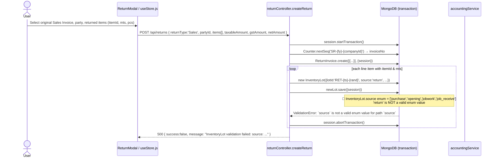
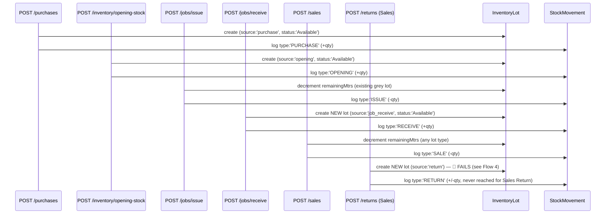
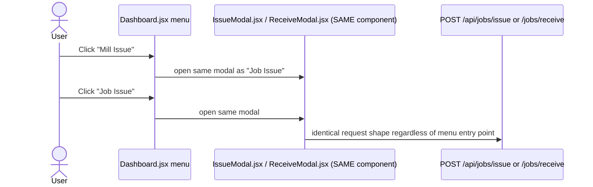
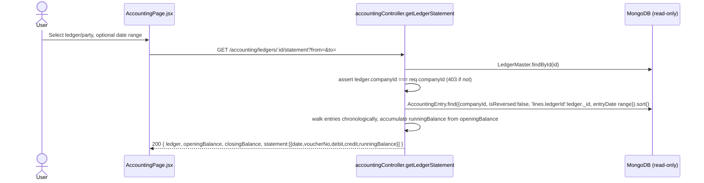
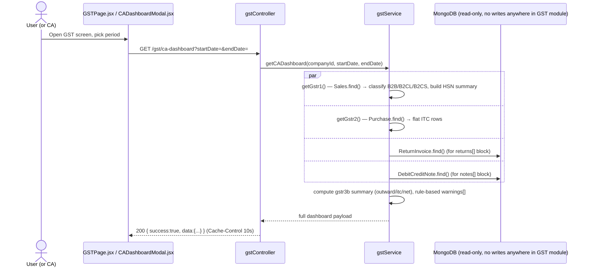
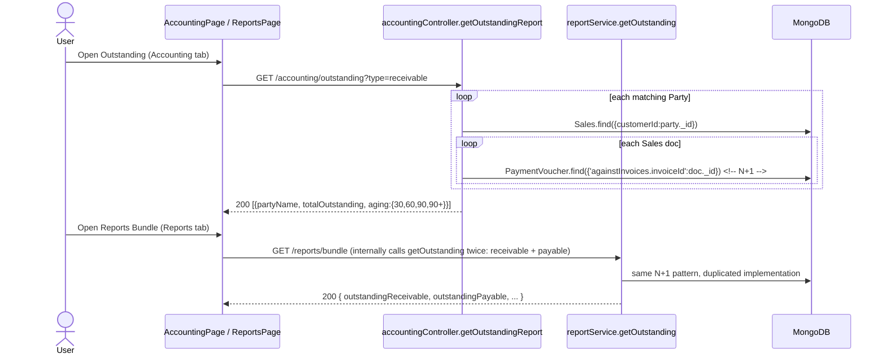
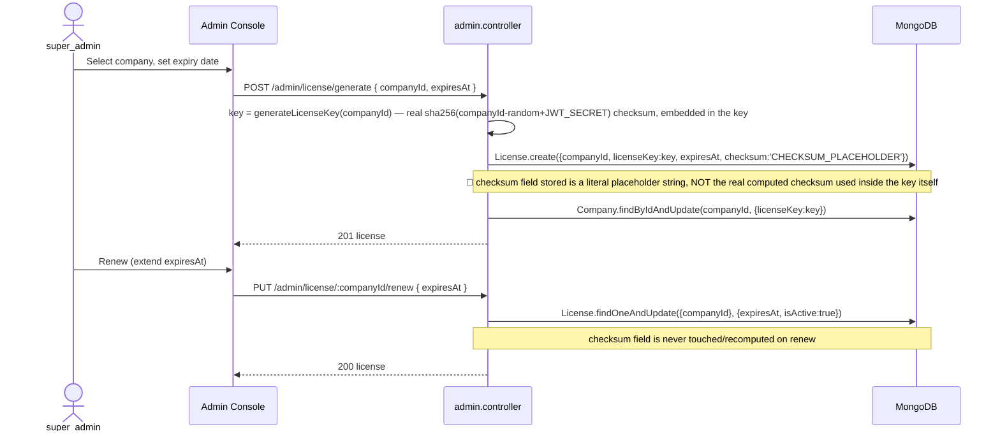
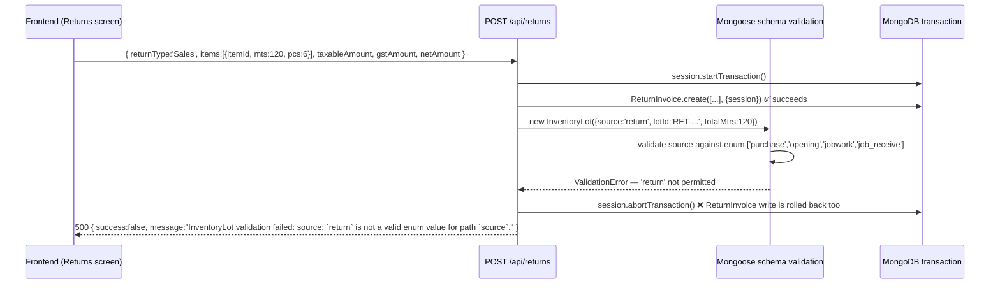

# 08 — Business Flows (Sequence Diagrams, DB Impact, Failure Points)

Every flow below was traced end-to-end from the frontend action (`frontend/src/store/useStore.js` action or page component) through the Express route, controller, service, Mongoose model writes, and every downstream accounting/inventory/GST side effect. Mermaid `sequenceDiagram`s show the actual call order found in code, not an idealized design. **Failure Points** sections list what breaks, silently or loudly, and cite the exact file/line evidence.

---

## 1. Purchase Bill (grey/finished/yarn goods inward)

**Entry point:** `PurchaseModal.jsx` → `useStore.createPurchase()` → `POST /api/purchases`.

```mermaid
sequenceDiagram
    actor U as User (Purchase Screen)
    participant FE as PurchaseModal.jsx / useStore.js
    participant API as purchaseController.createPurchase
    participant SVC as purchaseService.createPurchase
    participant DB as MongoDB (session/transaction)
    participant ACC as accountingService.onPurchaseBillPost

    U->>FE: Fill supplier, items, taxable/GST/net amounts
    FE->>API: POST /api/purchases { items[], taxableAmount, cgst, sgst, igst, netAmount }
    API->>API: req.body.companyId = req.companyId (server-trusted tenant)
    API->>SVC: createPurchase(purchaseData)
    SVC->>DB: session.startTransaction()
    SVC->>DB: Counter.nextSeq('PUR-{companyId}') → invoiceNo
    SVC->>DB: new Purchase(...).save({session})
    loop each line item
        SVC->>SVC: generate lotId = LOT-{timestamp}-{rand4}
        SVC->>DB: new InventoryLot({source:'purchase', totalMtrs, remainingMtrs}).save({session})
        SVC->>DB: new StockMovement({type:'PURCHASE', qtyMtrs:+mts}).save({session})
    end
    SVC->>ACC: onPurchaseBillPost(purchase, session)
    ACC->>DB: getOrCreatePartyLedger(supplierId) — Assets/Liabilities ledger
    ACC->>DB: getSystemLedger('Purchase A/c'), CGST/SGST/IGST Input
    ACC->>DB: AccountingEntry.create([{Dr Purchase, Dr CGST/SGST/IGST Input, Cr Supplier}], {session})
    ACC-->>SVC: entry
    SVC->>DB: purchase.accountingEntryId = entry._id; save({session})
    SVC->>DB: session.commitTransaction()
    SVC-->>API: purchase
    API->>API: auditService.log('CREATE_BILL', ...)
    API-->>FE: 201 { success:true, data: purchase }
```

**DB writes (all inside one Mongo transaction):** `Purchase` (1), `InventoryLot` (N = line-item count), `StockMovement` (N), `AccountingEntry` (1, 3–5 lines depending on CGST+SGST vs IGST).
**DB reads:** `Counter` (atomic `$inc`), `LedgerMaster` (party + 4 system ledgers, auto-created if missing).

**Accounting impact:** `Dr Purchase A/c (taxable) + Dr CGST/SGST/IGST Input (tax) = Cr Supplier Ledger (net)`. Increases ITC available (Assets side).
**Inventory impact:** One new `Available` lot per line item; grey/yarn/finished stock increases by `pcs`/`mts`.
**GST impact:** Feeds `GET /api/gst/gstr2` (purchase register) directly; ITC totals in the CA Dashboard's `gstr3b.itc` block increase.

**Failure points:**
- No server-side recomputation of `taxableAmount`/GST split from line items — a manipulated client payload posts whatever totals it sent (`07-API-AUDIT.md` API-8).
- `lotId` collision is only caught by the DB's unique index, not pre-checked — a collision aborts the whole transaction with a raw Mongo error.
- Accounting posting is (correctly, per an explicit "FIXED" comment) **inside** the transaction — a GST-ledger failure now rolls back the entire bill, unlike the older pre-fix behavior where postings were silent and independent.
- Editing a saved bill (`PUT /api/purchases/:id`) is called by the FE but does not exist as a route — see `07-API-AUDIT.md` API-1. Cancelling (`DELETE`) posts a reversal entry but never reverses the `InventoryLot`/`StockMovement` records it created.

---

## 2. Purchase Return (goods sent back to supplier)

**Entry point:** Returns screen → `useStore.createReturn({returnType:'Purchase', ...})` → `POST /api/returns`.

```mermaid
sequenceDiagram
    actor U as User
    participant FE as ReturnModal / useStore.js
    participant API as returnController.createReturn
    participant DB as MongoDB (transaction)
    participant ACC as accountingService

    U->>FE: Select original Purchase, party, items, taxable/GST/net
    FE->>API: POST /api/returns { returnType:'Purchase', partyId, items[{lotId,mts,pcs}], taxableAmount, gstAmount, netAmount }
    API->>DB: session.startTransaction()
    API->>DB: Counter.nextSeq('PR-{fy}-{companyId}') → invoiceNo
    API->>DB: ReturnInvoice.create([{...}], {session})
    loop each line item with lotId & mts
        API->>DB: InventoryLot.findOne({_id:lotId, companyId}).session
        API->>DB: lot.remainingMtrs -= mts; lot.status recompute; save({session})
        API->>DB: StockMovement.create({type:'RETURN', qtyMtrs:-mts}, {session})
    end
    API->>ACC: getOrCreatePartyLedger, getSystemLedger('Purchase A/c'), CGST/SGST Input
    API->>DB: AccountingEntry.create([{Dr Party, Cr Purchase A/c, Cr CGST/SGST Input}], {session})
    API->>DB: session.commitTransaction()
    API-->>FE: 201 { success:true, data: returnInvoice }
```

**DB writes:** `ReturnInvoice` (1), `InventoryLot` (updated in place — not new), `StockMovement` (1 per item), `AccountingEntry` (1).
**Accounting impact:** `Dr Supplier (net) = Cr Purchase A/c (taxable) + Cr CGST/SGST Input (tax reversal)` — reduces ITC previously claimed. **Uses `Purchase A/c` directly, not a dedicated `Purchase Return A/c`** even though `Purchase Return A/c` exists as a seeded system ledger (`accountingService.js:25`) — see `10-ACCOUNTING-AUDIT.md`.
**Inventory impact:** Reduces the *original* lot's `remainingMtrs`/`remainingPcs` (correct — goods leave inventory back to the supplier).
**GST impact:** Feeds the CA Dashboard's `returns[]`/`returnGst` block, but **not** the actual GSTR-1/GSTR-2 JSON structures (no CDNR section — see `11-GST-AUDIT.md`).

**Failure points:**
- **Always posts CGST+SGST 50/50**, regardless of whether the original purchase was IGST (inter-state) — `const halfGst = gstAmt/2` with no inter-state branch (`returnController.js:152-157`). An inter-state purchase return will incorrectly reverse CGST+SGST Input instead of IGST Input, leaving the real IGST ITC un-reversed and fabricating a CGST/SGST Input reversal that was never claimed in the first place.
- If `item.lotId` does not resolve to an existing lot, the loop silently `continue`s — the return is still recorded and accounted for, but with **no stock movement at all** for that line, an untraceable discrepancy between the return document and the stock ledger.

---

## 3. Sales Invoice (grey/finished/yarn goods outward)

**Entry point:** `SalesModal.jsx` → `useStore.createInvoice()` → `POST /api/sales`.

```mermaid
sequenceDiagram
    actor U as User (Sales Screen)
    participant FE as SalesModal.jsx / useStore.js
    participant API as salesController.createInvoice
    participant SVC as salesService.createInvoice
    participant DB as MongoDB (transaction)
    participant ACC as accountingService.onSalesInvoicePost

    U->>FE: Select customer, lot-linked items, rate, GST type (manual dropdown)
    FE->>API: POST /api/sales { items[{itemId,lotId,mts,pcs,rate}], taxableAmount, gstType, cgst/sgst/igst, netAmount }
    API->>SVC: createInvoice(salesData)
    SVC->>DB: session.startTransaction()
    SVC->>DB: Counter.nextSeq('INV-{companyId}') → invoiceNo
    SVC->>DB: new Sales(...).save({session})
    loop each line item WITH lotId
        SVC->>DB: InventoryLot.findOne({_id:lotId, companyId}).session
        alt remainingMtrs < item.mts
            SVC-->>API: throw "Insufficient stock in Lot ..." → 400, transaction aborted
        else stock sufficient
            SVC->>DB: lot.remainingMtrs -= mts; status recompute; save({session})
            SVC->>DB: StockMovement.create({type:'SALE', qtyMtrs:-mts}, {session})
        end
    end
    note over SVC: line items WITHOUT lotId skip stock validation entirely
    SVC->>ACC: onSalesInvoicePost(sales, session)
    ACC->>DB: getOrCreatePartyLedger(customerId) — Assets/Sundry Debtors
    ACC->>DB: getSystemLedger('Sales A/c'), CGST/SGST/IGST Output
    ACC->>DB: AccountingEntry.create([{Dr Customer(net), Cr Sales(taxable), Cr CGST/SGST/IGST Output}], {session})
    SVC->>DB: sales.accountingEntryId = entry._id; save({session})
    SVC->>DB: session.commitTransaction()
    SVC-->>API: sales
    API-->>FE: 201 { success:true, data: sales }
```

**DB writes:** `Sales` (1), `InventoryLot` (updated per lot-linked line), `StockMovement` (1 per lot-linked line), `AccountingEntry` (1).
**Accounting impact:** `Dr Customer (net receivable) = Cr Sales A/c (taxable revenue) + Cr CGST/SGST/IGST Output (tax liability)`.
**Inventory impact:** Decreases lot `remainingMtrs`/`remainingPcs`; auto-closes a lot when it hits zero.
**GST impact:** Feeds `GET /api/gst/gstr1` directly (B2B/B2CL/B2CS classification by customer GSTIN presence and value threshold, plus HSN summary).

**Failure points:**
- **Inter-state determination is a manual UI dropdown** (`type: 'INVOICE IN STATE' / 'INVOICE OUT OF STATE'` set by the operator in `SalesModal.jsx`), not computed by comparing `Party.gstin`/`stateCode` against `CompanySettings.gstin`/`state` — a keying mistake posts the wrong CGST+SGST vs. IGST split with no system safeguard (see `11-GST-AUDIT.md`).
- Line items lacking `lotId` bypass the stock check completely, permitting a sale to be recorded with no verifiable inventory backing it.
- No `Party.creditLimit` check before allowing a sale — a customer can be invoiced past their configured credit limit with no warning.
- Editing a saved invoice (`PUT /api/sales/:id`) is called by the FE but the route does not exist — `07-API-AUDIT.md` API-1.
- Cancelling (`DELETE`) explicitly does **not** restore stock (by design, per code comment) — only a subsequent Sales Return restores it, and Sales Return is itself broken (see Flow 4).

---

## 4. Sales Return (goods received back from customer) — 🔴 CONFIRMED BROKEN

**Entry point:** Returns screen → `useStore.createReturn({returnType:'Sales', ...})` → `POST /api/returns`.



**DB writes attempted (all rolled back):** `ReturnInvoice`, `InventoryLot`, `StockMovement`, `AccountingEntry` — **none persist**, because the transaction aborts as soon as Mongoose validates the new `InventoryLot` document (validation runs on `.save()`, before the write is sent to the server, but still inside the open session/transaction, so the abort cascades to every prior write in the same `session`).

**Accounting impact intended (never reached):** `Dr Sales A/c (taxable reversal) + Dr CGST/SGST Output (tax reversal) = Cr Customer (net credit)`. Also always splits GST 50/50 CGST/SGST even for an inter-state original sale (same bug class as Purchase Return, Flow 2).
**Inventory impact intended (never reached):** Restore returned goods to a new `Available` lot.
**GST impact:** None — the operation never completes, so nothing reaches GSTR-1/CA Dashboard either.

**Failure points (this IS the failure — cited fact, root-caused):**
- `InventoryLot.source` schema (`backend/models/InventoryLot.js`) omits `'return'` from its enum. `returnController.js:64` unconditionally sets `source: 'return'` for every Sales Return line item that has both `itemId` and `mts` — i.e. every realistic Sales Return.
- **Every Sales Return with real item quantities fails with a 500 error and rolls back completely.** The customer's returned goods are never recorded as stock, the customer's account is never credited, and GST is never adjusted. This is a **launch blocker** for any tenant doing sales returns (near-universal in textile trading — quality claims, short-length rejections, wrong-shade rejections).
- Purchase Return (Flow 2) is unaffected because it only *updates* an existing lot and never constructs a new `InventoryLot` document.
- **One-line fix:** add `'return'` to the `source` enum in `InventoryLot.js`. Documented as the top item in the launch-blocker triage.

---

## 5. Inventory / Lot Lifecycle (cross-cutting model, not a single endpoint)

Every lot-affecting flow funnels through the same two collections: `InventoryLot` (current balance per lot) and `StockMovement` (immutable audit trail per lot). This diagram shows the full lifecycle a single lot can pass through.



**Lot `status` state machine** (derived, not stored as an explicit FSM): `Available` → `Partially Used` (once `0 < remaining < total`) → `Closed` (once `remaining <= 0`). Computed inline on every write (`lot.status = lot.remainingMtrs <= 0 ? 'Closed' : 'Partially Used'`) — there is no single shared helper function; the same three-line ternary is duplicated in `salesService.js`, `jobService.js`, and `returnController.js`, so a future change to the status-derivation rule requires editing 3+ places.

**Failure points:**
- No lot **reservation**/locking mechanism — two concurrent Sales requests against the same lot with combined quantity exceeding `remainingMtrs` are only protected by whichever request's `save()` commits its transaction first; the second request re-reads inside its own transaction and should correctly see the updated `remainingMtrs` (Mongo transactions provide snapshot isolation), so this is **not** a race condition in practice, but there is no optimistic-concurrency version check either — silent serialization relies entirely on transaction semantics being used correctly everywhere (they are, for Sales/Purchase/Job — but **not** for the Sales Return path once/if the enum bug is fixed, since that path is also transactional).
- `InventoryLot` has no `rate`/cost field on the schema — `reportService.getStockReport()`'s `value = remainingMtrs * (l.rate || 0)` is therefore always `0` (see `07-API-AUDIT.md` section 11.4) — **stock valuation reporting is non-functional**, a material gap for any balance-sheet-grade inventory valuation.
- Deleting an `Item` (`DELETE /api/items/:id`) does not check for referencing `InventoryLot` documents — historical lots retain a dangling `itemId`.

---

## 6. Job Work — Issue (grey goods sent to a process house / job worker)

**Entry point:** `IssueModal.jsx` → `useStore.issueToJob()` → `POST /api/jobs/issue`. UI labels this action **"Job Issue"** or **"Mill Issue"** interchangeably (see Flow 8).

```mermaid
sequenceDiagram
    actor U as User
    participant FE as IssueModal.jsx / useStore.js
    participant API as jobController.issueToJob
    participant SVC as jobService.issueToJob
    participant DB as MongoDB (transaction)

    U->>FE: Select source lot, job worker (Party type='Job Worker'), process type, issueQty
    FE->>API: POST /api/jobs/issue { lotId, workerId, processType, issueQty, issuePcs }
    API->>SVC: issueToJob(issueData)
    SVC->>DB: session.startTransaction()
    SVC->>DB: Counter.nextSeq('JC-{companyId}') → jobCardNo
    SVC->>DB: InventoryLot.findOne({_id:lotId, companyId}).session
    alt lot.remainingMtrs < issueQty
        SVC-->>API: throw "Insufficient stock." → 400, abort
    else sufficient
        SVC->>DB: new Job({status:'Issued', jobCardNo, lotId, workerId, processType, issueQty}).save({session})
        SVC->>DB: lot.remainingMtrs -= issueQty; status recompute; save({session})
        SVC->>DB: StockMovement.create({type:'ISSUE', qtyMtrs:-issueQty}, {session})
    end
    SVC->>DB: session.commitTransaction()
    SVC-->>API: job
    API-->>FE: 201 { success:true, data: job }
```

**DB writes:** `Job` (1), `InventoryLot` (updated), `StockMovement` (1).
**Accounting impact:** **None at issue time** — correct, since job-work issue is an internal stock transfer (grey goods still owned by the company), not an expense or a taxable outward supply. (Job-work delivery challans under GST rules are non-supply movements — the absence of a tax posting here is *domain-correct*, unlike some other gaps in this codebase.)
**Inventory impact:** Source lot depletes; no new lot is created yet (the goods are "in transit/in process" with no dedicated `InventoryLot.status` value to represent that — see `09-TEXTILE-DOMAIN.md`).
**GST impact:** None directly, though a real deployment would need a Delivery Challan / E-way Bill reference for goods-sent-on-job-work, which this schema does not capture (`Job` has no `challanNo`/`ewayBillNo` fields, unlike `Sales`/`Purchase`, which do have `challanNo`/`eway`).

**Failure points:**
- `processType` is a free-text string on the `Job` schema with **no master-data backing at all**. `SubMaster.SUB_MASTER_TYPES` (`backend/models/SubMaster.js:3-17`) defines `AccountGroup, AccountHead, BookType, ItemGroup, Unit, ItemTaxSlab, City, Transport, Type, OtherMaster, Color, Design, HSN` — there is no `ProcessType` (or equivalent) entry in this list, and the generic `Type` entry is not cross-referenced from `Job.processType` anywhere in `jobService.js`/`jobController.js`. Every job card's process name ("Dyeing", "Printing", "Sizing", "Bleaching"...) is manually typed with zero standardization, making any "processing cost by process type" report unreliable due to spelling/casing drift.
- No delivery-challan/e-way-bill capture on the `Job` schema — a compliance gap for job-work movements above the e-way-bill threshold.

---

## 7. Job Work — Receive (finished/processed goods returned from job worker)

**Entry point:** Receive screen → `useStore.receiveFromJob()` → `POST /api/jobs/receive`.

```mermaid
sequenceDiagram
    actor U as User
    participant FE as ReceiveModal / useStore.js
    participant API as jobController.receiveFromJob
    participant SVC as jobService.receiveFromJob
    participant DB as MongoDB (transaction)
    participant ACC as accountingService (OUTSIDE transaction)

    U->>FE: Select Job, enter receivedQty, receivedPcs, wastage, charges, gstAmount
    FE->>API: POST /api/jobs/receive { jobId, receivedQty, receivedPcs, wastage, charges, gstAmount }
    API->>SVC: receiveFromJob(receiveData)
    SVC->>DB: session.startTransaction()
    SVC->>DB: Job.findOne({_id:jobId, companyId}).session
    alt job.status === 'Received'
        SVC-->>API: throw "already received" → 400, abort
    end
    SVC->>DB: InventoryLot.findById(job.lotId).populate('purchaseId').session
    SVC->>SVC: costPerMeter = purchaseId.taxableAmount / originalLot.totalMtrs (fallback 100)
    SVC->>DB: job.receivedQty/receivedPcs/wastage/status='Received'; save({session})
    SVC->>DB: new InventoryLot({source:'job_receive', lotId:'{orig}-FIN-{ts}', status:'Available'}).save({session})
    SVC->>DB: StockMovement.create({type:'RECEIVE', qtyMtrs:+receivedQty}, {session})
    SVC->>DB: session.commitTransaction()  <!-- stock side COMMITS here -->
    SVC->>ACC: onJobWorkChargesPost({millId:workerId, charges, gstAmount}) — try/catch, NOT in the same transaction
    ACC->>DB: compare Party.gstin state-code vs CompanySettings.gstin state-code → real inter-state detection
    ACC->>DB: AccountingEntry.create({Dr Job Work Charges, Dr CGST/SGST or IGST Input, Cr Job Worker})
    opt wastage > 0
        SVC->>ACC: onAbnormalWastagePost(companyId, wastage, costPerMeter, job._id)
        ACC->>DB: AccountingEntry.create({Dr Production Loss A/c, Cr Stock A/c})
    end
    SVC-->>API: { job, newLot }
    API-->>FE: 200 { success:true, data:{job,newLot} }
```

**DB writes:** `Job` (updated), `InventoryLot` (1 new finished lot), `StockMovement` (1), `AccountingEntry` (0–2, **posted after the transaction commits**).
**Accounting impact:** `Dr Job Work Charges + Dr CGST/SGST/IGST Input = Cr Job Worker (payable)`. If `wastage > 0`: `Dr Production Loss A/c = Cr Stock A/c` (valued at the real per-meter cost derived from the original purchase, not a hardcoded rate — a genuine fix evidenced by the code comment `FIXED: Calculate cost per meter from actual purchase data`).
**Inventory impact:** A brand-new finished/processed lot is created; the original grey lot is not touched further here (it was already debited at Issue time).
**GST impact:** Correctly splits CGST+SGST vs IGST by comparing the job worker's and company's GSTIN state codes — **the only place in the codebase that performs a real GSTIN-based inter-state check** rather than a manual dropdown.

**Failure points:**
- **The accounting posting explicitly happens outside the DB transaction** (`jobService.js:120-140`, wrapped in its own try/catch that only `console.error`s on failure) — this directly contradicts the "FIXED: posting moved inside transaction" pattern applied to Sales and Purchase. A Job Receive can fully succeed (job marked `Received`, finished lot created, stock movement logged) while its accounting entry silently fails to post, with no rollback and no user-facing error. This is an **inconsistency/regression** relative to the rest of the codebase's own stated fix pattern.
- `PUT /api/jobs/process` (a separate, simpler endpoint) can also set `status: 'Received'` directly, **completely bypassing** this entire cost-calculation/lot-creation/accounting flow — if any UI path calls the wrong endpoint, a job can be marked received with no finished lot and no accounting impact at all.
- `costPerMeter` falls back to a hardcoded `100` if the original lot has no linked `purchaseId` (e.g. the source lot came from Opening Stock or a prior Job Receive rather than a Purchase) — wastage valuation for such chains reverts to a meaningless constant.

---

## 8. "Mill Issue / Mill Receive" — UI alias, not a distinct backend flow

`backend/config/defaultConfigs.js` seeds sub-menu labels `Mill Issue` and `Mill Receive` under the `jobWork` module (alongside `Job Issue`/`Job Receive`), and `Dashboard.jsx`'s menu wires **"Mill Issue"/"Mill Receive" to open the exact same `IssueModal`/`ReceiveModal` components** that back "Job Issue"/"Job Receive". There is no `Mill` model, no `millId` field distinct from `Job.workerId`, and no backend route named `/mill/*` anywhere in `backend/routes/`.



**Implication for domain fidelity (see `09-TEXTILE-DOMAIN.md`):** Real textile trading distinguishes an in-house **process house / mill** (often a captive or long-term-contracted facility, sometimes with a running account and rate contract) from an ad-hoc **external job worker**. This codebase models both identically as a `Party` with `type: 'Job Worker'` routed through one `Job` schema — there is no way to report "Mill-wise processing cost" separately from "Job-worker-wise processing cost" because the underlying data has no field to distinguish them; only the party's display name differs.

---

## 9. "Production" — UI label, not a modeled workflow

No `Production` model, controller, service, or route exists anywhere in `backend/`. Any "Production" menu entry found in the frontend (`Dashboard.jsx` menu configuration referencing production-related labels) resolves to the same Job Issue/Receive modals described in Flows 6–8. There is no dedicated:
- Work order / production order entity distinct from `Order` (which itself only models Sales/Purchase orders, not shop-floor production orders).
- Multi-stage process routing (e.g. Grey → Dyeing → Printing → Finishing as a chain of linked job cards) — each `Job` document is a single issue→receive pair with no `previousJobId`/`nextJobId` linkage; chaining multiple processes on the same lot requires the operator to manually track which finished lot from Job A becomes the input to Job B, with no system-enforced traceability chain.
- Production planning, capacity, or BOM (bill of materials / recipe for blended yarns, etc.).

This is documented in full in `09-TEXTILE-DOMAIN.md`; noted here because the user-facing menu implies a "Production" module exists as a first-class concept when it does not.

---

## 10. Accounting — Payment / Receipt / Journal

**Entry points:** `AccountingForms.jsx` → `useStore.createPaymentVoucher()` / `createReceiptVoucher()` / `createJournalEntry()` → `POST /api/accounting/payments|receipts|journal`.

```mermaid
sequenceDiagram
    actor U as User
    participant FE as AccountingForms.jsx
    participant API as accountingController
    participant DB as MongoDB (transaction, payments/receipts only)

    U->>FE: Enter party, amount, payment mode(s)/splits, against-invoices[]
    FE->>API: POST /api/accounting/payments { partyLedgerId, amount, paymentSplits[], bankLedgerId, status, againstInvoices[] }
    API->>API: checkPeriodLocked(companyId, date)
    API->>API: normalizePaymentDetails(body) — validate split totals, mode-specific reference requirements
    API->>DB: getOrCreatePartyLedger / LedgerMaster.findById(bankLedgerId)
    API->>DB: new PaymentVoucher({...}) constructed
    alt status === 'Posted'
        API->>DB: AccountingEntry.create([{Dr Party, Cr Bank}], {session})
        loop each againstInvoices[] entry
            API->>DB: Sales.findOne(invoiceId) → update paidAmount/status, OR
            API->>DB: Purchase.findOne(invoiceId) → update paidAmount/status
        end
    else status === 'Draft'
        Note over API: no AccountingEntry, no paidAmount update — dead-end record, no "post later" endpoint exists
    end
    API->>DB: voucher.save({session}); session.commitTransaction()
    API-->>FE: 201 { success:true, data: voucher }
```

**DB writes (Posted path):** `PaymentVoucher` (1), `AccountingEntry` (1, 2 lines), `Sales`/`Purchase` (0..N, `paidAmount`/`status` patched).
**Accounting impact:** Payment → `Dr Party, Cr Bank`. Receipt → `Dr Bank, Cr Party`. Journal → whatever the operator manually keys, validated only by the schema's `pre('validate')` Dr=Cr balance hook.
**Failure points:**
- No endpoint to transition a `Draft` voucher to `Posted` after creation — Drafts are permanent dead-ends (`07-API-AUDIT.md` 8.4).
- `POST /api/accounting/journal` has **no `checkPeriodLocked` call** — a locked accounting period can be bypassed via a manual journal entry, defeating the purpose of period locking (`07-API-AUDIT.md` 8.11).
- `againstInvoices[]` reconciliation tries `Sales` first, then `Purchase`, assuming no ID collision (safe, since Mongo `ObjectId`s are globally unique) but the logic itself performs 1 extra DB round-trip per invoice inside a loop (N+1 pattern) for every voucher with multiple invoice allocations.

---

## 11. Ledger Statement (party account view)

**Entry point:** `AccountingPage.jsx` → `useStore.getLedgerStatement()` → `GET /api/accounting/ledgers/:id/statement`.



**Reads only** — no writes. Correct per-tenant isolation (explicit 403 check, one of the few controllers with an inline ownership assertion beyond the query filter). **Failure point:** if a single `AccountingEntry` contains the same `ledgerId` on both a Dr line and a Cr line, only the *first* matching line is reflected — a rare but real under/over-statement risk for hand-crafted journal entries.

---

## 12. GST — GSTR-1 / GSTR-2 / CA Dashboard

**Entry point:** `GSTPage.jsx` / `CADashboardModal.jsx` → `useStore.fetchGstr1/2/CADashboard()` → `GET /api/gst/gstr1|gstr2|ca-dashboard`.



**No DB writes in the entire GST module** — everything is derived read-only from `Sales`/`Purchase`/`ReturnInvoice`/`DebitCreditNote`. This means GST reporting is only as correct as the underlying transaction data, and any bug in Sales/Purchase/Return/Note posting (Flows 3, 4, 10) propagates directly into GSTR-1/2/3B figures with no independent reconciliation layer.

**Failure points (see `11-GST-AUDIT.md` for full detail):** hardcoded `hash: 'hash'`; default HSN `'5208'` when an item has none; b2cs summary rate hardcoded to `5`; GSTR-2 is a flat array, not ITC-categorized; GSTR-3B exists only inside this dashboard aggregation, not as its own filing artifact; `noteGst` is always `0` (missing schema field); the frontend's GSTR-2B Matching modal and "File Return" action are **entirely simulated** (`setTimeout` + `index % 3` fake reconciliation, no real GSTN API call anywhere in the codebase).

---

## 13. Outstanding / Aging (Receivables & Payables)

**Entry point:** Two independent call paths exist for the same business concept:



**Two independently-maintained implementations** of the same aging calculation exist (`accountingController.getOutstandingReport` and `reportService.getOutstanding`), with slightly different output shapes (the report-service version additionally returns a per-invoice breakdown array). Both share the same N+1 query pattern (`07-API-AUDIT.md` section 8.10/11.1) and could silently drift in business logic if one is bug-fixed without the other.

**Failure points:** Neither implementation nets a party's receivable against their payable when a `Party.type === 'Both'` (a customer who is also a supplier) — the two aging reports for such a party are computed and displayed entirely independently with no consolidated net-exposure figure.

---

## 14. Subscription / Tenant Registration (SaaS signup)

**Entry point:** `SignupPage.jsx` → `POST /api/auth/register` (public, no auth).

```mermaid
sequenceDiagram
    actor U as New Tenant Owner
    participant FE as SignupPage.jsx
    participant API as auth.controller.register
    participant SVC as auth.service.register
    participant DB as MongoDB (NO transaction wrapping this whole sequence)

    U->>FE: name, email, password, companyName
    FE->>API: POST /api/auth/register
    API->>SVC: register(name,email,password,companyName)
    SVC->>DB: Plan.findOne({name:'Basic'}) or create it
    SVC->>DB: new User({role:'user', companyRole:'owner'}).save()
    SVC->>DB: new Company({ownerId, planId}).save()
    SVC->>SVC: accountingService.seedSystemLedgers(companyId) — best-effort, errors only logged
    SVC->>DB: user.companyId = company._id; user.save()
    SVC->>DB: Subscription.create({status:'active', endDate:+30d, billingCycle:'monthly'})
    SVC->>SVC: licenseKey = generateLicenseKey(companyId); checksum = sha256(companyId-TRIAL+JWT_SECRET)
    SVC->>DB: License.create({licenseKey, expiresAt:+30d, isActive:true, checksum})
    SVC->>DB: Company.findByIdAndUpdate(companyId, {licenseKey})
    SVC->>SVC: configService.seedCompanyDefaults(companyId, userId) — moduleConfig, settings, forms, bills, columns, flags, notifications, reports, permissions
    SVC->>DB: CompanySettings.findOneAndUpdate({legalName: companyName})
    SVC->>SVC: token = jwt.sign({id,role,companyId}, JWT_SECRET, {expiresIn:'30d'})
    SVC-->>API: {token, user:{...}}
    API-->>FE: 201 { token, user }
```

**Failure points:**
- **No `mongoose.startSession()`/transaction wraps any of this** — nine sequential, independent writes. A crash or thrown error after `Company` is created but before `Subscription`/`License` exist leaves an **orphaned Company** that will fail `subscriptionMiddleware`'s checks on every subsequent request in a real (`NODE_ENV=production`) deployment, with no automated cleanup or retry — the owner is registered, has a token, but every protected API call returns 402/403 forever until a super_admin manually creates a Subscription/License via the Admin console (Flow 15) or the dev bypasses via `NODE_ENV=development`.
- `Subscription.status` is set to `'active'` immediately, not `'trial'`, even though the schema defines a `'trial'` enum value specifically for this scenario — the "trial" concept exists in the data model but is never actually used by the code path that creates trials.
- No email verification step — any email address, valid-looking or not, becomes an active company owner immediately.
- `accountingService.seedSystemLedgers` and `configService.seedCompanyDefaults` failures are logged but not surfaced to the client or retried — a company can end up missing system ledgers (breaking every subsequent Sales/Purchase posting with "ledger not found"-style errors) or missing dynamic config (falling back to `getActiveConfigBundle`'s self-healing re-seed on first `/api/config/active` call, which does work, but only for config, not for ledgers).

---

## 15. Admin — License Generate / Renew (super_admin manual intervention)

**Entry point:** `AdminDashboard`/company detail screen → `useAdminStore.generateLicense()` → `POST /api/admin/license/generate`; renew via `PUT /api/admin/license/:companyId/renew`.



**Failure points:**
- The license *key itself* (`generateLicenseKey()` in `backend/utils/license.js`) embeds a real, cryptographically-derived checksum (`sha256(companyId-random + JWT_SECRET)`, truncated to 4 hex chars) and has a matching `validateLicenseKey()` verifier — but **`subscriptionMiddleware` never calls `validateLicenseKey()` at all**; it only checks `license.isActive` and `new Date() > license.expiresAt`. The entire checksum/key-validation mechanism in `utils/license.js` is **dead code from the runtime's perspective** — a license's `licenseKey` string value has no bearing on whether requests succeed; only the `isActive`/`expiresAt` fields on the `License` document matter.
- The separate `License.checksum` **field** (distinct from the key's embedded checksum) is set to the literal string `'CHECKSUM_PLACEHOLDER'` by this admin endpoint (contrast with `authService.register()`'s self-service signup path, which computes a real `sha256(companyId-TRIAL+JWT_SECRET)` for this same field) — two license-creation code paths, two different (one broken) values for the same field, and the field is not read by any validation logic regardless.
- `JWT_SECRET` — the same secret used to sign every user's authentication token — doubles as the pepper for both the license-key checksum and the (unused) `License.checksum` field. Rotating `JWT_SECRET` (e.g. after a suspected token leak) silently invalidates every previously-issued license key's embedded checksum too, with no coordinated rotation plan. See `12-SECURITY-AUDIT.md` SEC-11 for the full write-up.

---

## 16. Returns — InventoryLot Enum Bug (root-cause deep-dive)

This is the same defect as Flow 4, isolated here as its own reference diagram because it is the single highest-severity functional bug found in this audit (a complete, silent failure of an entire customer-facing workflow).



**Root cause:** `backend/models/InventoryLot.js`:
```21:24:backend/models/InventoryLot.js
  source: {
    type: String,
    enum: ['purchase', 'opening', 'jobwork', 'job_receive'],
    default: 'purchase'
  },
```
`backend/controllers/returnController.js` (line 68) constructs the restocked lot with `source: 'return'`, a value absent from the enum above.

**Blast radius:** Any `POST /api/returns` call with `returnType: 'Sales'` and at least one item carrying both `itemId` and `mts` (i.e. any real sales return) fails completely — no `ReturnInvoice`, no stock restoration, no accounting entry, no GST adjustment. `returnType: 'Purchase'` is unaffected (it mutates an existing lot, never constructs a new one with this enum value).

**Recommended fix (one line):** `enum: ['purchase', 'opening', 'jobwork', 'job_receive', 'return']`.

**Why this matters for due diligence:** this bug would be caught by a single manual QA pass of the "process a sales return" happy path — its presence indicates the Returns feature has likely never been exercised end-to-end in a realistic test, despite being fully wired (route, controller, transactional logic, accounting posting, frontend modal) and appearing "done" from a code-review-only inspection. This is the strongest available evidence in this codebase that **shipped-looking code ≠ working code** here, and is the primary justification for the "Launch Ready? NO" verdict carried in `00-INDEX.md`.
