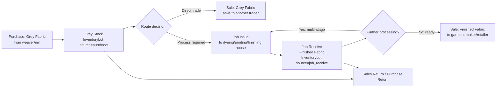

# 09 — Textile Domain Fidelity Audit

This document evaluates how faithfully the codebase models a **textile trading + job-work (grey → processed/finished fabric) business**, the domain the UI, field naming, and seeded masters explicitly target (`Item.category: 'Grey'|'Finished'|'Yarn'|'Others'`, `Party.type: 'Job Worker'`, `LOT-`/`JC-` numbering, `mts`/`pcs` units throughout). Findings are graded against how an experienced textile trader/mill accountant (Surat/Bhiwandi/Ichalkaranji-style grey & process trading, which the seeded defaults strongly resemble — Gujarat state code `'24'` default, `Party.stateName: 'Gujarat'` default) would expect the system to behave.

---

## 1. Domain vocabulary actually implemented

| Concept | Where implemented | Fidelity |
|---|---|---|
| Grey / Finished / Yarn / Others item categories | `Item.category` enum (`backend/models/Item.js:9-13`) | ✅ Correct top-level classification |
| Lot-wise stock (not just item-wise) | `InventoryLot` + `StockMovement` (`backend/models/InventoryLot.js`, `StockMovement.js`) | ✅ Core textile requirement — met. Every purchase/opening/job-receive/return creates a **traceable lot**, and every consuming transaction (sale, job issue) depletes a specific lot rather than a generic item-level counter. This is materially better than many low-end billing tools that only track item-level quantity. |
| Fold / Cut (grey fabric packing units) | `Sales.items[].fold`, `Sales.items[].cut`, `Purchase.items[].fold` (`Sales.js:66-67`, `Purchase.js:49,54`) | ⚠️ Fields exist and are marked `calculated: true` in `backend/config/defaultConfigs.js`'s bill-line-column config, but **no calculation formula is implemented anywhere in the backend** — `fold`/`cut` are plain `Number` fields with no derivation logic (e.g. standard trade convention: pieces × meters-per-fold = total meters is not computed server-side; it must be entered/computed entirely client-side, and the backend blindly trusts whatever number arrives). |
| Bale (packing unit for finished goods dispatch) | `Sales.baleNo` (string), `PricingRule`/`Plan.features.fields.sales.bale` (feature-gated field) | ⚠️ A single free-text `baleNo` field, not a proper bale/packing-list model (no bale-to-item/qty breakdown, no bale weight, no multi-bale-per-invoice structure). |
| Haste (delivery/collection term — common trade shorthand in Gujarat textile markets for "by hand"/direct collection vs. transport) | `Sales.haste` (free string, `Sales.js:34`) | ⚠️ Field exists, captured as free text, not used in any business logic (no effect on e-way bill applicability, no effect on transport charge calculation). |
| Transport / LR No / LR Date / Vehicle / E-way | `Sales.transport, lrNo, lrDate, eway`; `Purchase` has no equivalent transport block at all | ⚠️ **Asymmetric** — Sales captures basic transport/LR/e-way fields; Purchase captures none (no `lrNo`/`transport`/`eway` on `Purchase.js` at all), despite inbound goods movement being equally subject to e-way bill rules above the threshold. |
| Broker (dalal) on both Sales and Purchase | `Sales.brokerId`, `Purchase.brokerId` (`Party.type: 'Broker'`) | ✅ Correctly modeled as a `Party` reference, feature-gated per plan (`Plan.features.fields.purchase.broker`, `sales` equivalent implied by `Sales.brokerId` always present regardless of plan check at the schema level — the plan gate is UI-only, not schema-enforced). |
| Job Work (grey-to-process-house movement) | `Job` model, `/api/jobs/*` | ✅ Core concept modeled with issue/receive/wastage — see Section 3 for gaps. |
| Wastage / process loss | `Job.wastage`, `accountingService.onAbnormalWastagePost()` | ✅ Captured and costed at actual per-meter rate (Flow 7 in `08-BUSINESS-FLOWS.md`) — a genuinely accurate implementation of a real textile-accounting concept (abnormal loss valued and expensed, not silently absorbed into stock). |
| HSN / GST rate per item | `Item.hsnCode`, `Item.gstRate` (default `5`) | ✅ Present; default GST rate `5%` matches the common HSN 5208/5407/5515-family rate bracket for cotton/synthetic woven fabric under GST as of the relevant slabs — a reasonable domain default, though hardcoded rather than looked up from an HSN-rate master. |
| Fabric-specific descriptors: `fabricType`, `design`, `color`, `size` | `Item.js:14-29` | ✅ Present at the item-master level. |
| Denier / Count / Construction / GSM / Width (core textile spec fields for yarn and woven fabric) | **Not found anywhere** in `Item.js` or any sub-schema | ❌ **Missing.** A real grey/finished fabric or yarn item master in this domain is expected to carry at minimum: yarn count (e.g. "30s"), construction (e.g. "108x56"), width (e.g. "44\""/"58\""), and GSM/weight-per-meter for finished fabric, or denier for synthetic yarn. None of these exist as structured fields — only a free-text `design`/`fabricType` string is available, meaning no structured filtering/reporting by construction or count is possible (e.g. "show all lots of 30s cotton grey in stock" cannot be queried; only free-text search on `design`/`name` is possible). |
| Rolls/Thans as a distinct unit from generic `pcs` | Not modeled — `pcs` is a generic integer everywhere | ⚠️ Textile trade commonly distinguishes "pieces" (thans/rolls of fabric, each of variable length) from a simple piece count; `pcs` here is treated as a flat count with no per-piece-length breakdown (no `[{pcsLength: number}]` array), so a lot's `totalMtrs / totalPcs` average length is the only derivable figure — individual roll lengths within a lot are not tracked, which matters for grading/quality claims where specific rolls are identified by length. |

---

## 2. Grey → Finished Goods Lifecycle — how well is it actually modeled?

The textbook textile trading lifecycle this system should support:

**What is faithfully implemented:**
- A→B (Purchase creates a grey lot) — ✅ fully correct, transactional, lot-traced.
- B→D (direct grey sale) and B→E (issue to job worker) — ✅ both correctly deplete the same underlying lot pool by the same stock-movement mechanism.
- E→F (receive as a **new, independent lot**) — ✅ correctly modeled as new stock (finished goods are a different SKU-state from the grey input, even though the schema does not explicitly link "this finished lot came from that grey lot's fabric" beyond a soft `lotId`-derived naming convention `{origLot}-FIN-{timestamp}` in the generated `lotId` **string**, which is cosmetic, not a real foreign-key/lineage field).
- F→H (sale of finished goods) — ✅ same Sales flow as grey, correctly type-agnostic.

**What is missing or broken (the G→E multi-stage loop, and lineage):**
- ❌ **No formal lot lineage/genealogy.** `InventoryLot` has no `parentLotId`/`sourceLotId` field. The only trace connecting a finished lot back to its grey origin is the human-readable `lotId` string prefix (`{originalLot.lotId}-FIN-{timestamp}`) constructed in `jobService.js:94` — this is a display convenience, not a queryable relationship. A report answering "which grey purchase(s) ultimately produced this finished lot, and at what cumulative processing cost?" cannot be built from the current schema without string-parsing lot IDs, which breaks the moment a lot passes through **two or more** job-work stages (the `-FIN-` suffix is applied once; a second job-receive on an already-`-FIN-`-suffixed lot's output produces a doubly-suffixed, non-parseable ID with no clean genealogy at all).
- ❌ **No native multi-stage chaining.** Real textile processing is very commonly multi-stage (e.g. Grey → Bleaching → Dyeing → Printing → Finishing, at the same or different job workers). The system supports this only by the operator manually re-issuing the finished lot from stage N as the "source lot" for a fresh `POST /api/jobs/issue` at stage N+1 — which works mechanically (any `Available` lot, regardless of `source`, can be issued to a job) but with **no cumulative process-cost rollup, no stage-sequence enforcement, and no way to see "this lot has been through: Dyeing → Printing" as structured history** — only by manually reading through `StockMovement`/`Job` records and correlating lot IDs by hand.
- ⚠️ **No distinct "in-process" stock state.** Once goods are issued to a job worker, the source lot is simply depleted (`remainingMtrs -= issueQty`) — there is no `InventoryLot.status` value or dedicated ledger representing "goods currently at Job Worker X, in process" as a queryable stock bucket. A company cannot run a report of "how much grey fabric is currently out at job workers, and with whom" directly from `InventoryLot`; it would need to be reconstructed by diffing all `Issued`/`In-Process` (not yet `Received`) `Job` records against their `issueQty`, which is possible (the data exists on `Job` itself) but is not exposed as a first-class "stock at job worker" report anywhere in `reportService.js`.
- ❌ **No rate-contract / job-worker-wise standard rate master.** Real mills negotiate a per-meter (or per-kg) job-work rate per process type per job worker, often revised periodically. `jobService.receiveFromJob()` takes `charges` as a raw number typed in at receive time with no comparison against an expected/contracted rate — no over-rate warning, no rate-variance report.

---

## 3. Job Work Domain-Correctness Deep Dive

Building on `08-BUSINESS-FLOWS.md` Flows 6–9:

| Domain expectation | Implementation reality |
|---|---|
| Job Worker vs. Mill vs. in-house Process House should be distinguishable | **Not distinguishable** — all three are the same `Party.type: 'Job Worker'` record; "Mill Issue"/"Mill Receive" menu items are literal UI aliases for the identical Job Issue/Receive modals and API calls (`08-BUSINESS-FLOWS.md` Flow 8). |
| Delivery Challan (required by GST rules for job-work goods movement, non-supply) | **Missing entirely** — `Job` schema has no `challanNo`, `challanDate`, or `ewayBillNo` field (contrast: `Sales`/`Purchase` do have `challanNo`/`eway` fields for their own, different, invoice-adjacent purposes). A company using this system for job-work has no system-generated delivery challan document at all — a real compliance gap since job-work movement of goods above value/distance thresholds legally requires an e-way bill referencing a delivery challan, not a tax invoice. |
| Job Work Return (job worker returns unprocessed/rejected/short-processed goods without full completion) | **Not modeled as a distinct flow.** `Job.status` enum is `Issued | In-Process | Received | Cancelled` — there is no "Partially Received" or "Returned Unprocessed" outcome; a job worker returning less than the full issued quantity is only representable by recording `receivedQty < issueQty` inside a normal Receive, with the "missing" quantity implicitly and permanently absorbed as `wastage` on that same transaction (`wastage` is a client-supplied number with no validation that `issueQty - receivedQty - wastage ≈ 0`), conflating true process wastage (fabric shrinkage/loss during dyeing, an expected % of GSM) with "the job worker never gave the goods back" (a very different real-world event, often disputed/negotiated) into a single unvalidated field. |
| Job-work challan-based GST reconciliation (goods sent, not returned within the 1-year/3-year GST time limit becomes a deemed supply) | **Not tracked at all** — no aging/expiry check on `Job.status: 'Issued'`/`'In-Process'` records exists anywhere; a job card issued years ago and never received back generates no warning, no deemed-supply GST liability flag, nothing. |
| Rate/charge negotiation and job-worker running account | Job Worker's `Party` ledger accumulates `Cr` balances from `onJobWorkChargesPost()` like any supplier — functionally usable as a running account via the standard Ledger Statement (`GET /api/accounting/ledgers/:id/statement`), so this specific concern is **adequately met** by generic accounting infrastructure even without job-work-specific tooling. |

---

## 4. Party / Masters Domain Fidelity

- **`Party.type` enum:** `Customer | Supplier | Both | Broker | Job Worker` — covers the core relationship types. **Missing textile-trade-common relationship types:** *Commission Agent* (distinct from `Broker` in some regional conventions — often has a different accounting treatment, TDS applicability), *Transporter* as a `Party` (transport is instead a `SubMaster` type `'Transport'`, i.e. a plain name-only master with no address/GSTIN/contact fields, insufficient for issuing e-way bills which require the transporter's GSTIN/transporter ID), *CA/Auditor* (referenced conceptually by the "CA Dashboard" GST feature but never modeled as an actual party/user role with restricted access — the CA Dashboard is accessible to any authenticated user with the `gst` module enabled, not a dedicated CA login).
- **`accd` (account code)** — a legacy Tally-style running account-code field (`Party.accd`, auto-incremented from `1001`), a strong signal this system (or its data model) was ported from/inspired by a legacy DOS/desktop textile accounting package (the `accd`, `mainGroup`, `updateInAllFirm`, `updateInAllYear` fields are recognizable multi-firm/multi-year desktop ERP conventions, e.g. Busy/Tally-adjacent regional textile software) — carried forward but only partially wired: `updateInAllFirm`/`updateInAllYear` are stored strings (`'Y'`/`'N'`) with **no multi-firm or multi-year functionality anywhere in this codebase** (there is only one `Company` = one firm = one continuous ledger, no financial-year closing/carry-forward mechanism at all — see `10-ACCOUNTING-AUDIT.md`). These fields are vestigial schema baggage from whatever legacy system this was modeled after, not live features.
- **`msmeType`/`udyamAadhar`** on `Party` — correctly anticipates MSME-vendor payment-timeline compliance (Section 43B(h) of the Income Tax Act / MSME Development Act 45-day payment rule, highly relevant to textile trading where a large share of suppliers/job workers are MSME-registered) — **the field exists but is never read by any business logic**: no aging alert, no MSME-specific payment-due-date enforcement distinct from the generic `dueDays` field, no MSME-interest-liability calculation if payment exceeds 45 days. Captured but functionally inert.
- **`gstType: 'INVOICE (IN STATE)'`** default on `Party` (`Party.js:117`) — a per-party default that is **not actually consulted anywhere** in the live Sales/Purchase inter-state determination logic (which instead uses the manual per-invoice `type` dropdown, per `11-GST-AUDIT.md`) — another vestigial field.

---

## 5. Units of Measure

`Item.unit` defaults to `'MTRS'` (meters — correct primary unit for fabric) and is a free-text `String`, not an enum or `SubMaster`-linked reference, despite `SubMaster.SUB_MASTER_TYPES` including a dedicated `'Unit'` type expressly for this purpose (`backend/models/SubMaster.js:8`). **No conversion logic exists** between units (e.g. meters↔yards, which matters when trading with export-oriented buyers who often quote in yards, or kg↔meters for yarn priced by weight but consumed by length) — an item's `unit` is purely a display label with zero unit-conversion arithmetic anywhere in `itemService.js`, `salesService.js`, or `purchaseService.js`. All quantity math throughout the stack (`mts`, `remainingMtrs`, `totalMtrs`) hardcodes the *meters* assumption in variable naming itself, meaning a company genuinely trading in yards or kg would need to treat "meters" fields as an arbitrary unit label and manually ensure consistency — the system provides no help and no safety net if mixed units are entered across different lots of the same item.

---

## 6. GST/HSN Domain Accuracy (cross-reference to `11-GST-AUDIT.md`)

- Default GST rate `5%` and default HSN `'5208'` (woven cotton fabric ≥85% cotton by weight) are domain-plausible defaults for a Gujarat-based grey/cotton fabric trader, reinforcing that this codebase was built with a specific real-world segment in mind (cotton/blended woven grey & processed fabric trading, not synthetic filament yarn, garments, or made-ups, which would carry materially different HSN/rate profiles — e.g. many synthetic fabrics/MMF sit at 12% rather than 5%, and the system's blanket `5` default would misclassify those without the operator manually overriding every item).
- No **HSN-rate cross-validation** — an item can be saved with HSN `5208` (5% bracket) but `gstRate: 18` (or any value) with no warning; the two fields are fully independent, free-text-adjacent inputs with no lookup table enforcing the legally-correct rate for a given HSN code.

---

## 7. Overall Textile-Domain Verdict

| Area | Grade | Rationale |
|---|---|---|
| Lot-wise grey/finished stock tracking | **B+** | Genuinely solid — real lot depletion, real stock movements, transactional integrity on the happy paths. This is the strongest domain-fidelity asset in the codebase. |
| Job work (issue/receive/wastage/costing) | **B-** | Core mechanics work and wastage costing uses real per-meter cost (a detail many simpler systems get wrong) — but no delivery challan, no multi-stage lineage, no job-worker-vs-mill distinction, no return-of-unprocessed-goods flow. |
| Purchase/Sales trading fundamentals | **C+** (pulled down by the confirmed Sales Return bug and manual, error-prone inter-state GST determination) | Otherwise complete for a basic trading ERP: fold/cut/bale/broker/transport fields exist, though several are inert placeholders. |
| Item/fabric specification depth | **D** | No count/construction/GSM/denier/width structured fields — this is the single biggest gap preventing the system from being credible to a serious textile-industry buyer evaluating it against domain-specific competitors (e.g. dedicated textile ERPs that model yarn count and fabric construction as first-class, calculation-driving fields). |
| Multi-firm / multi-year handling | **F** | Vestigial fields (`updateInAllFirm`/`updateInAllYear`) imply the legacy system this was derived from supported it; this codebase does not, at all — no year-end close, no carry-forward, no multi-company consolidation (see `10-ACCOUNTING-AUDIT.md`). |
| Compliance-adjacent trade documents (challan, e-way for job-work) | **D** | Sales has basic transport/LR/e-way capture; Purchase and Job Work have essentially none. |

**Bottom line:** the system was clearly designed by someone with real exposure to how a grey-fabric-and-job-work trading business runs day-to-day (the lot model, wastage costing, and fold/cut/bale/haste vocabulary are not generic invented terms — they are accurate trade jargon), but the implementation stops short of the structured, calculation-driving specification depth (count/construction/GSM/denier) and the compliance-document rigor (challans, lot lineage, multi-year close) that would be required for this to credibly replace an established textile-industry desktop ERP for a serious mid-size trading house. It is best characterized as a **domain-aware billing + lot-stock system**, not yet a **domain-complete textile process ERP**.
