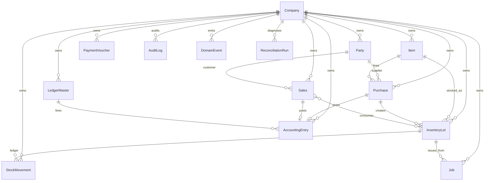

# Sprint 1.4 — Database Stabilization, Transaction Integrity & Data Consistency

**Version:** 1.0 · **Date:** 15 Jul 2026 · **Stage:** Foundation Stabilization  
**Constraint honored:** No UI redesign · No business algorithm rewrite · No feature invention · Frontend untouched  

---

## Verdict

| Metric | Score |
|---|---|
| Sprint Completion | **71 / 100** |
| Production Database Readiness | **69 / 100** |
| ACID coverage (core financial paths) | **82 / 100** |
| Index / unique coverage | **78 / 100** |
| Soft-delete / versioning adoption | **65 / 100** |
| Reconciliation engine | **75 / 100** |
| Audit / events foundation | **70 / 100** |
| Migration & backup strategy documented | **85 / 100** |

Full acceptance (“zero known mismatches forever”) is **not** claimed — legacy cancel-without-stock-restore and client-trusted GST amounts remain product/Stage-2+ work. Sprint 1.4 installs the **integrity platform** required before Stage 2 Business Engine.

---

## 1. Database Architecture Audit

### Hierarchy (target vs now)

```
Company
  └─ branchId / financialYearId (fields ready, optional — FY still derived in counters)
       └─ Masters (Party, Item, Book, LedgerMaster, SubMaster)
            └─ Transactions (Purchase, Sales, Return, Order, Note, Job, PaymentVoucher)
                 └─ Inventory (InventoryLot ← StockMovement append-only)
                 └─ Accounting (AccountingEntry double-entry)
                 └─ GST (derived from Sales/Purchase/Returns — not duplicate store)
                 └─ Reports (aggregation over source docs)
                 └─ Audit (AuditLog + DomainEvent + ReconciliationRun)
```

### Company isolation

| Layer | Status |
|---|---|
| JWT `req.companyId` + strip client spoofing | ✅ (Sprint 1.2 middleware) |
| Repositories require `companyId` | ✅ BaseRepository |
| Soft-delete find filter | ✅ enterprise plugin on core models |
| Aggregate auto-inject company + soft-delete | ✅ |

### Dual stacks (unchanged policy)

| Dead | Live |
|---|---|
| `LedgerEntry` + `/api/ledgers` (deprecated headers) | `AccountingEntry` + `LedgerMaster` |
| `Inventory` + `purchase.service.js` | `InventoryLot` + `purchaseService.js` |

---

## 2. Collection Relationship Diagram



---

## 3. Index Optimization Report

### Migration framework

| Artifact | Path |
|---|---|
| Runner | `backend/scripts/migrate.js` |
| Registry model | `backend/models/Migration.js` (`_migrations`) |
| Commands | `npm run migrate` / `npm run migrate:status` |
| Migrations | `001_core_indexes.js`, `002_sync_mongoose_indexes.js` |

### Key unique / compound indexes added

| Collection | Index | Purpose |
|---|---|---|
| parties | `(companyId, gstin)` partial unique | Duplicate GSTIN prevention |
| purchases | `(companyId, supplierId, supplierInvoiceNo)` partial unique | Duplicate supplier bills |
| purchases / sales | `(companyId, date, status)` | List/report |
| inventorylots | `(companyId, itemId, status)` | Stock queries |
| stockmovements | `(companyId, idempotencyKey)` partial unique | Retry safety |
| accountingentries | `(companyId, refId, voucherType)` | Traceability |
| books | `(companyId, code)` partial unique | Book codes |
| auditlogs | `(companyId, createdAt)` | Admin audit |
| visits / subscriptions / licenses | company-scoped | Scan prevention |
| items | `(companyId, hsnCode)` sparse | Search (not unique — shared HSN valid) |

**Data cleanup observed on migrate (test DB):** duplicate party GSTIN `24AAAAA0000A1Z5` blocked `uniq_company_gstin`; multiple parties with `accd: null` blocked sparse unique — use partial filters (`accd` / `gstin` non-empty) and dedupe before enforcing.

---

## 4. Transaction Flow Matrix

| Flow | Session? | Counter in session? | Inventory | StockMovement | Accounting | Rollback |
|---|---|---|---|---|---|---|
| Purchase create | ✅ | ✅ | Lot created | PURCHASE + idempotencyKey | `onPurchaseBillPost` | ✅ |
| Sales create | ✅ | ✅ | Lot decrement | SALE + key | `onSalesInvoicePost` | ✅ |
| Job issue | ✅ | ✅ | Lot decrement | ISSUE | — | ✅ |
| Job receive | ✅ | n/a | New finished lot | RECEIVE | Charges/wastage **inside** txn (if amounts > 0) | ✅ |
| Payment / Receipt | ✅ | ✅ | — | — | Entry + paidAmount | ✅ |
| Return | ✅ | ✅ | Restore/reduce | RETURN | Entry | ✅ |
| Purchase/Sales cancel | ✅ | ✅ for reversal no. | ⚠️ **stock not restored** (pre-existing) | — | Reversal entry | ✅ accounting |

### Critical fix this sprint

1. **`Counter.nextSeq(id, session)`** — sequences participate in the same Mongo transaction.  
2. **Job receive accounting** moved inside the transaction (no more silent commit with missing books).  
3. **Referential checks** on purchase/sales party + items before write.  
4. **StockMovement** append-only (updates blocked) + optional `idempotencyKey`.

---

## 5. Inventory Consistency Report

| Rule | Status |
|---|---|
| Lots created on purchase | ✅ |
| Movements required for trail | ✅ (purchase/sales/job/return/opening) |
| Movement history immutable | ✅ schema pre-hook |
| Negative remaining detection | ✅ reconciliation `NEG_STOCK` |
| Lot vs movement net drift | ✅ `LOT_MOVEMENT_DRIFT` |
| Cancel restores stock | ❌ still gap (use Sales/Purchase Return) |
| Manual remaining edits | Policy: services only; no admin editor added |

---

## 6. Accounting Integrity Report

| Rule | Status |
|---|---|
| Double-entry pre-validate | ✅ existing |
| Unbalanced entry detector | ✅ recon `UNBALANCED_JOURNAL` |
| Purchase/Sale missing posting | ✅ warning codes |
| Soft-delete on entries | ✅ plugin (cancel uses reversal, not delete) |
| Optimistic locking helper | ✅ `BaseRepository.updateWithVersion` |
| Derived TB / P&L / BS | ✅ still from AccountingEntry (no stored balances) |

---

## 7. GST Consistency Report

| Rule | Status |
|---|---|
| Input/Output from transactions | ✅ via invoice fields + gstService |
| Separate GST ledger documents | Not used (correct) |
| Component vs gstAmount check | ✅ recon |
| Server recompute on save | ❌ Stage 2/4 (client-trusted amounts remain) |

---

## 8. Referential Integrity Report

| Tool | Path |
|---|---|
| `assertExists` / `assertRefs` | `backend/utils/refIntegrity.js` |
| Wired into | `purchaseService.createPurchase`, `salesService.createInvoice` |

Broader wiring (returns, jobs, vouchers) is incremental — helper is reusable.

---

## 9. Audit Trail Report

| Store | Behavior |
|---|---|
| `AuditLog` | Indexed; immutable update/delete blocked; `reason`, `requestId` |
| `AuditService.log` / `logSystem` | Fail-open (never breaks money path) |
| `DomainEvent` | Append-only; written from `eventBus.emitSafe` |
| Events emitted | `purchase.created`, `sales.created`, `job.received` (+ prior sales) |

**Gap:** not every mutation yet calls AuditService — platform is ready; Stage 2 should mandatorily log cancel/edit.

---

## 10. Migration Plan

1. Deploy code.  
2. Backup DB (`mongodump`).  
3. `cd backend && npm run migrate`  
4. `npm run migrate:status` → all ✓  
5. If unique build warnings → data-clean duplicates → re-run.  
6. Never edit applied migration files; add `003_*.js`.

Rollback of indexes is **manual** (documented as ops-only) to avoid accidental production drops.

---

## 11. Backup & Recovery Plan

Documented policy: `backend/config/backupPolicy.js`

| Schedule | Action |
|---|---|
| Daily | Full `mongodump` |
| Weekly / Monthly | Retain copies |
| RPO / RTO targets | 24h / 4h (starter SaaS) |
| Company restore | Selective `mongoexport` by `companyId` on critical collections listed in policy |
| PITR | Requires Atlas/self-hosted Oplog — mark ready when hosting tier supports continuous backup |

---

## 12. Data Quality Report

Reconciliation engine codes include:

- `NEG_STOCK`, `REMAINING_GT_TOTAL`, `LOT_WITHOUT_MOVEMENT`, `LOT_MOVEMENT_DRIFT`, `PURCHASE_MISSING_LOT`  
- `UNBALANCED_JOURNAL`, `PURCHASE_NO_LEDGER`, `SALE_NO_LEDGER`  
- `GST_COMPONENT_MISMATCH`, `GST_NET_MISMATCH`  
- `OVERPAID_INVOICE`  
- `JOB_BROKEN_LOT_REF`, `NO_PARTIES`, `NO_ITEMS`

API:

- `POST /api/integrity/reconcile`  
- `GET /api/integrity/reconcile`  
- `GET /api/integrity/reconcile/:id`  

Persists `ReconciliationRun` for audit.

---

## 13. Reconciliation Engine Report

| Aspect | Detail |
|---|---|
| Service | `backend/services/reconciliationService.js` |
| Model | `ReconciliationRun` |
| Modes | Full (inventory + accounting + GST + outstanding + DQ) |
| Zero-mismatch claim | **Only after a clean run on a given company** — not global forever |
| Performance | Lot-level loops acceptable for SME tenants; Stage 7 may batch |

---

## 14. Database Performance Report

| Change | Effect |
|---|---|
| Compound date/status indexes | Faster registers & dashboard filters |
| Soft-delete index fields | Avoid collection scans on hot finds |
| Audit / event indexes | Admin query safety |
| Movement ref index | Faster cancel/trace |
| Soft-delete find middleware | Slight query rewrite cost ≪ scan cost |

Aggregation report N+1 (known from Stage 0 audit) remains Stage 7 — not rewritten here.

---

## 15. Production Database Readiness Score — **69 / 100**

| Factor | Weight | Score |
|---|---|---|
| Tenant isolation | 15 | 14 |
| ACID on money/stock paths | 20 | 16 |
| Indexes & uniques | 15 | 12 |
| Soft delete / version | 10 | 6 |
| Immutability (stock/audit/events) | 10 | 8 |
| Reconciliation / DQ | 10 | 7 |
| Migrations & backup docs | 10 | 9 |
| Remaining known integrity gaps | 10 | -3 (cancel stock, GST trust, Book.companyId optional legacy) |

---

## Acceptance Checklist

| Criterion | Met? |
|---|---|
| Every collection company-isolated (query layer) | ✅ for live paths |
| Financial transactions ACID | ✅ core create/pay/return/job |
| Purchase → inventory + ledger atomically | ✅ |
| Inventory movements traceable | ✅ |
| Accounting balances enforced | ✅ validate + recon |
| GST reports from transactions | ✅ (no GST duplicate store) |
| Proper indexes | ✅ + migrate |
| Duplicate prevention DB-level | ✅ partial uniques |
| Soft delete implemented | ✅ core transactional models |
| Versioning prevents concurrent overwrite | ⚠️ helper ready; not every endpoint uses it yet |
| Reconciliation engine | ✅ |
| Audit trail for every mutation | ⚠️ infrastructure yes; coverage partial |
| Backup & migration documented | ✅ |
| Integrity verification API | ✅ |
| Zero known inventory/accounting/GST mismatch | ❌ honest — cancel/stock + client GST remain |

**Sprint completion: 71/100**

---

## Files added / key changes

**New:** enterprise mixin, Migration, DomainEvent, ReconciliationRun, migrations `001`/`002`, migrate script, reconciliationService, integrity routes/controller, refIntegrity, backupPolicy  

**Hardened:** Counter(+session), purchase/sales/job/return/accounting numbering, StockMovement immutability, BaseRepository softDelete/updateWithVersion, AuditLog, eventBus persist, Party/Item/Purchase/Sales/Lot/Entry/Job/Book indexes + plugins  

**Frontend:** no changes  

---

## Handoff to Stage 2 — Business Engine

With 1.1–1.4 foundations in place:

1. Implement explicit **edit / cancel stock reverse** policies on purchase & sales.  
2. Mandate AuditService on every cancel.  
3. Use `updateWithVersion` on concurrent master edits.  
4. Keep running `POST /api/integrity/reconcile` in CI/smoke per tenant.  
5. Only then expand textile workflow depth (GRN, process costing, etc.) on this persistence layer.

